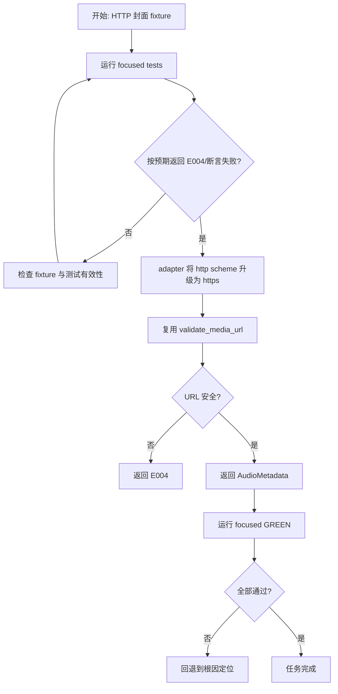
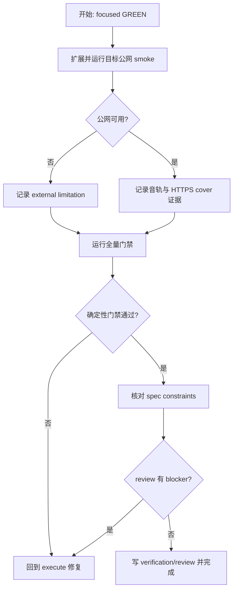

# 仅音频封面 URL 修复实施计划

> **For agentic workers:** REQUIRED SUB-SKILL: Use `superpowers:executing-plans` to implement this plan task-by-task. Steps use checkbox (`- [ ]`) syntax for tracking.

**Goal:** 让仅音频 source resolve 安全兼容 Bilibili 受信任图片域返回的 HTTP 封面，同时保持全局 HTTPS 与域名白名单不变。

**Architecture:** 在既有 Bilibili audio adapter 内增加纯规范化函数，先把可解析的 HTTP 封面 scheme 升级为 HTTPS，再交给 `validate_media_url` 做唯一安全裁决。`adapt_audio_metadata` 改为显式 `Result`，ParserService 只传播结果，executor 与前端不变。

**Tech Stack:** Rust、Tauri、reqwest/url、Cargo tests；前端 Vue/TypeScript 只做回归门禁。

**Spec:** `docs/requests/bilicatch-audio-cover-url-fix-20260913/spec/spec.md`

## Global Constraints

- 不允许 `validate_media_url` 接受 HTTP。
- 不允许非 Bilibili host、凭据、fragment、相对或非 HTTP(S) URL。
- 不改变 IPC、下载模式、音频 profile、登录规则或 E004 文案。
- raw 兼容只在 adapter，网络/文件副作用仍在 downloader/executor。
- 不增加依赖、trait、manager、factory 或配置项。

---

## 交付单元标识

`bilicatch-audio-cover-url-fix-20260913`

## 阅读导航

| 项目 | 内容 |
| --- | --- |
| 任务总数 | 2 |
| 串行任务 | 2 |
| 可并行任务 | 0 |
| 高风险点 | 不得扩大 URL 白名单或遗漏 query/path |
| 关键依赖 | `adapt_audio_metadata`、`validate_media_url`、`ParserService::resolve` |
| 实施主线 | AUDCOV-01 TDD 修复 -> AUDCOV-02 全量验证与评审 |

## 全局摘要

- 业务范围：仅音频任务的封面 URL 适配。
- 状态主线：fresh view/playurl -> audio candidate -> cover normalize/validate -> source bundle -> workspace/download/process。
- 根因：raw `http://i2.hdslb.com/...` 在 source bundle 返回前被 HTTPS validator 拒绝为 E004。
- 前置条件：规格已批准；计划批准后才能进入 execute。
- 回退原则：若 HTTP fixture 仍失败，停在 adapter/parser 调用链重新定位，不放宽 validator。

## Task AUDCOV-01：用 TDD 修复 audio metadata 封面适配

### 任务目标

用离线 fixture 先复现 HTTP 封面 E004，再以最小 adapter 改动使其安全变为 HTTPS，并证明不安全输入仍失败。

### 规格映射

`In Scope`、`Audio metadata adaptation`、`Design Constraints`、`AUDCOV-AC-01` 至 `AUDCOV-AC-05`。

### Files

- Modify: `src-tauri/src/infrastructure/bilibili/audio_source.rs`
- Modify: `src-tauri/src/services/parser.rs`
- Test: `src-tauri/src/infrastructure/bilibili/audio_source.rs` 的内联 tests
- Test: `src-tauri/src/services/parser.rs` 的内联 tests

### Interfaces

- Consumes: `validate_media_url(&str) -> Result<Url, AppError>`、`ViewData.pic: String`。
- Produces: `adapt_audio_metadata(&ViewData) -> Result<AudioMetadata, AppError>`，成功时 `cover_url` 必为已验证 HTTPS URL。

### 前置条件与完成条件

- 前置：state 为 execute 且 plan 已批准。
- 完成：目标 focused tests 经历预期 RED 后 GREEN；parser caller 编译并传播 adapter error；无其他 caller 破坏。

### 实现步骤

- [ ] **Step 1: 写 adapter 失败测试**

  在 `audio_source.rs` tests 中加入受信任 HTTP 封面：

  ```rust
  "pic":"http://i2.hdslb.com/bfs/archive/cover.jpg?token=fixture"
  ```

  断言 `adapt_audio_metadata(&view)` 成功并输出：

  ```text
  https://i2.hdslb.com/bfs/archive/cover.jpg?token=fixture
  ```

  同时以表驱动方式断言以下值返回 E004：外部 host、`user:pass@`、fragment、相对 URL、空字符串、`ftp://`。

- [ ] **Step 2: 写 parser source-resolve 失败测试**

  将 parser `view_fixture().pic` 改为受信任 HTTP 封面；现有 `audio_source_resolution_refreshes_auth_view_and_playurl_for_every_attempt` 增加断言：

  ```rust
  assert_eq!(first.metadata.cover_url, "https://i0.hdslb.com/a.jpg");
  ```

- [ ] **Step 3: 运行 RED**

  Run:

  ```powershell
  rtk proxy C:\Users\yangjianlin\.cargo\bin\cargo.exe test --manifest-path src-tauri\Cargo.toml infrastructure::bilibili::audio_source::tests
  rtk proxy C:\Users\yangjianlin\.cargo\bin\cargo.exe test --manifest-path src-tauri\Cargo.toml services::parser::tests::audio_source_resolution_refreshes_auth_view_and_playurl_for_every_attempt
  ```

  Expected：adapter 测试因当前保留 HTTP/无 `Result` 失败；parser 测试因 `validate_media_url` 返回 E004 失败。失败必须由目标行为缺失造成，而不是语法或 fixture 错误。

- [ ] **Step 4: 实现最小 adapter 规范化**

  在 `audio_source.rs` 增加窄范围纯函数：

  ```rust
  fn normalize_cover_url(value: &str) -> Result<String, AppError>
  ```

  行为顺序固定：`Url::parse` -> 仅当 scheme 为 `http` 时设为 `https` -> 调 `validate_media_url` -> 返回 validator 产生的规范化字符串。不得复制 host suffix 白名单。

  将接口改为：

  ```rust
  pub(crate) fn adapt_audio_metadata(view: &ViewData) -> Result<AudioMetadata, AppError>
  ```

  `ParserService::resolve` 使用 `let metadata = adapt_audio_metadata(&view)?;`，删除其重复的封面 `validate_media_url` 调用和不再使用的 import。

- [ ] **Step 5: 运行 GREEN 与邻近测试**

  ```powershell
  rtk proxy C:\Users\yangjianlin\.cargo\bin\cargo.exe test --manifest-path src-tauri\Cargo.toml infrastructure::bilibili::audio_source::tests
  rtk proxy C:\Users\yangjianlin\.cargo\bin\cargo.exe test --manifest-path src-tauri\Cargo.toml services::parser::tests
  rtk proxy C:\Users\yangjianlin\.cargo\bin\cargo.exe test --manifest-path src-tauri\Cargo.toml --test audio_source
  rtk proxy C:\Users\yangjianlin\.cargo\bin\cargo.exe test --manifest-path src-tauri\Cargo.toml --test audio_executor
  ```

  Expected：全部通过；lossless E005/E006、普通音轨选择和 executor 顺序不变。

### 交互与状态约束

- 页面无新状态或 loading。
- 成功后任务沿既有 `queued -> downloading -> processing -> completed` 流转。
- 真实不安全 URL 仍进入 failed/E004。

### API 与数据约束

- raw `pic` 字段名与 DTO 不变。
- 只在 Rust adapter 输出稳定 HTTPS；无 TypeScript/IPC 变更。
- 不记录 raw URL、query token 或错误响应正文。

### 风险与回退

- 风险：`Url::to_string()` 规范化编码形式；测试必须比较 path/query 语义和批准的精确 fixture。
- 回退：只撤销 adapter helper、返回类型和对应 tests；不碰 validator 或 executor。

### 流程图



## Task AUDCOV-02：公网 smoke、全量门禁与交付评审

### 任务目标

验证真实目标视频当前数据、全仓回归、规格约束和代码质量，形成 verification/review 工件。

### 规格映射

`AUDCOV-AC-04` 至 `AUDCOV-AC-07`、`Human Review And Handoff`、`Risks`。

### Files

- Modify: `src-tauri/src/infrastructure/bilibili/client.rs`（只扩展既有 ignored smoke，不新增生产逻辑）
- Create: `docs/requests/bilicatch-audio-cover-url-fix-20260913/execution/changelog.md`
- Create: `docs/requests/bilicatch-audio-cover-url-fix-20260913/verification/verification.md`
- Create: `docs/requests/bilicatch-audio-cover-url-fix-20260913/review/review.md`
- Update: `docs/requests/bilicatch-audio-cover-url-fix-20260913/plan/task-board.md`
- Update: `docs/requests/bilicatch-audio-cover-url-fix-20260913/state.json`

### Interfaces

- Consumes: Task AUDCOV-01 的 `adapt_audio_metadata -> Result`。
- Produces: 离线确定性证据、公网非确定性 smoke 证据、最终 pass/fail 与 review 结论。

### 前置条件与完成条件

- 前置：AUDCOV-01 focused GREEN。
- 完成：全量门禁通过，公网 smoke 成功或明确记录外部失败，verification/review 合规，state 完成。

### 实现步骤

- [ ] **Step 1: 扩展既有 opt-in smoke**

  在 `public_anonymous_parse_smoke` 中复用 fetched view/play，断言普通 audio candidate 可选、`adapt_audio_metadata` 成功且 cover scheme 为 HTTPS。不得打印完整 CDN/封面 URL。

- [ ] **Step 2: 运行公网 smoke**

  ```powershell
  rtk proxy C:\Users\yangjianlin\.cargo\bin\cargo.exe test --manifest-path src-tauri\Cargo.toml infrastructure::bilibili::client::tests::public_anonymous_parse_smoke -- --ignored --exact
  ```

  Expected：`BV1FNb366EH2` 当前返回至少一条可用普通音轨及安全 HTTPS cover metadata。公网失败只记录为 external，不改离线结论。

- [ ] **Step 3: 运行全量门禁**

  ```powershell
  rtk npm test -- --run
  rtk npm run typecheck
  rtk proxy C:\Users\yangjianlin\.cargo\bin\cargo.exe fmt --manifest-path src-tauri\Cargo.toml -- --check
  rtk proxy C:\Users\yangjianlin\.cargo\bin\cargo.exe test --manifest-path src-tauri\Cargo.toml
  rtk git diff --check
  ```

  Expected：所有命令通过；既有可忽略公网 smoke 在普通全量测试中仍 ignored。

- [ ] **Step 4: 验证规格约束**

  检查 `validate_media_url` 未被放宽、TypeScript/IPC 无变化、executor 无生产修改、不安全 URL tests 仍 E004。

- [ ] **Step 5: 写 verification 与 review**

  verification 必须逐项绑定 AUDCOV-AC-01 至 07，并显式记录 `spec constraint compliance: pass/fail`。review 必须记录 blocking issues、clean-code assessment、design-pattern assessment 与 merge readiness。

### 交互与状态约束

- 无 UI 改动；只验证成功任务不再出现错误状态。
- 所有 failure 均由现有 task/error 状态机处理。

### API 与数据约束

- 公网 smoke 只读取官方接口非敏感字段。
- 不持久化或输出 Cookie、token、完整签名 URL。
- updater/release 不在本任务范围。

### 风险与回退

- 公网数据可变化，离线 fixture 为权威门禁。
- 任一确定性测试失败则回到 execute；review 有 blocker 同样回到 execute。

### 流程图



## 功能拆解明细

| 功能单元 | 输入 | 处理 | 成功输出 | 失败输出 |
| --- | --- | --- | --- | --- |
| HTTP 封面适配 | raw absolute URL | scheme 升级后复用 validator | validated HTTPS String | E004 |
| HTTPS 封面适配 | raw absolute URL | 直接复用 validator | 等价 HTTPS String | E004 |
| audio metadata | ViewData | title/uploader + cover normalize | `Result<AudioMetadata, AppError>` | E004 |
| source resolve | BVID/CID/profile | view/playurl/select/metadata | `AudioSourceBundle` | 既有 E004/E005/E006/E009 |
| UI 状态 | task update | 既有 store 渲染 | 下载/处理/完成 | 既有本地化错误 |

## 项目脚手架与初始化策略

不适用；沿用现有项目、Cargo tests 与模块布局，不新增依赖。

## API 对接与类型策略

- 契约来源：Bilibili view/playurl raw JSON 和 Rust private DTO。
- 请求层：无生产请求变更。
- adapter：只对 `pic` 做语义规范化；字段名和 raw DTO 不变。
- 类型：Rust crate-private 函数改为 `Result`；TypeScript contracts 不变。
- 错误：复用 `AppError` 与 E004，不新增枚举。

## 依赖关系

`AUDCOV-01 -> AUDCOV-02`，严格串行。第二项依赖第一项的稳定接口与 GREEN 证据。

## 整洁性与复杂度控制

- 一个 helper、一个 rule owner、一个 caller propagation。
- 禁止字符串 `replace` 绕过 URL parser。
- 禁止复制 host allowlist。
- 禁止修改 executor 以吞掉 cover 错误。

## 模式决策与替代方案

- 保留既有 Adapter；直接纯函数是最小实现。
- 拒绝新增 Strategy/Factory/Manager，因为不存在运行时变体或创建复杂度。
- 拒绝放宽 validator，因为会扩大 SSRF/明文传输面。

## 代码上下文与影响范围

- 已确认 `adapt_audio_metadata` 单一生产 caller。
- 生产改动预计 2 个 Rust 文件。
- 测试改动预计 adapter/parser/client 内联测试。
- 前端仅跑回归，不改代码。

## 并行执行建议

不启用 workflow-style parallel execution。两个任务共享同一接口和测试链路，串行成本低且更能保持 TDD 证据清晰。

## 触发与上下文准备

- Trigger：用户报告仅音频 E004。
- Context：规格、code-context、目标视频当前官方响应、相关 Rust modules。
- Observation：focused RED/GREEN、全量测试、公网 smoke。
- Handoff：verification/review 完成后向用户报告；不自动发布。

## 受影响文件或模块

- `src-tauri/src/infrastructure/bilibili/audio_source.rs`
- `src-tauri/src/services/parser.rs`
- `src-tauri/src/infrastructure/bilibili/client.rs`（test only）
- 当前请求的 execution/verification/review 工件。

## 测试策略

- TDD：HTTP trusted cover 与 parser fixture 必须先红。
- 安全边界：表驱动 unsafe cover cases。
- 邻近回归：audio source、audio executor、parser、video/downloader。
- 全量：Rust 164+、前端 179、typecheck、fmt、diff check。
- 公网：目标 BVID ignored opt-in smoke，非确定性。

## 观察与人工介入点

- 当前 gate：用户批准计划。
- execute 中若真实 URL 与规格矛盾，回到 spec/plan，不自行扩大 host 范围。
- verification/review 若失败且可按计划修复，自动回到 execute。

## 回滚说明

- 生产回滚限定为 adapter helper、`Result` 签名和 ParserService caller。
- 测试随行为一起回滚；不修改 validator 基线。
- 未触及持久数据、安装目录或远端服务，回滚无迁移步骤。
