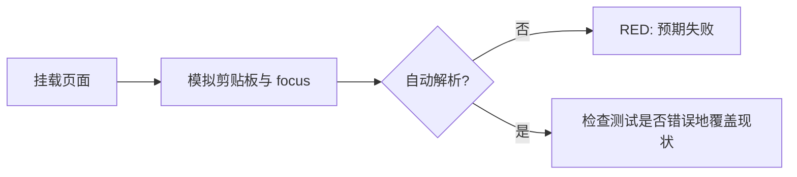
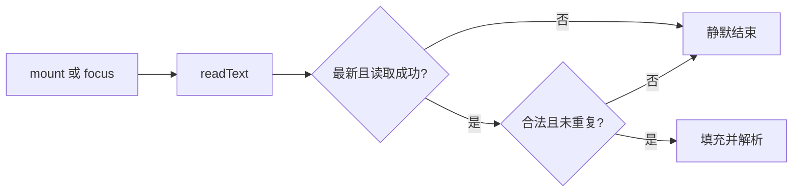
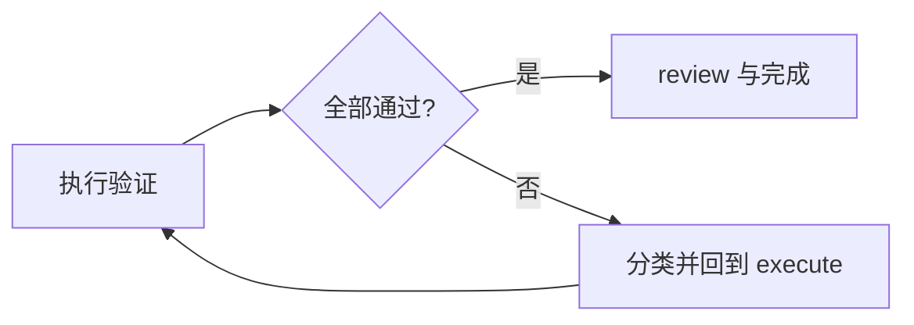

# 实施计划

## 摘要

按 TDD 串行交付：先用页面行为测试证明缺失，再接入窄剪贴板端口与 Tauri 只读权限，最后执行完整验证。产品内容变化为 `none`。

## 任务 1：RED 行为测试

- 范围：`DownloadPage.test.ts`。
- 行为：挂载/重新聚焦读取合法值后输入框更新且解析；无效值、异常、重复值被忽略。
- 风险：只 mock 外部剪贴板读取与解析网络边界，真实挂载页面/store/router。
- 验证：聚焦用例因缺少 reader 行为而失败。

## 任务 2：GREEN 原生能力与页面编排

- 范围：clipboard adapter、injection、`main.ts`、`DownloadPage.vue`、npm/Cargo 依赖、Tauri capability 和插件注册。
- 合同：只读文本；mount/focus 触发；既有校验；最新读取生效；卸载清理；错误静默。
- 模式：Level 1 lightweight dependency injection；不抽组件/composable。
- 风险：异步竞态、重复请求、原生权限遗漏。
- 验证：focused test 通过，类型检查与 Cargo check 捕获两端组合错误。

## 任务 3：回归与审查

- 执行 focused test、全量 Vitest、typecheck、build、Cargo check、diff check。
- 手工在 Tauri dev 中验证从外部复制并切回应用。
- 若失败，最多两轮按 `verify -> review -> execute` 回流；同一原因无进展则记录阻断，不掩盖失败。

