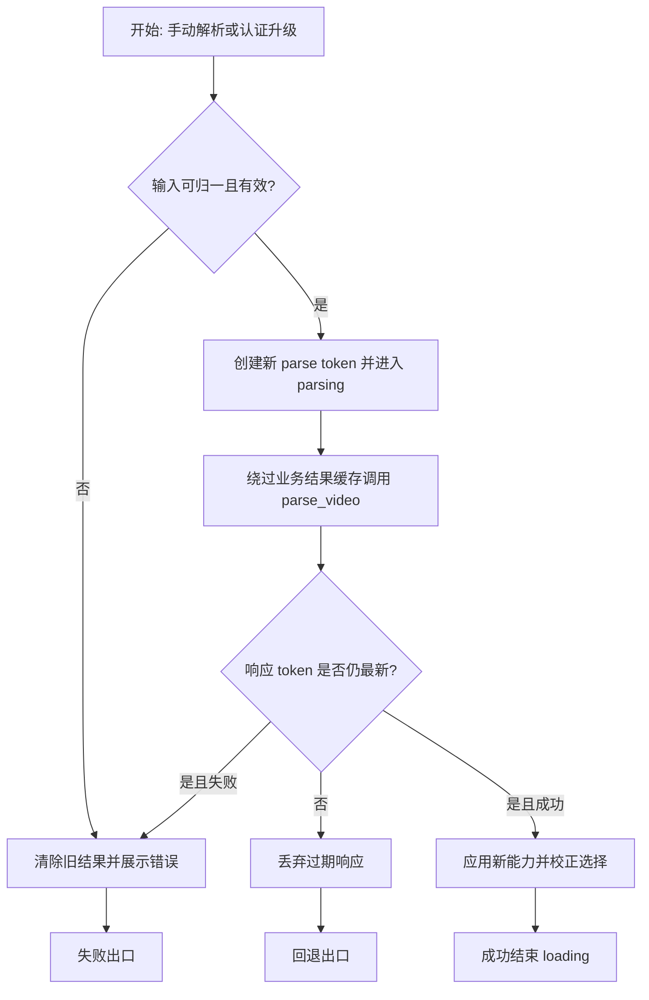
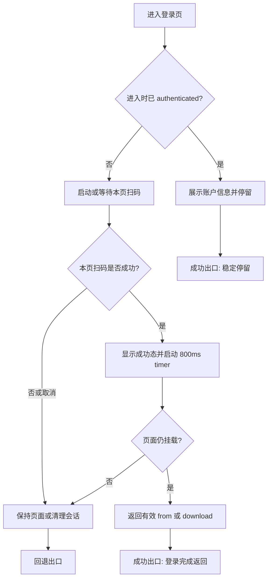
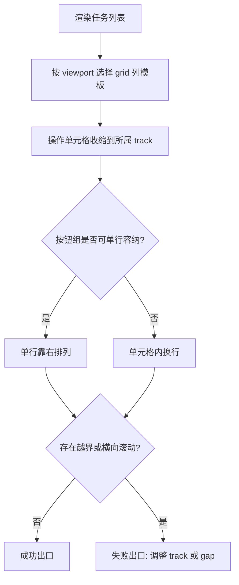
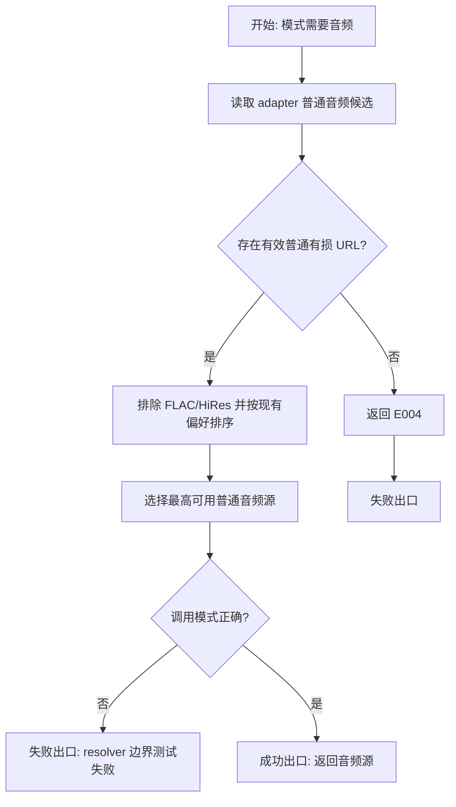
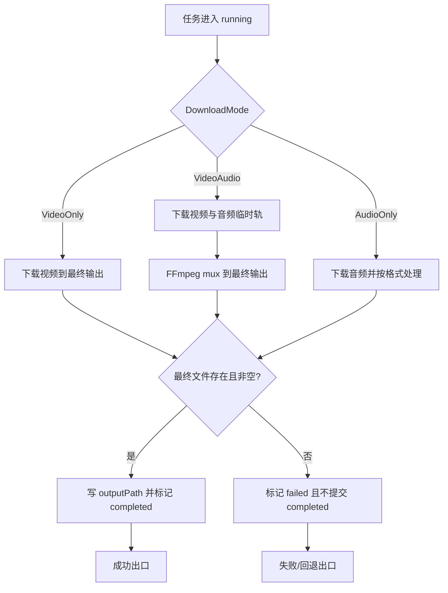
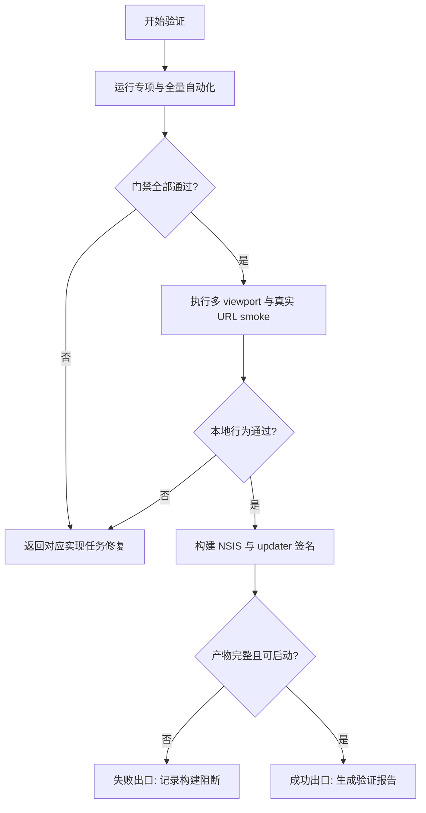
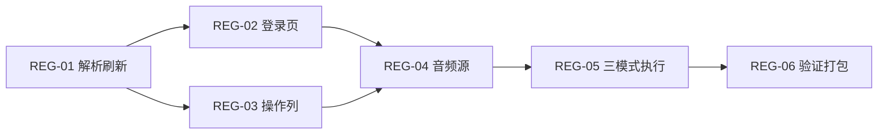

# 实施计划：BiliCatch 回归缺陷修复

## 交付单元标识

`bilicatch-regression-fixes-20260913`

## 阅读导航

- 目标：修复登录刷新、登录页停留、重复解析、任务操作列和三种下载模式的 5 项回归。
- 任务总数：6；串行 6；可并行 0。
- 高风险任务：`REG-04` 音频源选择、`REG-05` 三模式执行一致性。
- 关键依赖：`REG-01 -> REG-02/REG-03 -> REG-04 -> REG-05 -> REG-06`。
- 验收覆盖：`REG-AC-01` 至 `REG-AC-09` 全部映射。
- 快速索引：`REG-01` 解析刷新，`REG-02` 登录页，`REG-03` 操作列，`REG-04` 音频源，`REG-05` 执行器，`REG-06` 验证打包。

## 全局摘要

本次沿用现有 Vue 3、Pinia、Tauri 2、Rust service/adapter/executor 分层。主线先修正前端解析命令的 fresh 语义和认证协调，再消除登录页与任务表格的 UI 回归，随后修复 Rust 音频候选选择和三种模式的执行闭环，最后执行自动化、真实 URL smoke 与 NSIS 打包。

最关键的状态主线是：用户触发解析或认证状态升级 -> 创建新的 parse token -> 绕过成功结果缓存 -> 仅最新响应提交 -> 重建媒体能力和选择。最大风险是 Bilibili 外部接口数据波动及 FFmpeg 合流后的最终文件状态，因此公网只作为 smoke，确定性规则由 fixture 与执行器测试覆盖。

前置条件：规格已批准；保留工作区中既有的 HTTP `Referer` 与 executor 完成态相关改动；不推送代码、不创建 Release；执行阶段不得改变 IPC DTO 或新增下载模式。

## 任务拆解

### REG-01 认证刷新与手动 fresh parse

**任务目标**

让登录状态变化和每次显式“解析”都获取新结果，并确保并发响应只有最后一次生效。

**规格映射**

- 功能：认证后能力刷新、手动重新解析。
- 验收：`REG-AC-01`、`REG-AC-03`，并为 `REG-AC-08` 提供专项测试。

**范围与影响面**

- 页面：`DownloadPage` 的 auth watcher、解析表单提交入口。
- 前端状态：`download-center/store` 的缓存、parse token、`applyResult`、选择保留/回退。
- Rust：`parse_video` 用例级结果缓存边界；保留 WBI key 等协议级短期缓存。

**前置条件与完成条件**

- 前置：读取 `tsconfig.json`、下载中心 contracts、auth revision/status 契约和 parser service。
- 完成：同一输入手动解析两次产生两次 service 调用；登录升级时已有有效输入自动 fresh parse；旧响应不能覆盖新响应。
- 禁止猜测：不修改输入合法性规则、不更改 `ParseVideoResult` 字段、不把网络调用放入 Vue component。

**实现子项**

1. 先补 store/page 回归测试，明确 manual 与 auth-refresh 两种触发源都要求 fresh。
2. 在 store command 边界提供显式 fresh 行为，移除或绕过成功结果缓存；保留 token 防竞态。
3. Rust `parse_video` 对显式交互读取新 metadata/playurl，不复用上次业务结果；协议签名/WBI key 缓存不受影响。
4. auth 从非 authenticated 变为 authenticated 且存在已解析输入时重新解析。
5. 刷新成功先应用新能力，再尝试保留原 mode、quality、codec；组合失效时采用现有 fallback 并仅提示一次。
6. fresh 失败清除旧结果并结束 loading，避免旧权限状态伪装为最新状态。

**交互与状态约束**

- 点击按钮或 Enter 后立即进入 `parsing`；成功或失败时结束。
- 输入展示值不改写；校验仍使用现有 trim/normalizer。纯空格或归一化为空按现有“链接无效”处理。
- 登录成功但无可解析输入时不请求；快速重复触发仅最后 token 可提交。

**API 与数据约束**

- 契约来源：Rust command `parse_video({ input }) -> ParseVideoResult` 与现有 TS contracts。
- DTO 字段和错误码不变；fresh 是调用语义，不新增前端 raw API mapper。

**测试与验证要点**

- store：同一输入两次提交调用两次，第二结果完整替换；过期响应被忽略。
- page：匿名结果在 auth 升级后重新请求，`requiresLogin` 和 disabled 依据新结果更新。
- Rust parser：重复调用不命中业务结果缓存，WBI key 缓存仍可用。

**风险与回退**

- 风险：请求量增加。回退点仅为业务结果缓存行为，不回退 token 竞态保护。

### REG-02 登录页导航生命周期

**任务目标**

区分“进入时已登录”和“本页扫码完成登录”，避免账户信息页自动返回。

**规格映射**

- 功能：登录页返回。
- 验收：`REG-AC-02`、`REG-AC-08`。

**范围与影响面**

- 页面：`LoginPage.vue`。
- 测试：登录路由来源、初始 auth 快照、扫码状态迁移、timer 清理。

**前置条件与完成条件**

- 前置：`REG-01` 已固定 auth 状态观测语义。
- 完成：已登录用户点击用户名进入 `/login` 后持续停留；只有当前页面启动的扫码流程完成后等待 800ms 返回。
- 禁止猜测：不改变目标路由优先级、不新增登录持久化、不改变成功反馈时长。

**实现子项**

1. 先写失败测试覆盖初始 authenticated、restoring -> authenticated、本页扫码成功三条路径。
2. 增加页面内瞬时标志，只有当前挂载周期实际启动/等待过扫码时才允许安排返回 timer。
3. 保留有效 `from`，无有效来源回 `/download`。
4. 离开页面时清理 timer 和当前扫码会话；重复 auth 事件不重复导航。

**交互与状态约束**

- 已登录账户信息为稳定展示态，无 loading、无自动导航。
- 本页登录成功显示现有反馈 800ms；timer 到期且页面仍有效时返回。

**API 与数据约束**

- 仅消费现有 auth store/event，不新增 IPC 或 DTO。

**测试与验证要点**

- fake timer 精确验证 800ms 前后路由。
- 初始 authenticated 和恢复 authenticated 超过 800ms 仍在 `/login`。
- unmount 后 timer 不导航。

**风险与回退**

- 风险：标志设置时机遗漏扫码成功。回退为恢复原 watcher，同时保留新增测试定位差异。

### REG-03 任务表格操作列边界

**任务目标**

让所有行内操作按钮严格位于操作列单元格，响应式列映射一致且无横向溢出。

**规格映射**

- 功能：任务表格操作列。
- 验收：`REG-AC-04`、`REG-AC-08`。

**范围与影响面**

- 页面/容器：任务管理列表的 header、`TaskRow`、actions cell、窄屏布局。
- 列顺序不变：文件、状态、进度、速度、大小、操作；`<=1050px` 隐藏速度并保持其余列一一对应。

**前置条件与完成条件**

- 前置：确认现有 36x36px icon button 和 More 菜单定位方式。
- 完成：1280、900、800px 下子元素 bounding box 不越过所属 cell，页面/行无横向滚动，按钮尺寸不变。
- 禁止猜测：不调整操作含义、不隐藏合法操作、不重做任务列表视觉风格。

**实现子项**

1. 增加布局回归测试或可测 DOM 断言，覆盖不同任务状态下最多按钮组合。
2. 统一 header/row 的 grid track；actions cell 设置 `min-width: 0`、受控宽度和 `box-sizing`。
3. 按钮组采用紧凑排列；空间不足时在单元格内部换行，不侵入相邻列。
4. 检查 More 菜单 overlay 仍由浮层定位，不受 cell overflow 裁切。

**交互与状态约束**

- 行内按钮保持 36x36px，图标/tooltip/disabled 行为不变。
- 列空值、loading、状态文案、行操作逻辑不变；本任务只修布局边界。

**API 与数据约束**

- 无 API/类型变更；继续使用现有 task view model。

**测试与验证要点**

- 组件测试覆盖 active/completed/failed 行的按钮集合。
- Playwright 或浏览器测量 1280/900/800px 的 cell 与子元素矩形、`scrollWidth <= clientWidth`。

**风险与回退**

- 风险：对 cell 设置 overflow 导致菜单裁切。优先修 grid/min-width，不对 overlay 祖先使用强制 hidden；逐条回退 CSS 声明。

### REG-04 普通音频源选择规则

**任务目标**

让 Bilibili 返回的普通 AAC/M4A DASH 音频可用于匿名 audio-only 与 video+audio，避免按名义 64K 对实际 bandwidth 误拒绝。

**规格映射**

- 功能：三种下载模式中的音频解析。
- 验收：`REG-AC-05`、`REG-AC-06`、`REG-AC-08`。

**范围与影响面**

- Rust：audio source selector、parser/video source 对音轨选择的调用、fixture tests。
- 不包含：FLAC/HiRes、账户权限升级逻辑、新格式或转码。

**前置条件与完成条件**

- 前置：基于 raw adapter 输出的音频候选和现有 `AudioQuality` 契约编写失败测试。
- 完成：65,971/85,411 bps 普通有损候选可选；空候选才返回 E004；FLAC/HiRes 仍排除。
- 禁止猜测：不按未声明 codec 生成扩展名，不绕过 adapter，不静默选择无 URL 的源。

**实现子项**

1. 用固定 fixture 覆盖用户视频中观测到的 bandwidth 值。
2. 在 `select_audio_source` 单点移除认证相关的严格 bandwidth 上限，过滤依据改为“Bilibili 已返回且属于普通有损候选”。
3. 在允许候选中按现有质量偏好选择最高可用源，并保持 fallback 确定性。
4. 验证 VideoAudio 调用同一 selector，AudioOnly 不经过视频 resolver。

**交互与状态约束**

- 用户模式和格式选择不变；源不可用仍返回既有 E004/E005 等语义。

**API 与数据约束**

- 契约来源：Bilibili raw DTO -> Rust adapter -> domain candidate；IPC DTO 不变。
- `bandwidth` 继续保留用于排序/展示，不作为普通有损音频的硬权限阈值。

**测试与验证要点**

- 匿名候选 65,971/85,411 bps 返回最高普通有损源。
- 候选为空、仅无效 URL、仅 HiRes/FLAC 仍失败。
- VideoAudio 与 AudioOnly 的 resolver 调用边界符合模式。

**风险与回退**

- 风险：选择到服务端虽返回但下载时拒绝的 URL。下载 HTTP 状态继续走既有错误映射；可单独回退排序规则，不恢复错误硬阈值。

### REG-05 三模式执行与完成态一致性

**任务目标**

确保 VideoOnly、VideoAudio、AudioOnly 各自只下载所需轨道并在最终非空文件落盘后才标记 completed。

**规格映射**

- 功能：三种下载模式、最终文件校验。
- 验收：`REG-AC-06`、`REG-AC-07`、`REG-AC-08`。

**范围与影响面**

- Rust：executor registry、video/audio executor、HTTP downloader、FFmpeg 合流/提取、临时文件清理和任务状态。
- 纳入并验证工作区既有的 media `Referer` 和完成态顺序改动，不覆盖这些改动。

**前置条件与完成条件**

- 前置：`REG-04` 已能为需要音频的模式提供源；可信 FFmpeg sidecar 可被测试/打包发现。
- 完成：VideoOnly 不 mux；VideoAudio 下载双轨并 mux；AudioOnly 不调用视频 resolver；三者仅在最终文件存在且非空后 completed。
- 禁止猜测：不静默降级模式、不把临时轨道路径当 outputPath、不改变任务 DTO。

**实现子项**

1. 先补/校正 executor 测试，按模式断言 resolver、downloader、FFmpeg 调用次数与参数。
2. 保证 Bilibili media 请求携带现有 `Referer`，并由单元测试固定 header。
3. 统一执行结束顺序：处理最终输出 -> 验证存在且非空 -> 更新 outputPath/completed -> 清理临时文件。
4. 失败或取消时不得写 completed；按既有保留策略处理可诊断临时文件。
5. 验证输出扩展名和所选模式/格式一致。

**交互与状态约束**

- 队列状态沿用 pending/running/completed/failed/cancelled；不新增状态。
- 错误继续由现有错误码/消息映射到任务列表；文件系统失败不得表现成账户权限不足。

**API 与数据约束**

- 契约来源：`CreateDownloadTasksRequest`、`DownloadTaskDraft`、executor trait 和 registry。
- mode 决定字段：VideoOnly/VideoAudio 需要视频选择；AudioOnly 只需要音频格式相关字段。

**测试与验证要点**

- 三模式专项测试均断言非空最终文件。
- mux/提取失败、零字节输出、下载 HTTP 失败均不 completed。
- VideoOnly 断言无音频 resolver/FFmpeg mux；AudioOnly 断言无视频 resolver。

**风险与回退**

- 风险：Windows 文件句柄导致验证或 rename 时机变化。回退到各 executor 原子步骤逐项定位，不放宽最终文件校验。

### REG-06 全量验证、真实 URL smoke 与 NSIS 打包

**任务目标**

以确定性测试、真实用户 URL 和安装包构建给出最终可交付证据。

**规格映射**

- 验收：`REG-AC-01` 至 `REG-AC-09`，重点为 `REG-AC-08`、`REG-AC-09`。

**范围与影响面**

- 前端：专项测试、全量 Vitest、TypeScript typecheck、生产构建。
- Rust：format/lint（项目既有门禁范围）、专项/全量 Cargo tests。
- E2E/smoke：用户提供的完整 Bilibili URL；Windows NSIS 与 updater 签名产物。

**前置条件与完成条件**

- 前置：`REG-01` 至 `REG-05` 完成；网络、Bilibili、FFmpeg sidecar 和签名环境可用。
- 完成：所有确定性门禁通过；真实 URL 至少完成解析和三模式可入队/可执行检查；NSIS 安装包及 updater 签名生成。
- 禁止猜测：公网失败不能用来覆盖确定性测试结论；不登录或不持久化 Cookie；不推送或发布。

**实现子项**

1. 运行受影响单元/组件测试并修复回归。
2. 运行全量前端测试、typecheck/build 和 Rust tests。
3. 在 1280/900/800px 检查任务操作列，在已登录账户页检查 800ms 停留。
4. 用完整 URL 执行 fresh parse smoke；在当前授权能力范围检查 VideoOnly、VideoAudio、AudioOnly。
5. 构建 release NSIS，核对 exe 与 updater `.sig` 文件、FFmpeg sidecar、版本和路径。
6. 形成验证报告，记录任何由网络/账户导致的不可重复限制。

**交互与状态约束**

- smoke 使用非持久登录策略；应用退出后不得残留登录状态。
- 每轮手动解析都应观察到 loading 和新结果提交。

**API 与数据约束**

- 不更改 API；以实际 command、task event、文件输出作为证据。

**测试与验证要点**

- 自动化结论和公网 smoke 分栏记录。
- 安装包构建成功不等于运行成功，需检查启动、解析和目标文件可写。

**风险与回退**

- 风险：Bilibili 限流、账号权限、网络或 runner 签名环境不稳定。记录外部阻断并保留本地确定性证据；不降低测试断言。

## 功能拆解明细

### 解析输入与触发

- 容器：下载中心 URL 输入与解析按钮。
- 字段：视频地址，必填，文本输入；展示值保留原样，校验使用现有 trim/normalizer。
- 空白：纯空格、trim 后为空、非法 URL 均沿用现有“链接无效”；不新增长度规则或非法字符规则。
- 触发：按钮和 Enter；每次均 fresh；立即 loading；成功应用完整结果，失败清空旧结果并显示错误。
- 选择联动：新结果应用后校验 mode/quality/codec，有效则保留，无效按现有默认规则 fallback。

### 登录账户展示与扫码流程

- 容器：`/login` 页面。
- 已登录展示：现有用户字段与退出操作保持只读/原行为；无自动返回。
- 扫码流程：生成二维码 -> 等待 -> 成功反馈 -> 800ms 后返回；过期/失败可按现有方式重试；离开页面取消观察与 timer。

### 任务表格

- 列：文件、状态、进度、速度、大小、操作；字段来源、格式和空值展示不变。
- 行内操作：暂停/继续、取消、重试、打开目录、更多、删除等按现有任务状态显隐。
- 批量操作、排序、筛选、分页规则不变。
- 响应式：`<=1050px` 隐藏速度列且 header/row 同步；`<=850px` 沿用窄屏布局，操作仍受所属区域约束。

### 下载模式流程

- VideoOnly：视频 resolver -> HTTP 下载 -> 最终文件校验。
- VideoAudio：视频 resolver + 普通音频 selector -> 两轨下载 -> FFmpeg mux -> 最终文件校验。
- AudioOnly：普通音频 selector -> 下载/格式处理 -> 最终文件校验；不得访问视频 resolver。
- 任一步失败：保留既有错误语义，任务 failed，不标记 completed；取消则进入 cancelled。

## 项目脚手架与初始化策略

现有项目已具备 Vue 3 + Pinia + Tauri 2 脚手架、测试与打包配置。本计划不初始化项目、不增加框架依赖、不改变目录结构。

## API 对接与类型策略

- 前端权威来源：现有 TS contracts 与 `tsconfig.json`；保持 strict、bundler resolution 和 noEmit 约束。
- IPC 权威来源：Rust serde DTO/command；前端继续通过现有 service/request 层消费。
- 外部接口：Bilibili raw JSON 只在 Rust infrastructure/adapter 解析，不泄漏到 Vue/Pinia。
- 类型策略：无新增契约；若实现需要调整内部参数，以现有 domain type 扩展而不复制 DTO。
- 错误/loading/empty：由 store 与 task state machine 驱动，组件只渲染状态。

## 依赖关系

## 整洁性与复杂度控制

- fresh 规则只放在 store/parser 用例边界；组件不直接请求网络。
- 音频候选过滤只由 `select_audio_source` 拥有；executor 不重复判断账户质量。
- 登录返回 timer 只由 `LoginPage` 生命周期拥有。
- 文件和进程副作用只在 Rust executor/infrastructure。
- 不新增 manager/factory；沿用 Pinia command、auth Observer、executor Strategy registry。
- 只修改与 5 项缺陷和既有未提交修复直接相关的文件。

## 模式决策与替代方案

- 保留 Observer：auth event 已是状态变化入口，适合触发 fresh parse。
- 保留 Strategy registry：三种下载模式已有明确 executor 分流。
- 拒绝给每次解析添加时间戳参数：fresh 应是用例语义，不能依赖伪造 cache key。
- 拒绝在前端按 bandwidth 猜权限：可下载候选由 Bilibili 响应和 Rust selector 决定。
- 拒绝通过隐藏按钮解决溢出：会损失功能，布局应承担响应式约束。

## 代码上下文与影响范围

- 前端：`src/pages/DownloadPage.vue`、`src/features/download-center/store.ts`、`src/pages/LoginPage.vue`、任务管理组件与 CSS、对应测试。
- Rust：`src-tauri/src/services/parser.rs`、`src-tauri/src/services/audio/source.rs`、video/audio executor、HTTP downloader、对应测试。
- 构建：既有 Tauri/NSIS/updater 配置与 FFmpeg sidecar，不新增发布配置。
- 工作区既有变更必须在实施时逐行复核并保留，不能覆盖用户或前序修复。

## 并行执行建议

不启用 workflow-style 并行执行。任务共享 auth/parse 状态、Rust source/executor 和最终验证链路，串行执行更容易保持测试先行和避免同文件冲突。

## 触发与上下文准备

- 触发：计划获批后进入 execute。
- 上下文：读取批准规格、code-context、`tsconfig.json`、受影响 contracts/tests 以及当前 git diff。
- 观察点：每项先出现失败测试，再实施最小改动并使专项测试通过。
- 人工介入：仅当真实 Bilibili 登录/权限或外部服务阻断 smoke 时记录限制；不要求用户提供持久 Cookie。
- 交接：`REG-06` 输出测试、smoke、安装包和残余风险证据，进入 review/verify。

## 受影响文件或模块

| 范围 | 预期改动 |
| --- | --- |
| 下载中心页面/store | fresh parse、auth refresh、选择校正及测试 |
| 登录页 | timer 触发条件和生命周期测试 |
| 任务管理 CSS/组件测试 | grid track、actions cell 边界、多 viewport 验证 |
| parser/audio source | 业务缓存语义、普通音频候选选择及 fixture |
| executor/downloader | 模式分流、Referer、最终文件校验及回归测试 |
| 构建与验证工件 | 不改发布语义，仅生成本地 NSIS/签名和报告 |

## 测试策略

- TDD：每个行为先补失败测试，再做最小实现，再运行专项测试。
- 前端：Vitest store/page/component；typecheck；全量测试；生产构建。
- Rust：selector/parser/executor/downloader 单元与集成测试；全量 Cargo tests。
- UI：1280/900/800px 测量布局；登录页 fake timer 与实际导航检查。
- 集成：用户完整 URL 的 fresh parse 和三模式 smoke；公网结论与 fixture 结论分离。
- 打包：release NSIS、FFmpeg sidecar、updater `.sig`、启动与目录可写性检查。

## 观察与人工介入点

- 若实际登录账户未返回目标清晰度，记录 Bilibili 响应能力，不伪造可选项。
- 若公网 URL 失效或限流，保留状态码/错误码并使用 fixture 完成确定性验收。
- 若 updater 签名环境缺少私钥，只报告缺失，不生成或提交新密钥。

## 回滚说明

- 各任务以独立小改动和测试组织，可按任务回滚。
- 回滚不得移除既有 media `Referer`、最终文件校验或用户已有未提交改动。
- 若 fresh parse 带来不可接受的外部调用压力，可后续引入明确 TTL/refresh policy；本缺陷修复不恢复“每次手动解析命中旧结果”的行为。
