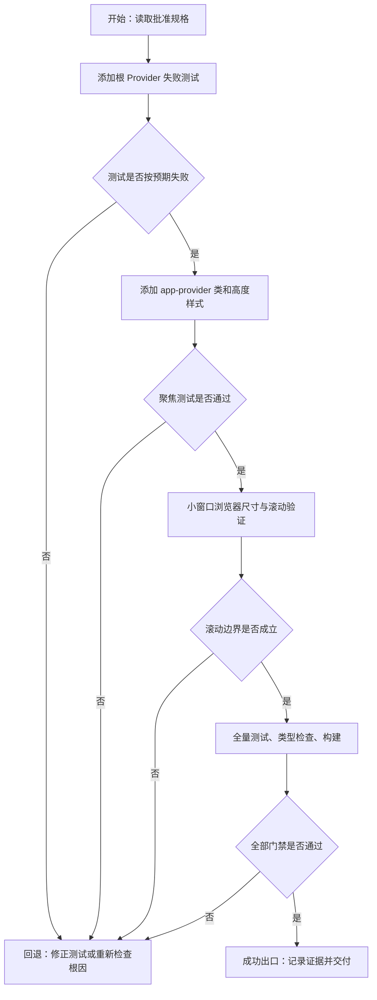

# 设置页滚动高度链修复 Implementation Plan

> **For agentic workers:** REQUIRED SUB-SKILL: Use `superpowers:executing-plans` to implement this plan task-by-task. Steps use checkbox (`- [ ]`) syntax for tracking.

**Goal:** 补齐应用根 Provider 高度链，使设置页在小窗口下由现有主内容容器滚动。

**Architecture:** `App.vue` 给第三方 Provider 声明本地布局类，`base.css` 只维护根级高度约束，`layout.css` 继续独占主内容滚动规则。修复不进入设置模块，也不改变 `body` 的滚动策略。

**Tech Stack:** Vue 3、Naive UI、CSS Grid、Vitest、Vue Test Utils、TypeScript、Vite。

**Spec:** `docs/requests/bilicatch-settings-scroll-fix-20260914/spec/spec.md`

## Global Constraints

- 根高度链固定为 `html/body/#app -> .app-provider -> .app-shell -> .workspace -> .content-scroll`。
- 保留 `body { overflow: hidden }` 和 `.content-scroll { overflow: auto }`。
- 不修改设置页、设置状态、IPC、路由或响应式宽度规则。
- 不新增依赖、包装组件或设计模式。

---

## 阅读导航

- 请求目标：小窗口下访问全部设置项。
- 任务总数：1。
- 串行任务：1；可并行任务：0。
- 高风险点：JSDOM 不计算真实布局，必须补浏览器尺寸验证。
- 关键依赖：真实 `NConfigProvider` 渲染、根 `tsconfig.json`、现有 `.content-scroll` CSS。

## 全局摘要

先以真实应用根渲染测试约束 Provider 类，再补最小模板和 CSS 规则。实现后用聚焦测试证明回归契约，用浏览器小视口检查实际 `clientHeight/scrollHeight/scrollTop`，最后运行全量测试、类型检查与生产构建。

## Task 1：恢复根 Provider 高度链

### 任务目标

让 `NConfigProvider` 的真实根 DOM 具备 `app-provider` 类，并通过该类把 `#app` 的确定高度传递给 `.app-shell`。

### 规格映射

- `AC-01`：真实 Provider DOM 包含 `.app-provider`。
- `AC-02`：类样式包含 `height: 100%` 和 `min-height: 0`。
- `AC-03`：滚动所有权保持不变。
- `AC-04`：测试、类型检查、构建通过。
- `AC-05`：浏览器小窗口尺寸与滚动位置验证。

### Files

- Modify: `src/app/App.test.ts`
- Modify: `src/app/App.vue`
- Modify: `src/styles/base.css`
- Create: `docs/requests/bilicatch-settings-scroll-fix-20260914/execution/changelog.md`

### Interfaces

- Consumes: Naive UI `NConfigProvider` 的 `class` 透传能力。
- Produces: DOM 类 `.app-provider`；CSS 根高度契约。

### 前置条件

- 已读取根 `tsconfig.json` 与 `src/vite-env.d.ts`。
- `spec_approved=true`，用户批准依据为 `USER-APPROVAL-01`。

### 实现子项

- [ ] **Step 1: 写入失败测试**

在现有应用根生命周期测试中断言真实 Provider 根元素：

```ts
expect(wrapper.get(".app-provider").classes()).toContain("n-config-provider");
```

生产变更若遗漏或移除 `app-provider` 类，此断言必须失败。

- [ ] **Step 2: 运行聚焦测试并确认 RED**

Run: `npm test -- src/app/App.test.ts`

Expected: FAIL，错误指出找不到 `.app-provider`。

- [ ] **Step 3: 实现最小模板和样式变更**

`src/app/App.vue`：

```vue
<NConfigProvider class="app-provider" :theme="naiveTheme">
```

`src/styles/base.css`：

```css
.app-provider {
  height: 100%;
  min-height: 0;
}
```

- [ ] **Step 4: 运行聚焦测试并确认 GREEN**

Run: `npm test -- src/app/App.test.ts`

Expected: PASS，且无失败或测试错误。

- [ ] **Step 5: 验证真实滚动边界**

在本地 demo 设置路由使用小高度视口，读取 `.content-scroll`：

```js
({
  clientHeight: element.clientHeight,
  scrollHeight: element.scrollHeight,
  overflowY: getComputedStyle(element).overflowY,
})
```

Expected: `scrollHeight > clientHeight`，`overflowY` 为 `auto`，设置 `scrollTop` 后其值大于 `0`。

- [ ] **Step 6: 运行完整门禁**

Run: `npm test`

Run: `npm run typecheck`

Run: `npm run build`

Expected: 三条命令均以退出码 0 完成。

- [ ] **Step 7: 记录执行和验证证据**

更新 task board、execution changelog、verification 与 review 工件，并核对最终 diff 只包含批准范围。

### 交互与状态约束

- 无新按钮、输入、加载或错误状态。
- 窗口尺寸不足时，仅主内容区域滚动。

### API 与数据约束

- 无 API 或数据契约变化。

### 整洁性与模式约束

- `app-provider` 是应用自有布局语义，不直接以第三方 `.n-config-provider` 作为业务 CSS 选择器。
- 使用直接 CSS，不引入新抽象或命名模式。

### 风险与回滚

- 风险：根级高度影响所有路由。
- 控制：不改变 `.content-scroll`、`body` 或页面级样式，并执行全量测试与真实尺寸检查。
- 回滚：只需移除 `app-provider` 类、对应 CSS 和回归断言。

### Mermaid 流程图



## 功能拆解明细

- 根结构单元：Provider class 透传。
- 高度规则单元：确定高度与最小高度收缩。
- 滚动单元：沿用 `.content-scroll`，不新增行为分支。
- 回归保护单元：真实组件渲染断言与浏览器尺寸证据。

## 项目脚手架与初始化策略

不适用；不新增脚手架或依赖。

## API 对接与类型策略

无 API 对接。模板属性由 Vue/Naive UI 现有声明处理；根 `tsconfig.json` 与 `src/vite-env.d.ts` 已读取。

## 依赖关系

测试 RED -> 模板/CSS GREEN -> 浏览器尺寸验证 -> 全量门禁 -> review。

## 整洁性与复杂度控制

一个语义类、一个两属性规则、一个真实渲染断言。禁止扩展为页面级高度补丁或通用布局抽象。

## 模式决策与替代方案

选择直接 CSS。拒绝修改 `body` 为可滚动，因为会形成全局/内部双滚动所有权；拒绝固定设置页高度，因为会耦合顶部栏和窗口尺寸。

## 代码上下文与影响范围

生产文件仅 `src/app/App.vue` 与 `src/styles/base.css`；测试文件仅 `src/app/App.test.ts`。相邻风险是其他路由的主内容滚动，纳入全量测试和浏览器检查。

## 并行执行建议

不启用 workflow 或子代理。测试、实现和浏览器验证共享同一高度契约，任务紧耦合且规模很小。

## 触发与上下文准备

触发是用户批准实施；上下文来自请求工件、规格、现有源码与第三方 Provider 实现。

## 测试策略

- TDD：真实 Provider 类断言必须先失败后通过。
- 聚焦：`src/app/App.test.ts`。
- 回归：前端全量 Vitest。
- 静态：Vue TypeScript 检查。
- 构建：Vite production build。
- 行为：小窗口 `.content-scroll` 尺寸与 `scrollTop` 检查。

## 观察与人工介入点

RED 失败原因、浏览器实际尺寸、门禁输出和最终 diff 都作为可观察证据。只有规格外产品决策或三次修复失败时才需人工介入。

## 回滚说明

该变更无数据迁移和持久状态；删除新增类、CSS 规则和测试断言即可完整回滚。
