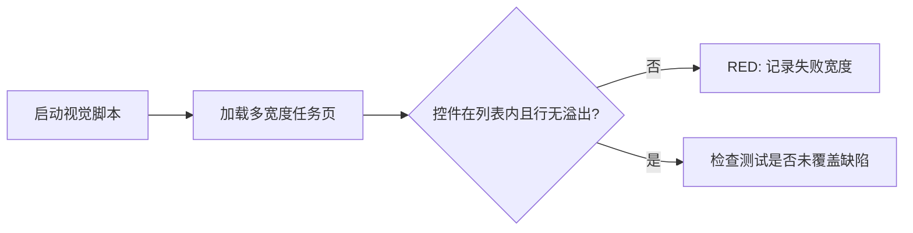
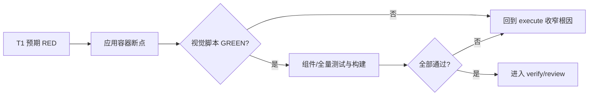

# 实施计划：任务操作列布局修复

## 交付单元与阅读导航

- ID：`bilicatch-task-actions-layout-fix-20260913`
- 目标：操作控件在任务列表边界内完整显示。
- 任务：2 个串行任务；无并行任务；高风险点是断点边界计算。
- 依赖：已审批 spec、现有 Vite 服务、Playwright/Edge 视觉脚本。

## 全局摘要与用户意图承接

先增强视觉回归脚本并观察 1100/851px 的预期失败，再用列表 inline-size 容器查询替代错位的 viewport 查询。不得裁剪、隐藏、缩小或改变按钮；证明问题没有被转移为页面滚动或行内滚动。

## 来源锚定与禁止扩展边界

- `USER-DEFECT-01` -> T1/T2：操作控件不得越过列表。
- code-fact-backed -> T1/T2：保留 TaskRow DOM、动作、36px 控件和现有交互。
- 每项 `product-content delta: none`；只改技术布局与验证。
- 不纳入组件、store、IPC、后端、文案、动作集合或其他页面。

## 业务功能与字段语义

业务功能点只有“用户能看到并使用任务行操作”。操作列仍表示当前状态允许的命令集合；可见性、disabled、菜单、确认和状态流均不变。无字段、校验、权限、API 或错误文案变化。

## 执行效率与上下文预算

`S1 local / narrow / compact`。只读任务页、行组件、共享按钮、task CSS、layout CSS、视觉脚本和直接测试。若需 JS resize state、DOM 重构或跨模块样式，停止并回退 spec。

## T1：建立失败的列表边界回归测试

- 目标：让真实页面在 1100/851px 的既有缺陷被自动检测。
- source/spec：AC-01、AC-02、AC-03；`USER-DEFECT-01`。
- product-content delta：none。
- 文件/符号：`scripts/verify-task-visuals.cjs` 的 cases、page.evaluate metrics、失败条件和 evidence root。
- 实施：
  1. 增加 1100、851px demo case；保留 1280、900、800、empty、error。
  2. 将证据输出到当前请求的 `verification/evidence` 并确保目录存在。
  3. 对每个数据页计算列表 rect、任务行 `scrollWidth/clientWidth`、操作控件是否越过列表、控件尺寸及 document overflow。
  4. 空/错误页没有列表时相对边界指标为 0。
  5. 运行脚本，必须因 1100/851px 的 `buttonsOutsideList` 或 `overflowingRows` 非零失败；不是路径、启动或语法错误。
- 风险：只检查 viewport 会假绿；断言必须比较 `.task-list`。
- 测试：`rtk node scripts/verify-task-visuals.cjs`，预期 RED。

## T2：按内容宽度修复并完成验证

- 目标：让六列/五列/两列布局按列表实际可用宽度切换。
- source/spec：function-complete 1-6、AC-01..04。
- product-content delta：none。
- 文件/符号：`task-management.css` 的 `.task-list`、中等/窄布局查询。
- 前置：T1 已以预期原因 RED。
- 实施：
  1. 在 `.task-list` 建立命名 inline-size container。
  2. 将 1050px viewport 中等布局改为列表容器最大 975px；阈值来自六列最小轨道 882 + 5*14 gap 70 + 24 padding = 976px。
  3. 将 850px viewport 窄布局改为列表容器最大 777px；阈值来自五列最小轨道 706 + 4*12 gap 48 + 24 padding = 778px。
  4. 保留现有 grid tracks、隐藏速度和两列映射，不改组件。
  5. 运行 T1 脚本至 GREEN，再运行 TaskRow/TasksPage tests、全量 test、typecheck、build。
  6. 检查 Git diff、引用链和证据，确认无无关格式化/调试/死代码。
- 回滚：移除 container declaration 并恢复原 media query；若 Edge/WebView2 运行不支持则回退 spec 选择布局方案，不用 JS 猜测。
- code-review 预检：
  - 健壮性：无外部数据/null/API；断点覆盖临界宽度。
  - 可维护性：阈值在计划/规格中可追溯，不新增抽象或文件。
  - 性能/内存：CSS 原生响应式，无 resize listener、watcher 或 cleanup。
  - 技术栈：沿用现有集中 CSS、Vue DOM、Playwright 脚本，不加依赖。
  - 业务 UI：按钮语义和所有视觉状态不变。

## 执行可用性与变更链路合同

- 变更前链路已确认：TasksPage -> task-list -> TaskRow Grid -> actions -> AppIconButton/menu。
- owning：CSS 布局与视觉脚本；邻接：组件事件、store/service、动作策略。
- 变更后复查：Vue 文件零 diff；按钮数量/ARIA 测试不变；无 row/document overflow。
- 不删除代码，不新增类型/API/状态/helper/component。
- Pattern：Level 0 direct code，none；无结构性变化轴，禁止引入 JS resize observer/composable。

## 前端工程、生产质量与评审约束

- 保留原生语义控件、焦点、ARIA、disabled、36px 目标和菜单。
- 不新增响应式状态、副作用、缓存、监听器或 bundle 依赖。
- diff 只允许 CSS、验证脚本与请求工件；无顺手重构。
- Tailwind 偏好与仓库技术栈冲突时，以不引入新技术栈为锚：仅编辑现有 CSS owner，不新增 semantic class。

## API、类型、函数式、架构复用、脚手架

均不适用：无数据/规则转换、共享抽象、API、TypeScript 或 greenfield 变更。

## 测试策略

- RED/GREEN：`rtk node scripts/verify-task-visuals.cjs`。
- focused：`rtk npm test -- src/features/task-management/components/TaskRow.test.ts src/pages/TasksPage.test.ts`。
- regression：`rtk npm test`、`rtk npm run typecheck`、`rtk npm run build`。
- 指标：buttonsOutsideList=0、overflowingRows=0、clippedButtons=0、undersizedButtons=0、documentWidth<=viewportWidth。

## 自愈闭环、观察与回滚

execute 后必须进入 verify/review。按 requirement-mismatch、plan-gap、architecture-gap、logic、syntax/type、runtime、organization、maintainability、technical-debt 分类；可修复项回流 owning stage。iteration <=7，同一 blocker 同 stage 连续 <=2、总 <=3；无新证据/修复/更窄诊断即 blocked。完成要求两项 self-healing verdict pass 且 blocker none。开发服务与视觉指标是观察点，最终结果为人工交接点。

## Execute-Readiness 自检

文件、规则、阈值、前后行为、测试顺序、失败条件、回滚和禁止项均已明确；无产品待确认项，execute 无需猜测。
