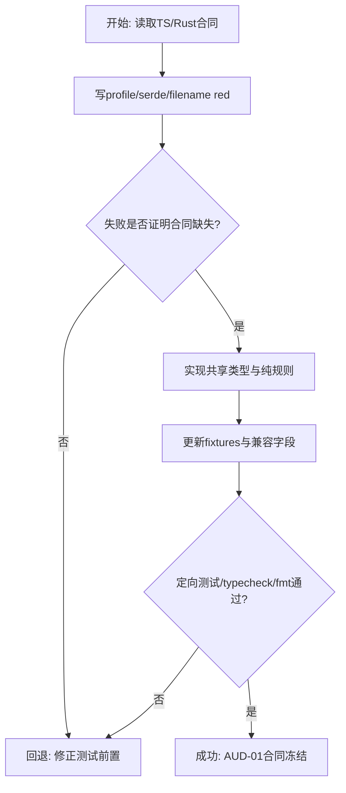
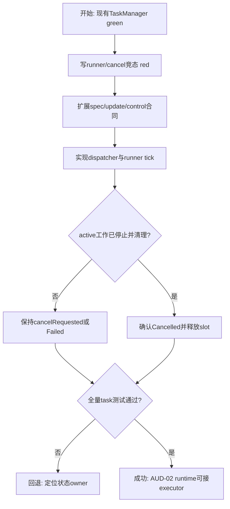
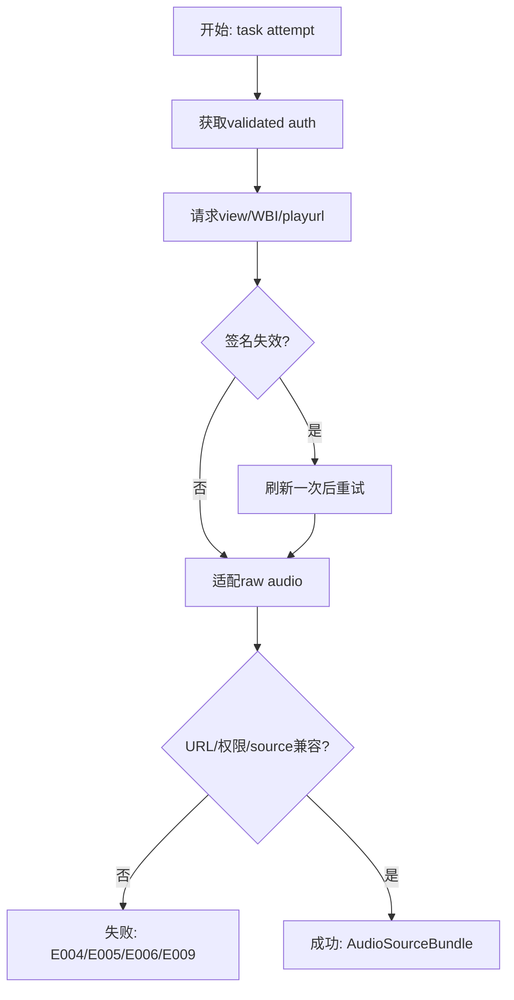
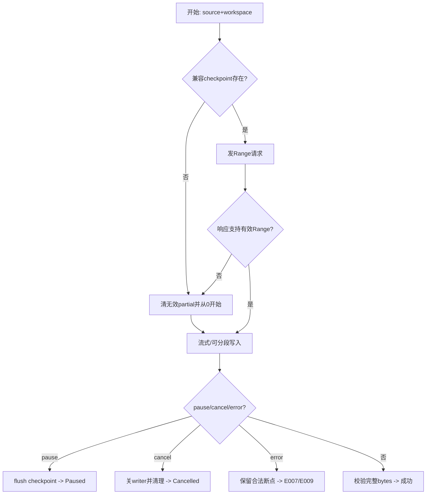
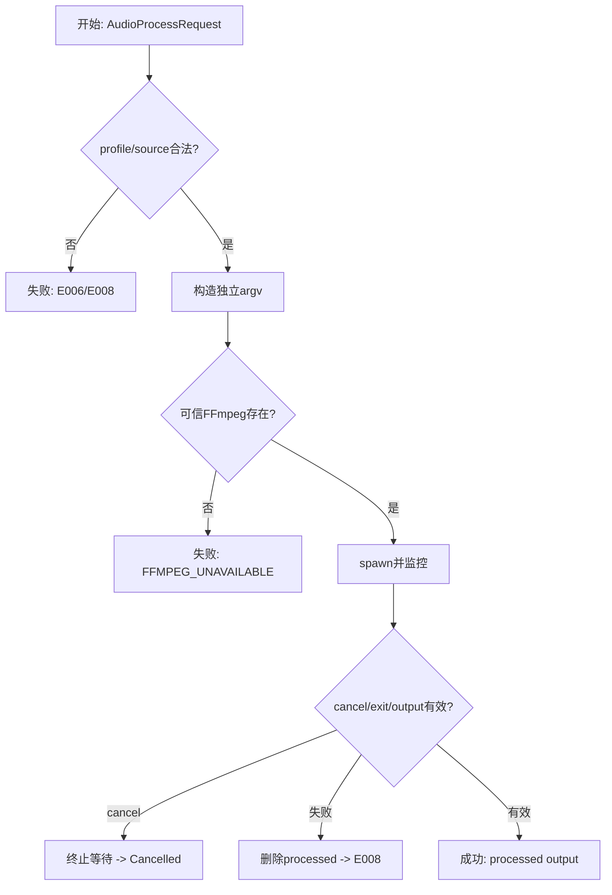
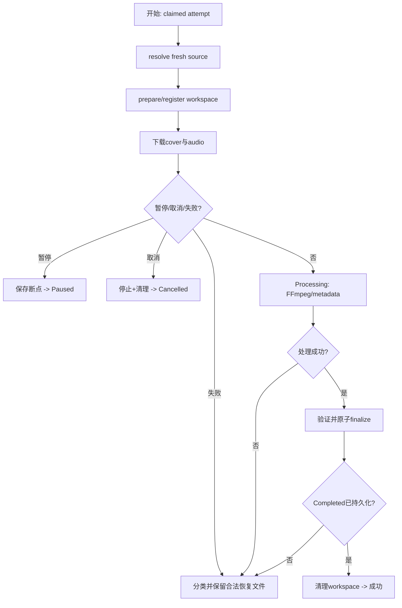
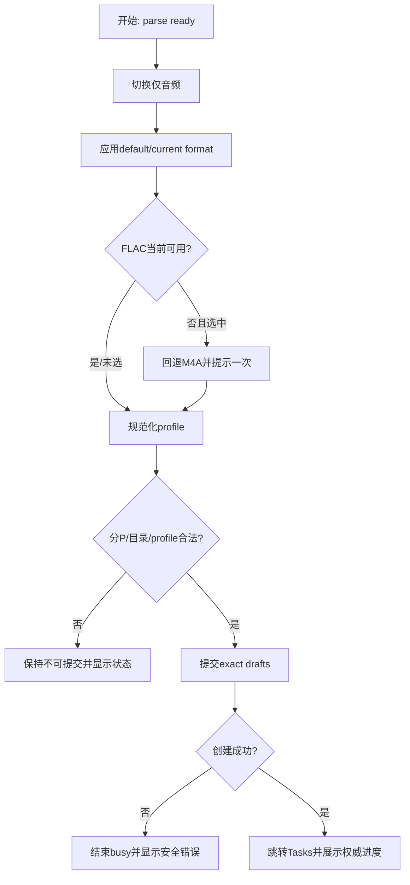
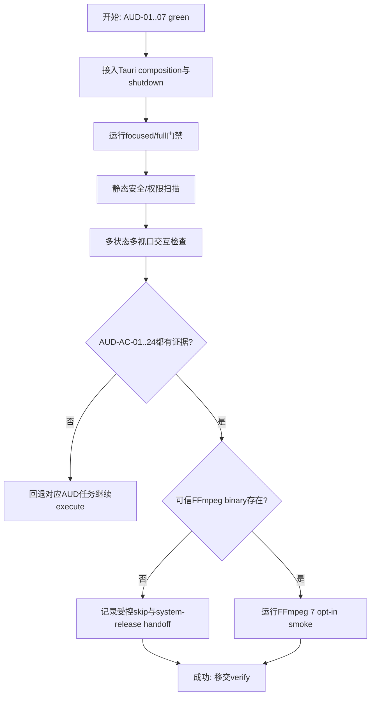

# 音频独立下载实施计划

> **执行约束：** 执行时使用 `frontend-agent-framework-execute`，按 AUD-01 至 AUD-08 串行推进。每项遵循 red -> green -> refactor，完成定向门禁并更新 task-board/changelog 后才能进入下一项。当前目录不是 Git 仓库，不创建虚假 commit 检查点。

**Goal:** 让已入队的 `audio-only` 任务通过可信 Rust 后台执行链输出带标题、UP 主和封面的 MP3/M4A/FLAC，并正确支持权限、断点、暂停、取消、重试和清理。

**Architecture:** TaskManager继续拥有状态与持久化；DownloadRuntimeRunner负责认领/控制/分派；AudioExecutor线性编排 source、Range downloader、workspace、FFmpeg和finalize。Vue仅负责合法output profile和既有任务状态呈现。

**Tech Stack:** Vue 3、TypeScript strict、Pinia、Vitest、Tauri 2、Rust、Tokio、reqwest、serde、FFmpeg 7.x CLI contract。

**Spec:** `docs/requests/bilicatch-v1-desktop/module-runs/audio-download/spec/spec.md`

## 交付单元标识

`audio-download`

## 阅读导航

| 项目 | 内容 |
| --- | --- |
| 任务总数 | 8 |
| 执行模式 | 全部串行；不启用 workflow/subagent |
| 高风险任务 | AUD-02 active cancel、AUD-04 Range/checkpoint、AUD-06 executor cleanup/finalize |
| 主线 | 合同 -> runtime -> source -> download/workspace -> FFmpeg -> executor -> UI -> 验收 |
| 规格覆盖 | AUD-AC-01..24 全部映射 |
| 跨模块依赖 | FFmpeg二进制打包留给system-release；本模块交付adapter与受控E008 |

## 全局摘要

实施先修正 `audioBitrateId` 的语义并扩展 parse/draft/internal execution合同；然后让TaskManager具备真实runner所需的支持模式认领、workspace登记和cancel acknowledgement。外部副作用按B站source、HTTP/workspace、FFmpeg三个边界分别TDD，最后由AudioExecutor组成线性工作流并接入Tauri生命周期。前端在后端合同稳定后补格式/profile、FLAC回退、任务副信息和错误文案，最终执行全量、恢复、安全和视觉门禁。

最大风险是现有任务取消会在writer停止前清理文件，以及断点文件/最终rename在Windows上的竞态。任何状态合同不兼容回spec，真实调用链不适配回architecture-design；不得用静默降级、跳过metadata或依赖系统PATH规避失败。

## 任务拆解

### AUD-01：跨端音频合同、Profile矩阵与命名规则

**目标与规格映射**

冻结 `AudioOutputProfile`、`audioCapability`、draft命名字段、format/profile校验与文件名结果。覆盖 AUD-AC-01、04..06、18、21、24。

**范围与文件**

- Modify: `src/contracts/media.ts`、download-center/task-management contracts与fixtures。
- Create: `src/features/download-center/audio-options.ts`及测试。
- Modify: `src-tauri/src/models/{parse,task}.rs`、`services/tasks/{validation,filename,manager}.rs`及contract/manager tests。
- Read first: 根 `tsconfig.json`、`src/vite-env.d.ts`、直接导入类型；保持strict、bundler、no alias。

**实现子项与禁止猜测边界**

- TS/Rust固定 profile：MP3 `128|192|320`、M4A `source`、FLAC `lossless`；不接受任意string组合。
- `ParseVideoResult.audioCapability` required；旧demo/test fixture显式更新，不用默认true。
- draft新增camelCase `videoTitle`/`partCount`；单P/多P命名、trim/折叠空白/非法字符/char边界200长度/fallback/冲突策略按spec。
- `audioBitrates`保留兼容但不再拥有output选择语义；不得在组件重复矩阵。

**TDD与完成条件**

- 先写TS矩阵red和Rust exact serde/validation/filename red；确认失败点来自缺失合同。
- 最小实现后跑相关Vitest、Rust contract/task tests、typecheck/fmt/check。
- 完成条件：两端矩阵fixture一致，原任务/解析合同回归通过，无UI或I/O实现。

**风险与回退**

旧task JSON不含新增draft字段但已含fileName，加载必须继续成功。若必须变更persisted schema，暂停并回spec，不静默清空。



### AUD-02：Task Runtime、支持模式认领与取消确认

**目标与规格映射**

把deferred任务宿主改为可控runner协议，保证active工作停止后才取消/清理。覆盖 AUD-AC-07、10、14、15、17、21、24。

**范围与文件**

- Create: `src-tauri/src/services/download_runtime/{mod,ports,dispatcher,runner}.rs`。
- Modify: `services/tasks/{ports,manager,mutations,state_machine,mod}.rs`、`infrastructure/tasks/*`、settings runtime provider与Rust tests。
- 暂不接Tauri production composition；用fake executor/reporter/clock驱动runner tick。

**实现子项与状态约束**

- 扩展internal `TaskExecutionSpec`：task snapshot、attemptId、connectionCount、temporaryDirectory。
- TaskManager只认领executor声明支持的mode；未支持video保持queued。
- 增加 `WorkspacePrepared`、`Cancelled` update与pending control查询；所有update保持attempt检查。
- queued/paused cancel可同步清理；downloading/processing只记录cancelRequested，runner转送并等待ack。
- runner先处理controls再claim，start快速返回handle；每attempt唯一handle，完成/panic释放slot，不持锁await、不busy-spin。

**TDD与完成条件**

- fake executor red覆盖支持模式、并发3/动态limits、start并行、重复control、pause/cancel ack、cleanup failure、旧attempt、panic/退出回收。
- 更新既有task manager/control/recovery测试，明确active cancel不再立即Cancelled。
- 完成条件：runtime在fake环境可完整推进状态且所有既有task tests通过。

**风险与回退**

若现有同步command无法表达pending结果，只保留公开DTO不变并通过后续事件确认；不得新增前端audio状态。



### AUD-03：B站Fresh Source、认证能力与安全URL适配

**目标与规格映射**

从每个attempt的fresh validated auth解析可下载音频源与metadata，严格执行匿名/登录/FLAC能力。覆盖 AUD-AC-02、03、05、08、18、19、22、24。

**范围与文件**

- Create: `src-tauri/src/services/audio/{mod,ports,source}.rs`、`infrastructure/bilibili/audio_source.rs`。
- Modify: `infrastructure/bilibili/{raw,adapter,client,mod}.rs`、`services/parser.rs`（只抽取必要共享WBI/playurl流程）、parse fixtures/tests。
- 不下载媒体字节、不写文件、不启动FFmpeg。

**实现子项与API边界**

- 扩展raw DASH的id、URL、backup、codec/container和FLAC/Hi-Res结构；适配为不含raw类型的 `AudioSourceBundle`。
- 每attempt重新validated auth、view、WBI/playurl；签名只刷新重试一次。共享流程避免parser/audio复制签名规则。
- 选择策略：匿名有损<=64K，认证有损<=192K，Hi-Res/无损显式分支；FLAC无真实无损候选则E005/E006。
- 所有media/cover URL执行HTTPS+host suffix验证，redirect逐跳重验；错误/Debug/serde不含URL query和credential。
- parse端生成 `audioCapability`；旧 `audioFormats/audioBitrates` 保持兼容语义边界。

**TDD与完成条件**

- fixture表覆盖anonymous/authenticated、lossy/HiRes/FLAC、无audio、签名重试、过期auth、主/备URL与恶意host。
- secret serialization/debug/static scan必须无cookie/URL；parser现有缓存/auth测试全部通过。
- 完成条件：fake Bilibili port可产生稳定bundle和能力，错误码分类精确。

**风险与回退**

真实raw字段无法由fixture证明时记录并回architecture/spec；不得用普通有损源构造lossless标志。



### AUD-04：可信Workspace、Range下载与Checkpoint恢复

**目标与规格映射**

实现流式音频字节下载、分段能力降级、持久断点和受限清理。覆盖 AUD-AC-06、09、10、13..17、19、21、22、24。

**范围与文件**

- Create: `src-tauri/src/infrastructure/download/{mod,http_downloader}.rs`、`infrastructure/audio/{mod,workspace}.rs`。
- Create/Modify: loopback HTTP helper、workspace/checkpoint integration tests。
- 依赖变更仅限必要Tokio/reqwest feature与窄运行依赖；不添加aria2或WebView权限。

**实现子项与状态约束**

- task hash workspace，source/cover/processed/checkpoint路径全部canonical containment；checkpoint不存URL/cookie。
- 206校验Content-Range；200忽略Range重置一次；416只在本地长度等于total时完成；identity/etag/长度不兼容从0开始。
- total+Range稳定才按connectionCount分段，否则单连接；合并验证无空洞/重叠/短读。
- 流式写盘；typed E007/E009；progress映射所需bytes/total/speed/eta，不在adapter改TaskStatus。
- pause flush后返回Paused，cancel关闭writer后返回Cancelled；重复cleanup幂等且只针对task workspace。
- 同名输出目标原子占位/`(n)`，finalize同卷rename、不覆盖。

**TDD与完成条件**

- 先以loopback server写206/200/416/ETag变化/断流/无长度/恶意redirect red。
- temp目录测试覆盖checkpoint损坏、restart、ENOSPC mapper seam、containment、cleanup、同名并发与Windows handle顺序。
- 完成条件：最终bytes逐字节一致，暂停/恢复/取消/失败文件集合符合spec。

**风险与回退**

多连接正确性无法证明时退化单连接并保留合同；不得牺牲完整性追求连接数利用率。



### AUD-05：FFmpeg参数、可信Locator与可取消Process Adapter

**目标与规格映射**

交付无shell的MP3/M4A/FLAC处理合同、metadata/cover和E008边界。覆盖 AUD-AC-11、12、15、16、18、19、22、23、24。

**范围与文件**

- Create: `src-tauri/src/services/audio/ffmpeg_args.rs`、`infrastructure/audio/{ffmpeg,ffmpeg_locator}.rs`及tests。
- Modify: Cargo Tokio process feature/必要依赖；不新增Tauri shell plugin或capability。
- `system-release`后续只提供预期sidecar文件/路径，不改AudioProcessRequest语义。

**实现子项与API约束**

- 纯argv builder固定：MP3 libmp3lame+三档；M4A `-c:a copy`；FLAC encoder且source tier前置校验。
- title/artist/cover作为独立argv；attached picture映射、non-interactive和内部processed覆盖明确。
- locator只接受可信resource/development injection路径，不扫PATH、不接受WebView输入。
- process adapter限制stderr，区分unavailable/exited/output invalid，统一E008；cancel终止并等待handle/文件关闭。
- 输出存在、非空且probe合同满足后才成功。real FFmpeg 7 smoke用环境显式opt-in，缺失skip。

**TDD与完成条件**

- table red覆盖三格式、非法profile、带空格/引号/Unicode metadata、无损guard和不含shell拼接。
- fake executable/process red覆盖spawn失败、非零、stderr超限、cancel、空输出、probe失败。
- 完成条件：默认测试无需系统FFmpeg，静态扫描无shell plugin/Command字符串执行。

**风险与回退**

随包binary未提供是受控E008，不可改成PATH偶然发现；cover不支持时失败而不是省略。



### AUD-06：AudioExecutor线性编排、Finalize与错误恢复

**目标与规格映射**

把source、workspace、download、process和TaskManager reporter组成完整attempt，并证明所有清理/重试出口。覆盖 AUD-AC-07..18、22、24。

**范围与文件**

- Create: `src-tauri/src/services/audio/executor.rs`、跨端口 `src-tauri/tests/audio_executor.rs`。
- Modify: audio ports/runtime dispatcher/task reporter glue。
- 全部用fake端口先完成，不在本任务接Tauri setup或Vue。

**实现子项与状态流**

- `execute`固定阶段：fresh source -> prepare/register -> cover/source download -> Processing -> process -> verify -> finalize -> Completed -> cleanup。
- progress只由download outcome映射0-90；processing不回退；final complete设置100。
- cancel intent优先于未提交完成；final rename和Completed持久化形成边界。旧attempt update由manager忽略。
- E009走NetworkFailure自动1/2/4秒；E007/E008/E005/E006走Failed。合法source/checkpoint保留，processed删除。
- success/cancel cleanup；post-completion cleanup warning不删除output、不重跑完成任务。
- 每个外部await前后检查control/cancellation，所有打开资源在状态ack前释放。

**TDD与完成条件**

- fake场景矩阵：MP3/M4A/FLAC happy path、metadata、source变化、pause/resume/restart、download/process cancel、每类error、cleanup failure、late update、retry reuse。
- 断言调用顺序、状态/event顺序、workspace最终集合和不含secret。
- 完成条件：规格工作流每个出口都有deterministic test，executor文件经职责拆分保持可读。

**风险与回退**

若编排需要直接写TaskManager state或adapter跨层调用，回AUD-02/architecture，不在executor中绕过reporter。



### AUD-07：下载中心/任务页联动、双语与可访问性

**目标与规格映射**

在既有页面完成output profile选择、FLAC回退、任务副信息和安全错误反馈。覆盖 AUD-AC-01..06、10、14、15、18、20、21、24。

**范围与文件**

- Modify: `features/download-center/{store,components/DownloadOptions}.ts/vue`、DownloadPage composition/tests。
- Modify: auth/download-center effects或窄输入接口、task-management formatter/error presenter/TaskRow tests。
- Modify: `locales/{zh-CN,en-US}.ts`、demo fixtures与相关CSS；不新增页面/路由/card。

**交互与状态约束**

- only-audio隐藏quality/codec；format顺序固定；MP3启用三档，M4A/FLAC显示disabled profile值。
- default/current FLAC失效时M4A回退+一次aria-live提示；M4A不可用则清空并禁用入队。
- format切换恢复会话内上次MP3选择；auth/parse迟到结果不能复活失效FLAC或产生watch循环。
- draft精确提交videoTitle/partCount/profile；loading从现有create开始，在成功/失败结束。
- task副信息按输出profile显示；E007/E008/E009/E005/E006本地化，不显示raw message/details/path/URL。
- 保留既有desktop/narrow布局、键盘label/focus，长英文不溢出。

**TDD与完成条件**

- store red覆盖format联动、default fallback、auth变化、无audio、last MP3、exact drafts和stale result。
- component/page red覆盖选项、disabled/aria、提示一次、busy结束、task metadata/errors和zh/en。
- 完成条件：相关Vitest/typecheck通过，组件不import Pinia/Tauri/FFmpeg合同。

**风险与回退**

认证状态接入只使用公开AuthSnapshot，不向download store传credential/revision内部字段。若需要全局watch fan-out，回architecture调整composition owner。



### AUD-08：Production Composition、全量回归与验收证据

**目标与规格映射**

接入Tauri生命周期，运行全部门禁并建立AUD-AC-01..24证据。覆盖全部验收标准。

**范围与文件**

- Modify: `src-tauri/src/lib.rs`、services/infrastructure module exports、Cargo manifests/locks、必要Tauri config（不新增WebView权限）。
- Create: audio demo/fake states（只在既有demo机制内）、execution changelog与后续verification evidence目录。
- Run: focused/full Vitest、typecheck/build、Cargo fmt/check/test、静态扫描、视觉/交互检查、可选FFmpeg smoke。

**实现与验证子项**

- composition顺序：Arc settings/auth/task -> source/downloader/workspace/processor -> AudioExecutor -> dispatcher -> runner spawn；shutdown收束handles。
- production仅认领audio；video保持queued。FFmpeg locator缺失时稳定E008，Retry可在sidecar后来可用后复用source。
- 静态扫描：cookie/SESSDATA/media URL/stderr/path泄漏、shell字符串、PATH扫描、危险remove、WebView capability。
- 视觉：下载中心/任务页desktop+narrow、zh/en、light/dark、FLAC disabled/fallback、download/processing/error/cancel pending；检查overflow/overlap/focus/aria。
- 建立AC矩阵，任何fail回对应AUD任务；只有全量无blocker才进入verify。

**完成条件**

- 前端/Rust全量门禁通过，现有156/85基线无回归并包含新增测试。
- 默认CI不访问公网/真实credential/system FFmpeg；opt-in smoke结果单列。
- task-board/changelog完整，AUD-AC-01..24每项有自动或人工证据入口。

**风险与回退**

composition启动失败撤回AUD-08接线，不撤销已green纯模块；依赖/lock变化只保留已验证最小项。无Git时按owner文件与task-board恢复，不覆盖用户变更。



## 功能拆解明细

| 功能单元 | Owner | 输入 | 输出/副作用 | 失败语义 | 任务 |
| --- | --- | --- | --- | --- | --- |
| output profile矩阵 | TS audio-options + Rust validation | format/profile/auth/capability | 合法草稿 | 禁止提交/原子拒绝 | AUD-01/07 |
| 文件命名 | Rust filename | videoTitle/part/page/ext | 安全不冲突文件名 | fallback/去重 | AUD-01/04 |
| runtime调度 | runner + TaskManager | queued/control/settings | attempt/status | pending/ack/ignored late | AUD-02 |
| fresh source | Bilibili adapter | bvid/cid/auth/profile | source+metadata | E004/E005/E006/E009 | AUD-03 |
| Range/checkpoint | downloader/workspace | URLs/offset/connections | source bytes/checkpoint | E007/E009/pause/cancel | AUD-04 |
| media处理 | FFmpeg adapter | source/cover/profile/metadata | processed file | E008/cancel | AUD-05 |
| attempt编排 | AudioExecutor | execution spec/ports | completed output/task updates | 分类恢复/cleanup | AUD-06 |
| UI联动 | download/task features | parse/auth/task snapshot | 表单/提示/状态 | 本地化安全反馈 | AUD-07 |
| production/evidence | composition/verification | 全模块 | runner+证据 | blocker回owner | AUD-08 |

文本输入语义仅涉及后端接收的解析元数据：`videoTitle/partTitle` 不由用户在当前UI编辑；Rust在命名时trim、折叠连续空白/换行、移除控制/非法字符，在归一化后判断空和200字符。计划禁止新增自由文本字段或让前端承担可信文件名生成。

## 项目脚手架与初始化策略

- 复用现有create-tauri-app、Vue/Pinia/Vitest和Rust command-service-infrastructure结构，不重跑生成器。
- 仅增加audio/download_runtime/infrastructure模块与必要Tokio/reqwest能力；不替换框架、router、UI库或task store。
- 禁止引入aria2、WebView shell/filesystem/HTTP插件、通用DI容器或新页面脚手架。

## API 对接与类型策略

| 合同 | 权威来源 | Request/Adapter owner | 类型策略 | 驱动状态 |
| --- | --- | --- | --- | --- |
| ParseVideoResult.audioCapability | Rust serde field table | ParserService/Bilibili adapter | TS保留camelCase镜像 | format availability/fallback |
| DownloadTaskDraft扩展 | Rust serde field table | existing task service direct consume | TS保留videoTitle/partCount/profile | create busy/success/error |
| task commands/events | existing Rust task DTO | existing task service | 无新增IPC，直接消费 | queued/download/processing/terminal |
| B站view/playurl | private raw fixture/field table | BilibiliAudioSource adapter | raw Rust -> stable internal bundle | source success/permission/error |
| HTTP Range | HTTP status/header合同 | ReqwestRangeDownloader | typed internal request/outcome | progress/pause/E007/E009 |
| FFmpeg 7 CLI | approved argv field table | MediaProcessorPort adapter | typed AudioProcessRequest -> argv | processing/E008/cancel |

无backend TypeScript、protobuf、OpenAPI或生成类型。执行先读根tsconfig与直接导入类型，TS保持strict/no alias；semantic normalization只在audio-options或Rust adapter，不在template computed散落。

## 依赖关系

```text
AUD-01 -> AUD-02 -> AUD-03 -> AUD-04 -> AUD-05 -> AUD-06 -> AUD-07 -> AUD-08
```

- AUD-02依赖internal合同；AUD-06依赖所有外部port已green。
- AUD-07等待Rust/TS合同稳定，避免UI以临时字段实现。
- AUD-08只负责composition和收口，不补业务规则。

## 整洁性与复杂度控制

- TaskManager、runner、AudioExecutor、source、downloader、workspace、processor各只有一个原因变化；任何跨层捷径视为blocker。
- profile/source tier、状态、error和filename规则各有单一owner，跨端只用fixture验证镜像，不复制raw逻辑。
- `AudioExecutor::execute`保持可读阶段函数；runner不持锁await；adapter错误不靠字符串分类。
- 文件约250行进入职责审查，超过350行拆分；不以无语义wrapper规避。
- production禁止`any`、silent catch、raw stderr/URL/cookie日志、shell拼接、任意递归删除。

## 模式决策与替代方案

| Pattern | 使用点 | 解决问题 | 拒绝方案/移除信号 |
| --- | --- | --- | --- |
| Strategy | dispatcher的audio/video执行变化轴 | 后续video不污染runner | runner大match；若永远仅一类任务则可收回 |
| Adapter/Port | B站/HTTP/workspace/FFmpeg/reporter | 外部失败与deterministic fake | UI/用例直接I/O；无替身价值的空端口应移除 |
| State/Command | existing TaskManager + cancel ack | 副作用完成与状态一致 | audio自建状态机 |
| Observer | existing task event | 实时跨线程更新 | audio专属event/general event bus |

格式分支仅用enum+纯函数，不建立每格式class hierarchy。

## 代码上下文与影响范围

- 入口：DownloadPage/DownloadOptions、TasksPage/TaskRow、Rust `lib.rs`、TaskManager、ParserService。
- 核心邻居：auth validated context、settings runtime paths/limits、JSON task recovery、Bilibili WBI/raw adapter。
- 回归敏感：active cancel、persisted V1 load、parse cache/auth revision、task progress coalescing、download defaults。
- code graph仍missing，使用已更新code-context与`rg`调用链；发现新调用者先补context再改。

## 并行执行建议

- 建议并行任务数：0。八项共享task DTO/runtime、Bilibili raw和audio ports，严格串行可确保每个red真实且避免同文件冲突。
- 不启用subagent/workflow；同一时间task-board只有一个 `in_progress`。

## 触发与上下文准备

- 触发：用户明确批准本计划后，状态切到execute。
- 每项开始读取对应spec、Files、Interfaces、根tsconfig/相关Rust owner；不全量扫描无关`.d.ts`。
- 若需要下载新crate且沙箱网络失败，按权限流程请求，不用替代包改变架构。
- 可测试行为严格TDD；真实B站/FFmpeg只作为opt-in smoke，不替代fake验证。

## 受影响文件或模块

| 区域 | 预计变化 |
| --- | --- |
| TS contracts/UI | media、download-center、task-management、locales、fixtures/tests |
| Rust task/runtime | task models/services/store、download_runtime、settings provider |
| Rust media | Bilibili raw/client/adapter、audio service/infrastructure |
| I/O/process | Range downloader、workspace、FFmpeg adapter/locator |
| Composition/config | `lib.rs`、module exports、Cargo manifest/lock、无新增WebView权限 |
| 文档 | task-board、execution changelog、verification evidence |

## 测试策略

- TS unit/component：profile matrix、auth/source fallback、exact draft、task副信息/错误、a11y/i18n/stale状态。
- Rust pure/contract：serde、validation、filename、source selection、argv、error mapping。
- Rust runtime/integration：runner control races、loopback Range、checkpoint/restart、workspace containment、fake process、完整AudioExecutor场景矩阵。
- 回归：全量Vitest/typecheck/build、Cargo fmt/check/test；现有基线不得减少。
- 静态安全：secret/media URL/stderr/path、shell/PATH、unsafe cleanup、Tauri capability/import owner。
- 视觉：既有download/tasks desktop+narrow、light/dark、zh/en及关键disabled/fallback/processing/error状态。
- opt-in：可信FFmpeg 7真实三格式metadata/cover probe；公网B站不进入默认门禁。

## 验收标准映射

| 验收标准 | 主要任务 | 计划证据 |
| --- | --- | --- |
| AUD-AC-01 | AUD-01/07 | profile矩阵与控件测试 |
| AUD-AC-02 | AUD-03/07 | auth/source availability测试 |
| AUD-AC-03 | AUD-03/07 | 回退一次与执行期失败测试 |
| AUD-AC-04 | AUD-01 | TS/Rust shared fixture+atomic validation |
| AUD-AC-05 | AUD-03/06 | source policy与320-from-lower测试 |
| AUD-AC-06 | AUD-01/04 | filename/冲突/原子输出测试 |
| AUD-AC-07 | AUD-02/08 | supported claim/limits/composition测试 |
| AUD-AC-08 | AUD-03/06/08 | fresh auth/source与secret scan |
| AUD-AC-09 | AUD-04 | loopback Range矩阵 |
| AUD-AC-10 | AUD-02/04/07 | progress/旧attempt/UI测试 |
| AUD-AC-11 | AUD-05 | argv table与source guard |
| AUD-AC-12 | AUD-05/06 | metadata/cover/output probe |
| AUD-AC-13 | AUD-04/06 | processing/finalize/Completed顺序 |
| AUD-AC-14 | AUD-02/04/06 | pause/resume/restart测试 |
| AUD-AC-15 | AUD-02/04/05/06 | cancel acknowledgement竞态 |
| AUD-AC-16 | AUD-04/06 | workspace结果集合/retry reuse |
| AUD-AC-17 | AUD-02/06 | 1/2/4 retry与error分类 |
| AUD-AC-18 | AUD-01/03/05/07 | 双语错误与泄漏测试 |
| AUD-AC-19 | AUD-03..05/08 | containment/URL/argv/capability扫描 |
| AUD-AC-20 | AUD-07/08 | a11y、DOM metrics与截图 |
| AUD-AC-21 | AUD-01..08 | 全量构建/测试门禁 |
| AUD-AC-22 | AUD-03..06 | fake端到端场景矩阵 |
| AUD-AC-23 | AUD-05/08 | opt-in smoke与system-release handoff |
| AUD-AC-24 | AUD-01..08 | clean-code/pattern review checklist |

## 观察与人工介入点

- 观察：attempt/handle数量、control request/ack顺序、source tier选择、checkpoint offset、Range响应、workspace文件集合、FFmpeg argv/exit、event sequence。
- 人工介入：仅在可信FFmpeg binary可用时执行real smoke；sidecar打包、签名和安装路径最终由system-release验收。
- execute完成后自动进入verify/review；只有spec/architecture不兼容或外部资源门禁才停下。

## 回滚说明

- 无Git元数据，按task owner文件和task-board恢复最近green状态，不删除/覆盖用户已有变更。
- AUD-01合同失败不得继续runtime；AUD-02状态失败不得继续I/O；AUD-03..05各自可回退adapter而保留前序纯合同。
- AUD-08 composition失败只撤销接线，不撤销已验证模块；manifest/lock只回退本模块新增依赖。
- 测试只使用temp目录/loopback/fake credential，不操作用户真实下载、设置或凭据。

