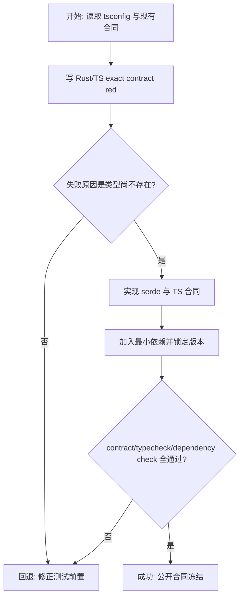
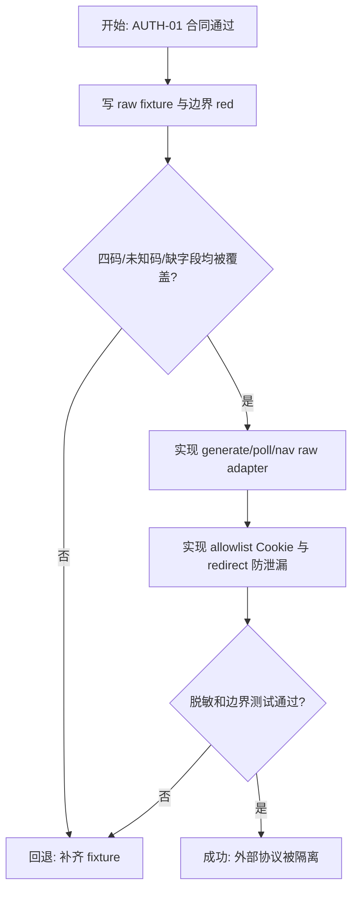
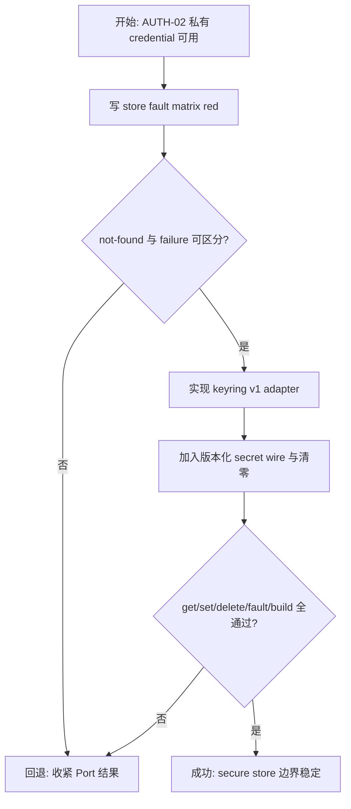
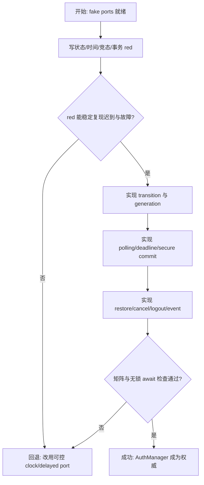
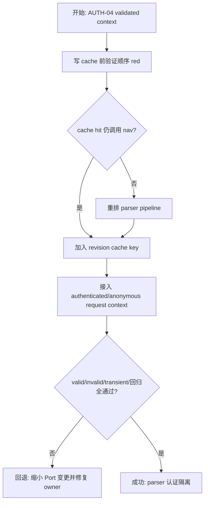
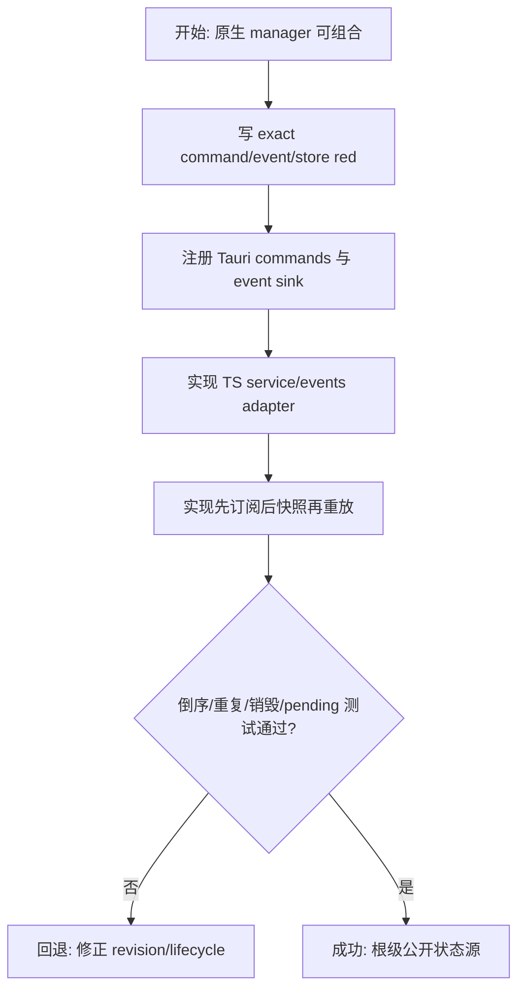
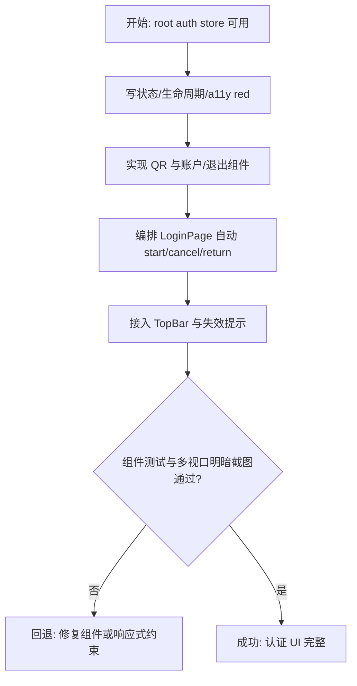
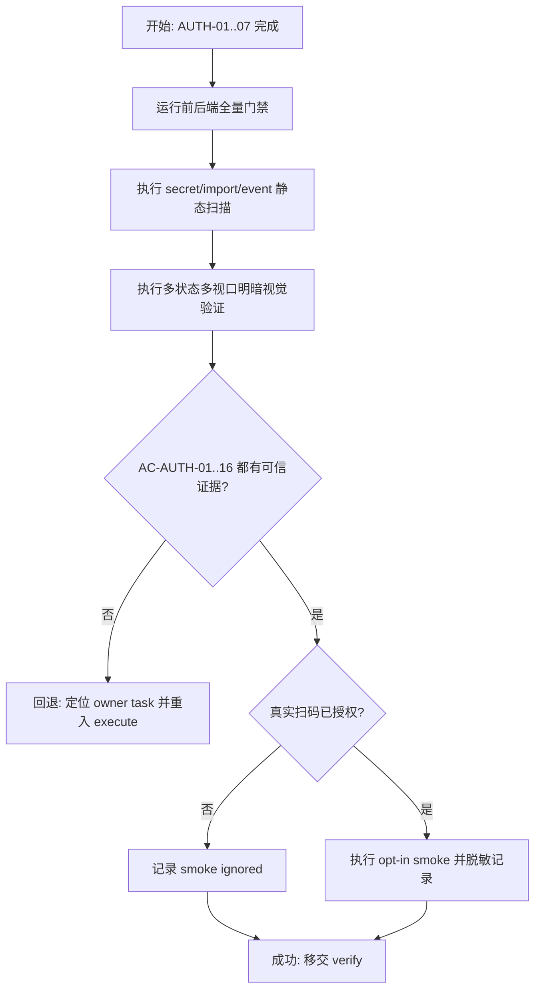

# 登录与认证实施计划

> **For agentic workers:** 执行时使用 `frontend-agent-framework-execute` 与 `superpowers:executing-plans`，严格按 AUTH-01 至 AUTH-08 串行推进。每项先建立可信 red，再完成 green、定向门禁与 task-board 更新。当前目录不是 Git 仓库，不伪造 commit 检查点。

**Goal:** 交付由 Rust 权威管理、系统凭据库安全持久化、根级 Vue store 同步的 B 站扫码认证，并让每次解析在缓存前使用已远端验证的认证上下文。

**Architecture:** Rust `AuthManager` 统一拥有 generation、revision、二维码轮询、凭据事务和状态提交；B 站 HTTP、系统凭据库、时钟/睡眠与事件发送由小型 Port/Adapter 隔离。`ParserService` 只消费 `AuthContextProvider`。Vue 通过单一 `auth://state` 根级订阅合并公开 snapshot，页面与顶栏不接触 transport 或 secret。

**Tech Stack:** Vue 3、TypeScript strict、Pinia、Vue Router、vue-i18n、Naive UI、Lucide、`qrcode`、Tauri 2、Rust 1.98、Tokio、reqwest、keyring 4、secrecy/zeroize、Vitest。

**Spec:** `docs/requests/bilicatch-v1-desktop/module-runs/authentication/spec/spec.md`

## 交付单元与全局约束

- 交付单元：`authentication`；只覆盖认证、解析认证上下文与对应 UI，不实现设置、下载执行、系统发布或多账号。
- 四个 command 均无参数：`get_auth_snapshot`、`start_qr_login`、`cancel_qr_login`、`logout`；唯一事件为 `auth://state`。
- Cookie、refresh token、`qrcode_key`、Set-Cookie、raw body 不得进入 public DTO、TypeScript、DOM 文本、日志、错误 details 或普通文件。
- 安全存储使用 `keyring = "4"` 默认 `v1`；不可用时 fail closed，不提供 JSON、sample store、硬编码密钥或 WebView secret 权限回退。
- 每次 parse 必须在读取结果 cache 前远端 nav 验证，不使用 TTL；瞬时失败保留 credential，明确失效才删除并匿名降级。
- 轮询间隔 2 秒，本地 monotonic deadline 180 秒；refresh/cancel/restore 的迟到结果只能由 generation guard 丢弃。
- Rust serde DTO 是跨端合同权威；TypeScript 保持 camelCase 原名。生产 TypeScript 禁止 `any`。
- 文件约 250 行进入职责审查，超过 350 行拆分；`LoginPage.vue` 目标不超过约 160 行。
- 所有 shell 命令以 `rtk` 开头；Rust 使用 `C:/Users/yangjianlin/.cargo/bin/cargo.exe`。

## 阅读导航

| 项目 | 内容 |
| --- | --- |
| 任务总数 | 8 |
| 执行模式 | 全部串行；不启用 workflow/subagent |
| 高风险任务 | AUTH-02 外部协议、AUTH-03 secure store、AUTH-04 竞态/事务、AUTH-05 parser/cache |
| 主线 | 合同与依赖 -> 外部适配 -> 安全存储 -> 状态机/轮询 -> parser 接入 -> 前端状态 -> 页面/顶栏 -> 集成验收 |
| 规格覆盖 | AC-AUTH-01..16 均绑定任务与证据 |

## 全局摘要

实施先冻结公开合同与依赖，再分别证明外部 B 站响应映射和系统凭据库故障语义。随后用 fake clock、delayed port 和 generation token 建立 AuthManager 的确定性并发测试，确保 `secure persist -> commit -> emit` 的顺序不可被破坏。Parser 接入必须改为 `normalize -> validated_context -> cache lookup -> authenticated/anonymous request`，缓存键加入 auth revision。最后才接入根级 Pinia store、LoginPage、TopBar 和退出确认。

没有真实账号不会阻塞自动化合同验收：默认使用去敏 fixture/fake port/fake keyring；真实扫码 smoke 仅在明确 opt-in 时执行，否则标记 ignored。任何行为不兼容先回规格，模块关系不兼容回架构；测试失败在当前 owner task 内修复。

## 任务拆解

### AUTH-01：跨端公开合同、上下文闭包与依赖

**目标与规格映射**

冻结 `AuthStatus/AuthAccount/AuthSnapshot/AuthStateEvent` 的 Rust serde 与 TypeScript 合同，记录 governing tsconfig，并引入实现所需最小依赖。覆盖 AC-AUTH-06、11、15、16。

**范围与文件**

- Create: `src-tauri/src/models/auth.rs`
- Modify: `src-tauri/src/models/mod.rs`
- Create: `src-tauri/tests/auth_contract.rs`
- Create: `src/features/authentication/contracts.ts`
- Create: `src/features/authentication/contracts.test.ts`
- Modify: `package.json`、lockfile、`src-tauri/Cargo.toml`、`Cargo.lock`
- Read/record: `tsconfig.json`、现有 `AppError`、`IpcTransport`、Tauri event 声明

**前置、实现与完成条件**

1. 先写 Rust exact JSON 与 TS fixture red，固定九状态、camelCase、nullable、RFC3339、revision safe integer。
2. Rust public type 只包含规格字段；`AuthAccount.mid` 为 nullable string。私有 credential 不放入 `models/auth.rs`。
3. 增加前端 `qrcode` 与声明、Rust `keyring 4`、`secrecy/zeroize` 和轮询所需最小 Tokio features；不安装 Tauri Store/Stronghold plugin。
4. `auth_contract`、TS contract suite、typecheck 和 Cargo dependency resolution 全通过，且 public JSON 字段扫描不含秘密标识。

**交互、API、测试与回退**

- 本任务不渲染 UI、不注册 command/event。
- command response/event 共同复用同一 DTO；禁止前端 mapper 重命名字段。
- 若 keyring 默认 feature 在当前目标无法构建，停止并记录平台错误；只能采用显式安全 feature gate + 不支持错误，不得降级明文。

### AUTH-02：B 站二维码与会话验证 Adapter

**目标与规格映射**

用私有 raw DTO 隔离 generate/poll/nav/Set-Cookie，输出稳定 `QrPollResult` 与验证结果；落实 host、redirect、timeout、body 上限和脱敏。覆盖 AC-AUTH-03、05、06、07、15、16。

**范围与文件**

- Create: `src-tauri/src/infrastructure/bilibili/auth_raw.rs`
- Create: `src-tauri/src/infrastructure/bilibili/auth_client.rs`
- Modify: `src-tauri/src/infrastructure/bilibili/mod.rs`、必要时复用 `client.rs` 的 bounded decode/redirect helper
- Create: `src-tauri/tests/fixtures/auth/*.json`
- Create: `src-tauri/tests/auth_adapter_contract.rs`

**前置、实现与完成条件**

1. AUTH-01 PASS；先用去敏 fixture 建 red：generate 缺字段、四个 raw code、未知 code、nav valid/invalid、非 2xx、body 超限。
2. 定义最小 `QrAuthPort`：generate 只向 manager 提供临时 `qrContent/private key`；poll 在 adapter 内映射 86101/86090/0/86038；未知码 fail closed。
3. confirmed 仅提取 allowlist，至少要求 `SESSDATA` 与 `DedeUserID`；可选 `bili_jct`、`DedeUserID__ckMd5`、`sid`、private refresh token。
4. Cookie 只加到 HTTPS B 站 allowlist host；redirect 到非 allowlist host 时不得转发。connect 8s、total 20s、body <=4MiB。
5. fixture/adapter tests 全通过，错误对象不包含 URL query、body、Cookie 或 key。

**交互、API、测试与回退**

- adapter 不拥有 auth status、revision、generation 或存储。
- 若上游字段漂移，保留 raw fixture 失败证据并只修改 adapter；不让数字状态码扩散到 manager/Vue。

### AUTH-03：系统凭据库 Port 与生产 Adapter

**目标与规格映射**

交付单账号、版本化、fail-closed 的 credential get/set/delete，并提供内存 fake 与故障注入。覆盖 AC-AUTH-05、06、07、08、15、16。

**范围与文件**

- Create: `src-tauri/src/services/auth/ports.rs`
- Create: `src-tauri/src/infrastructure/auth/mod.rs`
- Create: `src-tauri/src/infrastructure/auth/credential_store.rs`
- Create: `src-tauri/tests/auth_credential_store.rs`

**前置、实现与完成条件**

1. AUTH-02 PASS；先写 fake/production seam 的 get/set/delete/not-found/platform failure/corrupt blob red。
2. `CredentialStorePort` 只接受/返回私有 secret owner；生产 key 固定为 `com.bilicatch.app / bilibili-session`，wire schemaVersion=1。
3. secret owner 不实现 `Debug/Serialize`，临时 byte/string 用 secrecy/zeroize；解析失败不把原文放入 error。
4. NotFound -> anonymous；NoStorageAccess/PlatformFailure -> E007/E_INTERNAL。删除失败必须可被 manager 区分。
5. 所有 fault tests 与 Windows production adapter construction/build test 通过；源码扫描无 plaintext/sample fallback。

**交互、API、测试与回退**

- adapter 不保存 account UI 数据，不 emit event，不决定 authenticated。
- 跨平台 runtime 验证留到 system-release；当前平台构建失败即阻断本任务，禁止模拟成功。

### AUTH-04：AuthManager 状态机、轮询与凭据事务

**目标与规格映射**

实现恢复、开始/刷新、2 秒轮询、180 秒 deadline、取消、确认提交、退出和事件顺序，证明所有迟到响应与存储故障都不能产生错误状态。覆盖 AC-AUTH-03..08、11、12。

**范围与文件**

- Create: `src-tauri/src/services/auth/mod.rs`
- Create: `src-tauri/src/services/auth/manager.rs`
- Create as threshold requires: `src-tauri/src/services/auth/state_machine.rs`、`polling.rs`、`context.rs`
- Modify: `src-tauri/src/services/mod.rs`
- Create: `src-tauri/tests/auth_manager.rs`

**前置、实现与完成条件**

1. AUTH-03 PASS；用 fake clock/sleeper/QR/store/event sink 和 delayed promises 写全状态矩阵 red。
2. 所有 async 流程采用 `external I/O -> generation check -> secure persist -> commit -> emit`；mutex 内不 await。
3. start 先使旧 generation 失效并进入 requesting；每 2 秒 poll，180 秒硬截止且不产生第 91 次请求；deadline 后 confirmed 不保存。
4. confirmed 顺序固定：完整 allowlist -> nav valid/account -> secure set -> authenticated commit/event。任一步失败不得成功 event 或部分 secret。
5. restore：not-found anonymous、valid authenticated、invalid delete 后 anonymous、transient error 保留 secret/error。logout：delete 成功后 anonymous，失败保留 account/authenticated。
6. cancel 对 active QR 进入 cancelled，对 terminal/authenticated/anonymous 幂等；旧 generation 的 waiting/confirmed 永远忽略。

**交互、API、测试与回退**

- `expiresAt` 仅展示；硬截止使用 monotonic clock。
- event 必须携带 commit 后 snapshot；revision 严格单调。
- 若竞态测试偶发，不能放宽断言或加真实 sleep；必须修正 generation/port 设计。

### AUTH-05：Parser 认证上下文与缓存隔离

**目标与规格映射**

让每次 `parse_video` 在 cache lookup 前调用 `validated_context()`，只在验证成功时向 B 站请求加入 Cookie，并用 auth revision 隔离结果缓存。覆盖 AC-AUTH-07、09、10、16。

**范围与文件**

- Modify/Create: `src-tauri/src/services/auth/context.rs`
- Modify: `src-tauri/src/services/parser.rs`
- Modify: `src-tauri/src/infrastructure/bilibili/client.rs` 及 `BilibiliPort` 请求上下文
- Modify: `src-tauri/src/lib.rs` composition
- Modify: 相关 parser/client integration tests

**前置、实现与完成条件**

1. AUTH-04 PASS；先写调用顺序 red，证明已有 cache hit 也必须产生 nav 验证。
2. `AuthContextProvider` 返回 `ValidatedAuthContext { revision, optional secret request context }`，parser 不读取 credential store。
3. 流程固定 `normalize -> validate auth -> build revision cache key -> cache lookup -> parse`；无 TTL。
4. valid 向 allowlist B 站请求添加 Cookie；explicit invalid 安全删除、emit anonymous 后继续匿名 parse；transient error 返回 E001/E002 且不发后续受限请求。
5. 登录/退出/失效 revision 改变后旧 cache 不命中；既有 `ParseVideoResult` 与匿名 E005 语义不变。

**交互、API、测试与回退**

- 测试覆盖 cache-hit validation、valid/invalid/transient、revision separation、Cookie host containment 和既有匿名回归。
- 若现有 `BilibiliPort` 变化影响过大，只增加窄 `RequestContext` 参数，不复制 client 或 parser。

### AUTH-06：Tauri command/event 与根级 Auth Store

**目标与规格映射**

注册原生入口并建立前端单一状态源，实现 subscribe-buffer-snapshot-replay、pending 和清理。覆盖 AC-AUTH-01、06、11、12。

**范围与文件**

- Create: `src-tauri/src/commands/auth.rs`
- Modify: `src-tauri/src/commands/mod.rs`、`src-tauri/src/lib.rs`
- Create: `src/features/authentication/service.ts`、`service.test.ts`
- Create: `src/features/authentication/events.ts`、`events.test.ts`
- Create: `src/features/authentication/injection.ts`、`demo.ts`
- Create: `src/features/authentication/store.ts`、`store.test.ts`
- Modify: `src/main.ts`、`src/app/App.vue`

**前置、实现与完成条件**

1. AUTH-05 PASS；先写 command registration/serde、exact invoke/listen/unlisten 与 store ordering red。
2. Tauri commands 仅委派 AuthManager；四个 JS 调用必须无 args。事件 payload 只含 `AuthStateEvent`。
3. root store 初始化先订阅，缓冲 event，再 snapshot，再按 revision 重放；只接受更高 revision。destroyed 后响应不写入。
4. `start/cancel/logout` pending 独立且 finally 清除；subscription 失败保留 command snapshot 可用性并产生非阻塞错误。
5. demo service 仅在 DEV composition 可达，且不包含生产 Cookie/key/keyring 模拟数据。

**交互、API、测试与回退**

- LoginPage/TopBar 只读 store/actions；组件不得 import invoke/listen。
- 倒计时不写入 auth snapshot；页面自己基于 clock interval 派生。
- 如果部分 listener 创建失败，清理已创建的资源并保留可重试初始化。

### AUTH-07：LoginPage、二维码工具、TopBar 与退出交互

**目标与规格映射**

交付全部认证状态的响应式、可访问 UI，保证二维码可扫、顶栏同步、成功返回与退出确认正确。覆盖 AC-AUTH-01、02、08、10、12、13、14。

**范围与文件**

- Modify: `src/pages/LoginPage.vue`、`src/components/layout/TopBar.vue`
- Create: `src/features/authentication/components/QrLoginPanel.vue`
- Create: `src/features/authentication/components/AuthAccountPanel.vue`
- Create: `src/features/authentication/components/LogoutConfirmDialog.vue`
- Create/Modify: 对应 component/page tests、`src/styles/main.css`、中英文 locale、必要的 DownloadPage session-invalid 通知

**前置、实现与完成条件**

1. AUTH-06 PASS；先写九状态、自动 start、unmount cancel、QR renderer error、800ms return、logout focus/component red。
2. `qrcode` 只将非空且受限长度的 `qrContent` 画到 224x224 canvas；不显示/复制原文。requesting 使用同尺寸 skeleton。
3. `aria-live=polite` 只包含状态，不包含每秒倒计时；timer clamp 0..180 且卸载清理。按钮最小 36px并防重复。
4. authenticated 展示 name fallback、nullable UID、B 站 HTTPS avatar allowlist/失败占位；logout 默认焦点保留登录，关闭归还。
5. 成功状态保持 800ms 后返回有效来源，否则 `/download`；TopBar 已从 root store 更新。退出成功自动开始新 QR，失败保留账户态。
6. 样式按 >=760 双列、<760 单列、<520 QR `min(224px, 100%)`；明暗主题 QR 白底。

**交互、API、测试与回退**

- TopBar 不发 start/logout，只导航 `/login`；宽屏昵称截断，窄屏视觉隐藏但 aria-label 保留。
- DownloadPage 仅显示 session invalid 的本地化非阻塞提示，不重新实现 auth 规则。
- 视觉失败回到组件/CSS owner 修复，不通过缩小字体或隐藏功能绕过。

### AUTH-08：集成、安全、视觉与验收证据

**目标与规格映射**

执行全量门禁与 AC-AUTH-01..16 证据矩阵，确认回归、安全、视觉和外部 smoke 状态。覆盖全部 AC。

**范围与文件**

- 全 authentication scope 及 parser/AppShell/DownloadPage 回归
- Create: `docs/requests/bilicatch-v1-desktop/module-runs/authentication/execution/changelog.md`
- 后续 verify 阶段更新 verification evidence；本任务只收集可复现原始结果

**前置、实现与完成条件**

1. AUTH-07 PASS；运行定向 suite 后运行 `rtk npm test`、`rtk npm run typecheck`、`rtk npm run build`。
2. 运行 `rtk C:/Users/yangjianlin/.cargo/bin/cargo.exe fmt --manifest-path src-tauri/Cargo.toml -- --check`、Cargo check/test 与 auth integration suites。
3. 静态扫描 production TS/public DTO/log/error/event 对 Cookie/token/qrcode_key/Set-Cookie/raw body、直接 invoke/listen、plaintext/sample fallback、WebView secret capability。
4. 用 Playwright 或项目现有浏览器验证 1280/900/800 与窄屏，至少覆盖 requesting、waiting_scan、waiting_confirm、expired、error、authenticated，明暗主题；检查 overflow、重叠、截断、控件尺寸和 canvas 非空。
5. 真实扫码 smoke 没有明确授权时保持 ignored 并记录原因；不得用 fixture 冒充在线成功。
6. 每个 AC 绑定测试/截图/扫描证据后才进入 verify；任一 blocker 回到 owner task。

**交互、API、测试与回退**

- 匿名 parse、既有任务管理、AppShell 导航/主题必须回归通过。
- 当前非 Git 仓库：回退只撤销当前任务新增/修改且不覆盖用户变更，然后重跑门禁。

## Function Breakdown

| Function unit | Owner | 输入 | 输出/副作用 | 关键失败语义 |
| --- | --- | --- | --- | --- |
| Public auth contract | Rust model | internal auth state | public snapshot/event | 永不含 secret |
| QR auth adapter | Bilibili infrastructure | generate/poll/nav request | stable enum/account/private credential | 未知码/缺字段 fail closed |
| Credential store | keyring adapter | private credential | secure set/get/delete | 不可用即错误，无明文回退 |
| AuthManager | auth service | command/generation/poll result | revisioned commit/event | persist 前不 authenticated |
| AuthContextProvider | auth service | current credential | validated context/revision | invalid 清除；transient 保留 |
| Parser integration | ParserService | input + context | cached parse result | validate 在 cache 前 |
| Root auth store | Pinia | service snapshot/event | stable UI state/actions | revision replay/cleanup |
| Login UI | page/components | public snapshot | QR/account/actions | 不接触 raw URL/secret |

## 脚手架与初始化

- 复用现有 create-tauri-app、Pinia、Router、i18n、Naive UI、Lucide、Vitest、reqwest 与 AppShell。
- 依赖安装集中在 AUTH-01；执行前先读取 lockfile，不升级无关包。
- `AuthManager` 在 Tauri setup/composition 创建并 manage；restore 异步启动，初始 public snapshot 为 restoring。
- 根 store 在 `App.vue` 生命周期初始化/销毁，LoginPage 不新建全局 listener。

## API 与类型策略

- 稳定公开类型严格采用已批准 spec；Rust serde exact JSON 与 TS fixture 双向约束。
- raw external structs、StoredCredential、AuthRequestContext 均为 Rust private，不跨 IPC。
- command 无参数；不得出现空对象与嵌套 wrapper 的猜测。event payload 仅 `{ snapshot }`。
- AppError 只使用稳定 code/public message/details；details 使用结构化、去敏字段。

## 依赖、整洁性与复杂度

- 依赖方向只能为 UI -> store/service adapter -> Tauri command -> AuthManager -> ports/adapters。
- parser -> AuthContextProvider，不得 parser -> credential store；components 不得 -> store/service/transport。
- State 使用 enum + guard；Observer 仅一个 auth event；Port/Adapter 只给外部变化与确定性测试；generation token 处理迟到结果。
- 不创建通用 Event Bus、Repository、DI container、state class、credential factory 或前端 polling。
- command 只委派、store 只合并公开状态、组件只 props/emits。重复规则出现第二处即回到 owner 抽取。

## Pattern 决策

| Pattern | 使用点 | 理由 | 明确拒绝 |
| --- | --- | --- | --- |
| State enum/guard | AuthManager | 九状态与严格转换 | 状态 class hierarchy、模板散落 raw code |
| Observer | `auth://state` | 跨页同步与 revision replay | 应用级 Event Bus、多处 listen |
| Port/Adapter | QR、keyring、clock、event、auth context | 外部变化与 fake 测试 | 通用 Repository/DI container |
| Generation token | restore/start/refresh/cancel/poll | 隔离迟到 async result | 锁内 await、跨 IPC AbortController |

## 代码上下文与影响范围

- TypeScript 根配置为 strict、ES2020、DOM、ESNext/bundler、isolatedModules、noEmit、相对导入；新增声明必须纳入当前闭包。
- 直接影响 LoginPage、TopBar、App composition、DownloadPage session 提示、parser/client/cache key、Rust model/service/infrastructure/command、locales/styles/manifests。
- 必须保持 foundation AppShell、匿名 parser result、WBI/cache 行为、task-management commands/events 与 opener 回归。
- code graph unavailable 的既有记录继续有效；以 architecture artifact 的人工依赖图为权威导航。

## 并行建议与触发准备

- 并行建议：0。AUTH-01..08 共享合同、私有 credential 和状态提交顺序，采用单 agent 串行执行。
- 执行触发：用户明确批准本计划后，将 `stage` 切到 execute，并使用 `frontend-agent-framework-execute`。
- 每项开始前只加载该任务直接相关文件与 governing config；遇到 bug 使用 systematic debugging，不扩张到后续模块。

## 受影响文件汇总

| 区域 | 预计变化 |
| --- | --- |
| Rust model/service | `models/auth.rs`、`services/auth/*`、`services/parser.rs` |
| Rust adapters/commands | `infrastructure/auth/*`、`infrastructure/bilibili/auth_*`、`commands/auth.rs`、`lib.rs` |
| Vue feature | `features/authentication/{contracts,service,events,injection,demo,store}.ts` 与 components |
| 页面/壳层 | `LoginPage.vue`、`TopBar.vue`、`App.vue`、`main.ts`、DownloadPage 提示 |
| 配置/内容 | manifests/lockfiles、locales、styles、tests/fixtures/docs |

## 测试与验收策略

- 单元：serde exact fields、raw mapping、allowlist、store fault、state matrix、revision merge、timer/route/focus。
- 集成：manager transaction/races、parser cache ordering、Tauri registration/event、production adapter build。
- 安全：secret source/public DTO/TS/log/error/event/capability 扫描；redirect host containment。
- 视觉：固定 QR canvas pixel 非空与 1:1；1280/900/800/窄屏、明暗、error/expired/authenticated 等状态无 overflow/overlap。
- 全量：npm test/typecheck/build；cargo fmt/check/test；既有匿名 parser/task/AppShell 回归。

## 观察点、人工介入与回滚

- 可观察点：auth revision/generation 只记录非秘密数值；事件次数、poll 调用时刻、store 调用顺序、parser nav-before-cache 顺序。
- 人工介入：真实扫码 smoke、Linux/macOS 系统凭据服务与发布签名环境仅在明确授权/对应平台执行；未执行如实标 ignored/待发布验证。
- 外部协议漂移：保留失败的去敏 fixture/状态码，停止在 adapter 边界，不把 raw response 带入错误。
- 回滚：当前无 Git 元数据；按 task board 的 owner 文件撤销当前增量，保留用户已有修改，恢复上一任务 green 后再继续。

