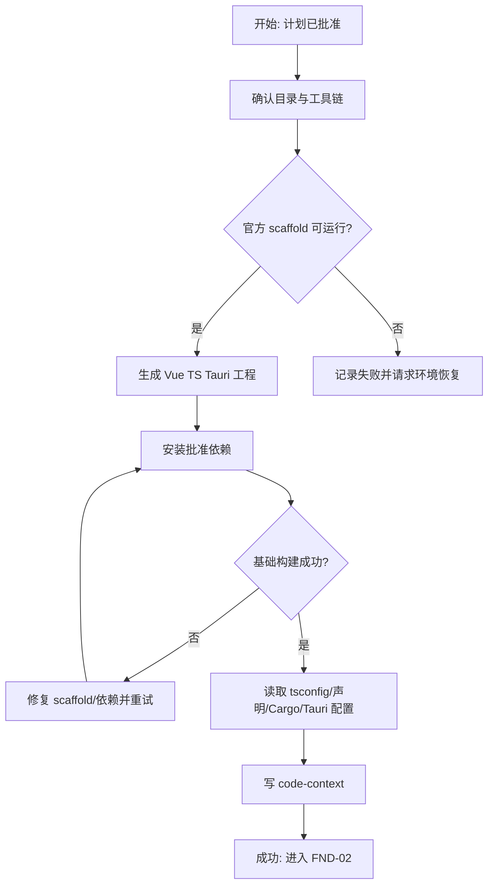
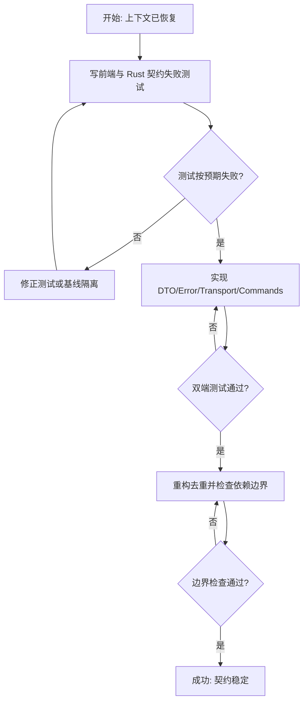
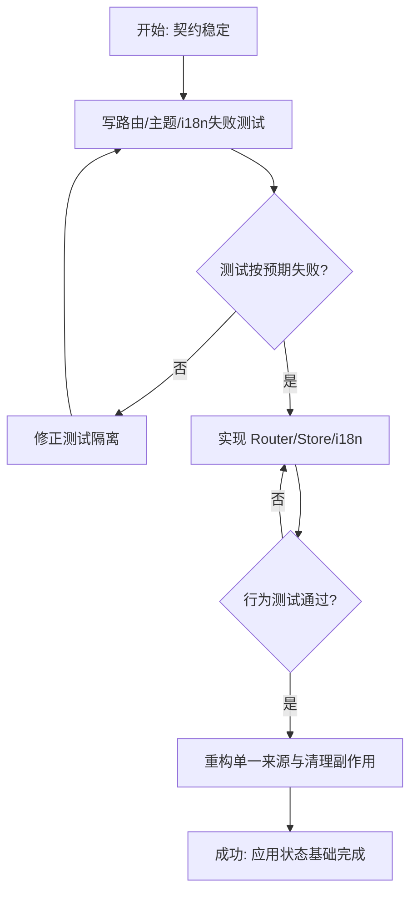
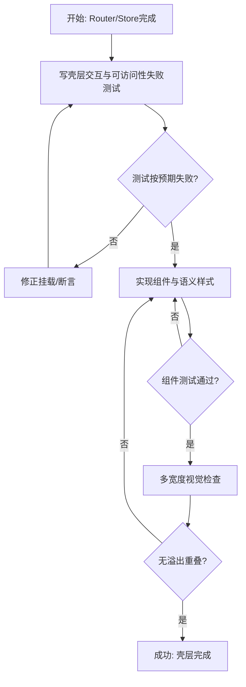
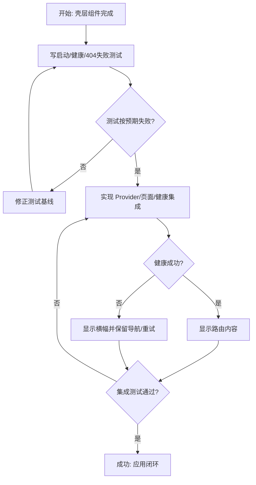
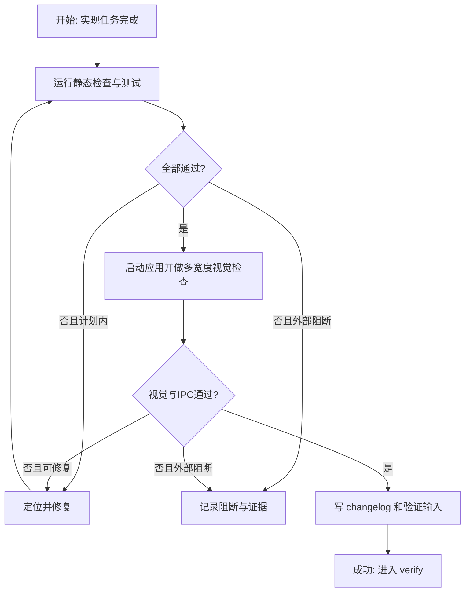

# 实施计划：应用基础、壳层与共享契约

## 交付单元标识

`foundation-shell-contracts`

## 阅读导航

| 项目 | 内容 |
| --- | --- |
| 目标 | 从空仓库建立可运行、可测试的 Tauri Vue TypeScript 应用壳与共享契约 |
| 任务数 | 6 |
| 串行/并行 | 6 个串行；0 个并行 |
| 高风险任务 | FND-01 脚手架与环境、FND-02 双端契约、FND-06 Tauri/视觉验证 |
| 关键依赖 | Node/npm、Rust/Cargo、官方 create-tauri-app、Tauri 系统依赖 |
| 规格索引 | AC-FND-01 至 AC-FND-12 |

## 全局摘要

执行主线为：官方 scaffold -> 读取真实 TypeScript/Rust 上下文 -> 先写契约测试 -> 实现共享契约与后端命令 -> 先写前端行为测试 -> 实现 Router/Pinia/i18n/主题 -> 实现 AppShell -> 集成错误/占位页 -> 执行全部门禁与视觉检查。

开始前必须已有批准的 spec；结束条件是所有验收项均有证据。最大风险是脚手架版本和本机 Tauri 工具链差异，任何偏差必须记录，不允许用手写假工程规避。

## 项目脚手架与初始化策略

- 使用官方 `create-tauri-app` Vue + TypeScript 模板，npm。
- scaffold 目标就是当前仓库根目录；必须保护现有 `biliCatch_PRD.md` 和 `docs/`。
- 生成后删除模板示例 UI，保留官方配置、icons 和 Tauri 启动结构。
- 添加 Vue Router、Pinia、vue-i18n、Naive UI、Lucide Vue；测试使用与 Vite/Vue 兼容的 Vitest、Vue Test Utils 和 jsdom。
- bootstrap 不得重新选择框架、路由模式或包管理器。

## FND-01：官方脚手架与代码上下文恢复

### 任务目标
安全运行官方 scaffold，安装批准依赖，并在写 TypeScript 前固化真实 compiler/Cargo/Tauri 上下文。

### 规格映射
AC-FND-01、AC-FND-11；Bootstrap 与 TypeScript 上下文章节。

### 范围与影响面
根 package/config、`src/` 模板、`src-tauri/`、`docs/.../artifacts/code-context.md`。

### 前置条件
计划获批；Node/npm 和 Rust/Cargo 可探测；现有 PRD/docs 已确认不被覆盖。

### 实现子项
- 记录目录清单和工具版本。
- 运行官方 create-tauri-app 非交互 Vue/TypeScript scaffold；如工具需网络，按权限流程请求安装/下载。
- 安装批准的运行依赖和测试依赖。
- 读取根 tsconfig 及直接 extends/references 链，记录 strict、module、moduleResolution、target、lib、types、paths。
- 读取 `vite-env.d.ts`、package scripts、Cargo.toml、tauri.conf 和 capability 基线。
- 建立 code-context 产物后才能开始 FND-02。

### 交互与状态约束
无业务交互。失败时保持现有 PRD/docs 和已生成可诊断文件；不以自建骨架作为自动 fallback。

### API 与数据约束
本任务不定义契约，只恢复权威配置来源。

### 测试与验证
检查 scaffold 标识、配置可解析、依赖树可安装、模板原始构建可运行；不适用 TDD，原因是 scaffold/环境操作不是业务行为。

### 风险与回退
若目标目录非空不被脚手架接受，使用官方工具支持的临时 scaffold 目录并仅通过可审核的文件级迁移落到根目录；不得覆盖 docs/PRD。任何版本偏差记录在 changelog。

## FND-02：共享契约、IPC Adapter 与 Rust 健康命令

### 任务目标
以测试先行建立 AppInfo、HealthStatus、AppError、IpcTransport 和两个 Rust command。

### 规格映射
AC-FND-07、AC-FND-08、AC-FND-09、AC-FND-10、AC-FND-12。

### 范围与影响面
`src/contracts/`、`src/services/ipc/`、前端测试；`src-tauri/src/models/`、`commands/`、`services/`、`lib.rs`、Rust 测试。

### 前置条件
FND-01 完成；按 code-context 使用真实 TypeScript 配置。

### 实现子项
- Red：先写 unknown/string/object reject 的错误归一测试、mock transport 命令/参数测试、Rust DTO/error 序列化测试。
- Green：实现唯一 AppErrorCode union、DTO、`IpcTransport`、Tauri transport、`normalizeIpcError`、app IPC service。
- Green：实现 Rust `AppError`、AppInfo、HealthStatus、service 与薄 command，注册 `get_app_info`/`health_check`。
- Refactor：消除重复字段/错误码，确保页面层没有 invoke。

### 交互与状态约束
健康失败只生成可消费错误，不在 transport 中显示通知或导航。

### API 与数据约束
命令名 snake_case；JSON 字段 camelCase；timestamp RFC3339；成功/错误形状与批准 spec 完全一致。

### 测试与验证
前端 unit tests + Rust unit tests；静态搜索确保 `@tauri-apps/api/core` 只在 IPC transport 边界导入。

### 风险与回退
若 Tauri reject 实际类型不同，扩充 normalize 输入用例，不更改页面契约。若 command 单测难以直接调用，提取纯 service 函数测试，command 保持薄层。

## FND-03：Router、应用状态、主题与国际化

### 任务目标
实现 Hash 路由、唯一标题来源、三态主题和中英文壳层文案。

### 规格映射
AC-FND-02、AC-FND-05、AC-FND-06、AC-FND-10、AC-FND-12。

### 范围与影响面
`src/app/router.ts`、`stores/app.ts`、`locales/`、主题同步函数与测试。

### 前置条件
FND-02 契约完成；页面组件可先用测试 stub。

### 实现子项
- Red：根重定向、四路由/404、meta title、主题 system/light/dark、matchMedia 变化/清理、locale 切换/缺失键测试。
- Green：实现路由配置、app store、主题纯函数与订阅、i18n messages。
- Refactor：导航/路由标题由单一配置衍生；不重复保存派生状态。

### 交互与状态约束
主题与语言切换不重载，不重建 router；仅 system 跟随系统变化；未知路由落 404。

### API 与数据约束
ThemePreference 与 AppLocale 严格枚举；本任务不持久化。

### 测试与验证
Vitest 覆盖全部状态分支、订阅清理和 i18n key；TypeScript typecheck。

### 风险与回退
jsdom 不完整实现 matchMedia 时使用局部 typed mock，不污染生产代码。

## FND-04：AppShell、Sidebar 与 TopBar

### 任务目标
按页面设计实现稳定、响应式、可访问的桌面工作台壳层。

### 规格映射
AC-FND-03、AC-FND-04、AC-FND-10、AC-FND-12。

### 范围与影响面
`components/layout/`、`components/shared/`、`styles/`、AppShell 组件测试。

### 前置条件
FND-03 路由与 app store 完成。

### 实现子项
- Red：导航顺序/目标、active/aria-current、品牌跳转、登录/设置入口、返回禁用/启用、tooltip/aria-label、响应式 class/结构测试。
- Green：实现 AppShell、Sidebar、TopBar、AppIconButton 与语义 CSS token/layout。
- Green：接 Naive UI provider 与 Lucide icon；稳定尺寸和 title overflow。
- Refactor：保持组件只渲染/发出导航，不含 IPC/persistence 业务。

### 交互与状态约束
返回按钮始终占位；窄宽隐藏冗余设置入口；图标态通过 tooltip 表意；键盘可用。

### API 与数据约束
只消费 router、app store 和静态导航定义，无外部 API。

### 测试与验证
Vue Test Utils 验证行为与 ARIA；浏览器视觉检查 1280x800、900x700、800x650；检查文字不溢出/重叠。

### 风险与回退
Naive UI 默认样式冲突时只调整全局 theme overrides/token，不在单组件散落颜色。

## FND-05：占位页、健康状态与全局错误集成

### 任务目标
完成启动、路由内容、健康失败横幅和 404 的端到端壳层闭环。

### 规格映射
AC-FND-02、AC-FND-06、AC-FND-08、AC-FND-09、AC-FND-10。

### 范围与影响面
`pages/`、`app/App.vue`、`app/providers.ts`、app store 健康状态和集成测试。

### 前置条件
FND-02 至 FND-04 完成。

### 实现子项
- Red：启动 loading -> healthy/failed、失败不阻断导航、四占位页、404 返回、locale 后文案更新测试。
- Green：实现 provider 组合、健康检查 action、非覆盖式错误横幅、占位/404 页面。
- Refactor：错误显示和命令副作用不进入布局组件；占位页不伪造业务功能。

### 交互与状态约束
loading 在 health resolve/reject 后结束；失败可重试；重试开始重新进入 pending；任何状态导航可用。

### API 与数据约束
只通过 app IPC service 调用 `health_check`/`get_app_info`；mock transport 覆盖成功/失败。

### 测试与验证
组件集成测试验证所有分支；静态搜索检查 page/component 无直接 invoke。

### 风险与回退
若真实 Tauri 初始化时序与浏览器测试不同，在 composition root 延迟创建 transport，不在页面增加环境判断。

## FND-06：门禁、运行与视觉验收

### 任务目标
对 AC-FND-01 至 12 建立可复现证据，修复可在批准计划内处理的问题。

### 规格映射
全部验收标准。

### 范围与影响面
全模块；execution changelog、后续 verification 输入。

### 前置条件
FND-01 至 FND-05 完成。

### 实现子项
- 运行 typecheck、前端测试、生产 build、Rust fmt/check/test。
- 启动 dev server，检查浏览器预览；可用时启动 Tauri dev 验证 IPC。
- 使用 Playwright/浏览器截图检查 1280、900、800 宽度，检查溢出、遮挡、空白和主题。
- 静态扫描直接 invoke、散落颜色、重复路由定义、`any` 和无理由复杂抽象。
- 修复计划范围内失败并重跑；记录工具链/外部环境限制。

### 交互与状态约束
验证不新增产品行为；发现规格缺口则回退 spec，发现实现缺陷则留在 execute 修复。

### API 与数据约束
比较 Rust JSON 与 TS contracts；成功、已知错误、未知错误均取证。

### 测试与验证
本任务本身即门禁执行；所有命令输出摘要和截图路径进入 changelog/verification。

### 风险与回退
若 Tauri 系统依赖缺失，准确记录阻断并保留已通过的前端/Rust证据；不得把浏览器 mock 当真实 IPC 通过。若视觉失败，回到对应 FND-04/05 修复。

## 功能拆解明细

| 功能单元 | 实现任务 | 完成条件 |
| --- | --- | --- |
| 官方工程基础 | FND-01 | scaffold、依赖、上下文产物、模板构建 |
| AppError/DTO/transport | FND-02 | 双端类型、错误归一、两个命令及测试 |
| Hash 路由 | FND-03 | 根重定向、四路由、404、meta 标题 |
| 主题 | FND-03/FND-04 | 三态、系统订阅、根属性、完整 token |
| i18n | FND-03/FND-05 | 中英文壳层键、即时切换、fallback |
| Sidebar | FND-04 | 品牌、三导航、active、紧凑态、可访问性 |
| TopBar | FND-04 | 返回、标题、登录、设置、稳定尺寸 |
| 启动与健康 | FND-02/FND-05 | loading、成功、失败横幅、重试 |
| 占位与 404 | FND-05 | 四个无伪功能占位、可恢复 404 |
| 全部门禁 | FND-06 | AC-FND-01 至 12 有证据 |

## API 对接与类型策略

- 权威来源：Rust DTO 序列化形状 + 前端 contracts；无 protobuf/OpenAPI/生成 TS。
- `get_app_info`、`health_check` 分别作为独立 service 函数，不压成一个模糊 API 任务。
- Rust 字段通过 serde camelCase 对齐，前端直接消费。
- Tauri transport 只处理协议与错误归一；UI loading/error 由 app store 与页面负责。
- mock transport 只在测试/浏览器开发注入，不依据运行时猜测散布分支。

## 依赖关系

`FND-01 -> FND-02 -> FND-03 -> FND-04 -> FND-05 -> FND-06`。

串行是硬约束：FND-02 需要实际 tsconfig；FND-03 依赖 contracts；FND-04 依赖 router/store；FND-05 组合全部；FND-06 最后验证。

## 整洁性与复杂度控制

- 每个业务规则只有一个所有者：路由 meta、导航数组、contracts、i18n、CSS token 分别唯一。
- 页面/组件不直接 invoke；transport 不显示 UI；store 不持有重复派生路由状态。
- 组件优先组合，文件职责混合或明显超长时就地拆分。
- 禁止 `any`、隐藏全局、万能 manager/service、事件总线和无消费者的抽象。
- 副作用有明确动词并可清理，尤其是 matchMedia listener 和 async health action。

## Pattern 决策与替代方案

- 保留 Adapter（IpcTransport），用于真实 Tauri 与测试 transport；替代方案“组件直接 invoke”因不可测试和错误分散被拒绝。
- 保留轻量 Composition Root；DI 容器/service locator 因规模不匹配被拒绝。
- 主题、导航使用直接函数/数据，不使用 Strategy/Factory。

## 代码上下文与影响范围

当前无代码图需求。FND-01 生成工程后，实际 tsconfig、声明、package、Cargo 和 Tauri 配置成为权威上下文，并写入 `artifacts/code-context.md`。后续只读取与本模块直接相关类型，不全量扫声明文件。

## 并行执行建议

不启用 workflow-style parallel execution。首模块任务共享刚生成的配置和核心契约，前序输出决定后序形状；并行会增加冲突和猜测。后续独立模块是否并行仍受框架“模块顺序交付”限制。

## 触发与上下文准备

- 触发：计划审批通过。
- 最小上下文：批准 spec/clarifications、页面/架构设计、state.json、实际 scaffold 配置。
- 观察点：每个任务结束更新 task-board 和 changelog；任何依赖/规格偏差先记录。
- 交接：FND-06 完成后进入 verify，不在 execute 自行宣布完成。

## 受影响文件或模块

根前端配置与 `src/`、`src-tauri/`，以及当前模块的 execution 文档和请求级 code-context。不得改写其他模块规格或 PRD。

## 测试策略

- FND-02 至 FND-05 均执行 red -> green -> refactor，并在 changelog 记录首个失败测试和最终通过命令。
- 前端：Vitest + Vue Test Utils + jsdom，聚焦路由、store、主题、i18n、布局行为、ARIA、IPC 错误。
- Rust：DTO/error serialization、service 结果和 command 核心边界。
- 构建：TypeScript/Vue typecheck、Vite production build、cargo fmt/check/test。
- 视觉：多宽度、亮暗主题、四路由、404、后端失败；检查非空、无重叠、无溢出。
- 真实 IPC：优先 Tauri dev；无法启动时单独标记，不能以 mock 替代。

## 观察与人工介入点

- scaffold 或依赖下载需要网络/权限时走系统批准。
- 官方模板与规格发生根本不兼容时，停止并回退架构/spec，而不是私自换栈。
- 当前计划需用户批准；execute 完成后由 verify/review 继续同一框架循环。

## 回滚说明

- 所有更改限制在新建工程与当前请求产物；保留原始 PRD/docs。
- 脚手架部分失败时不删除整个工作区，只清理明确由失败生成且经过核对的文件或在原位修复。
- 测试/视觉失败回到对应执行任务；架构不适配回到 architecture-design；规格缺口回到 spec。

