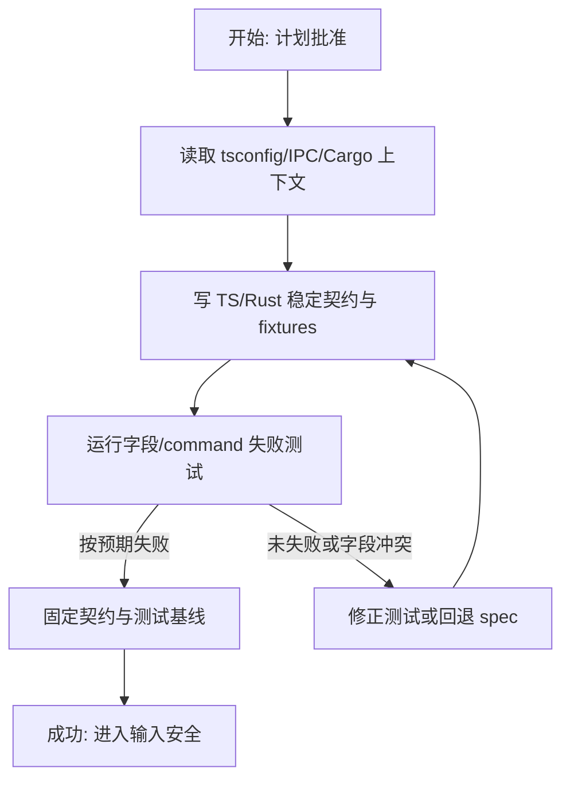
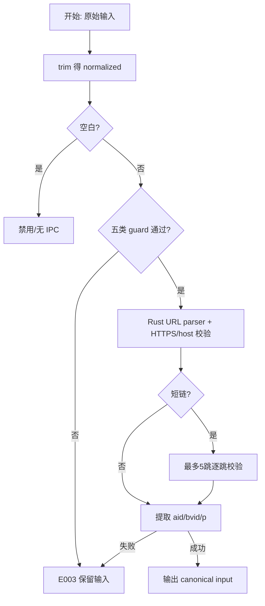
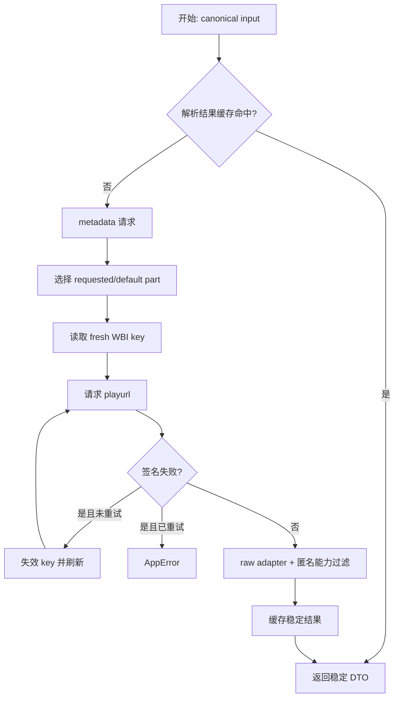
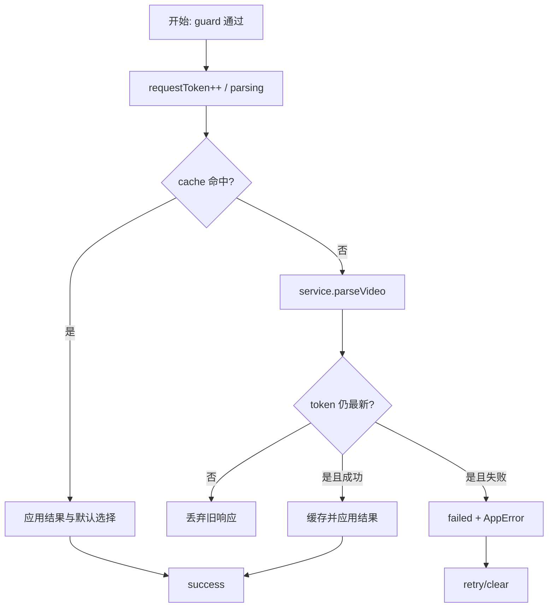
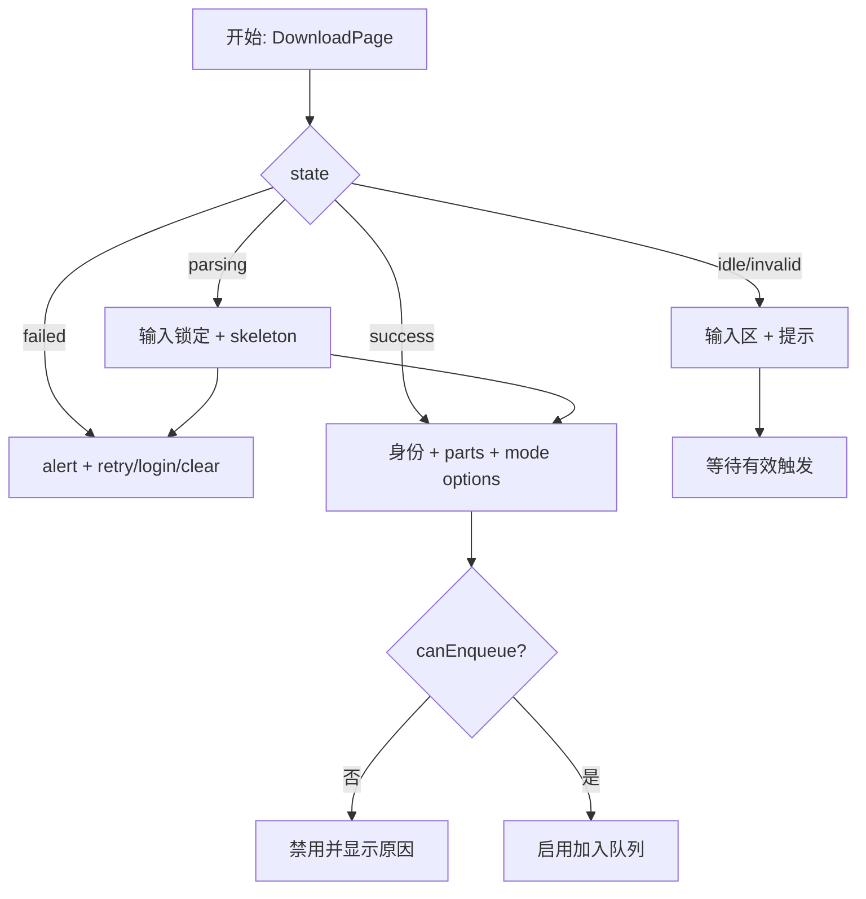
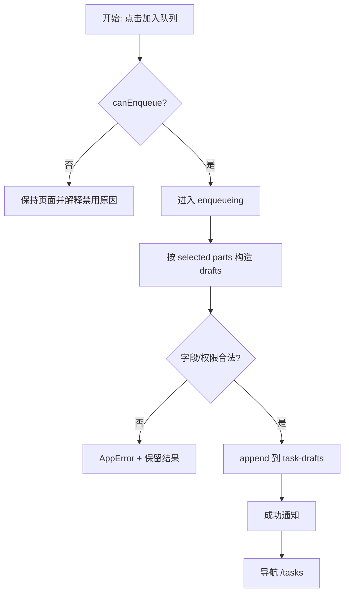
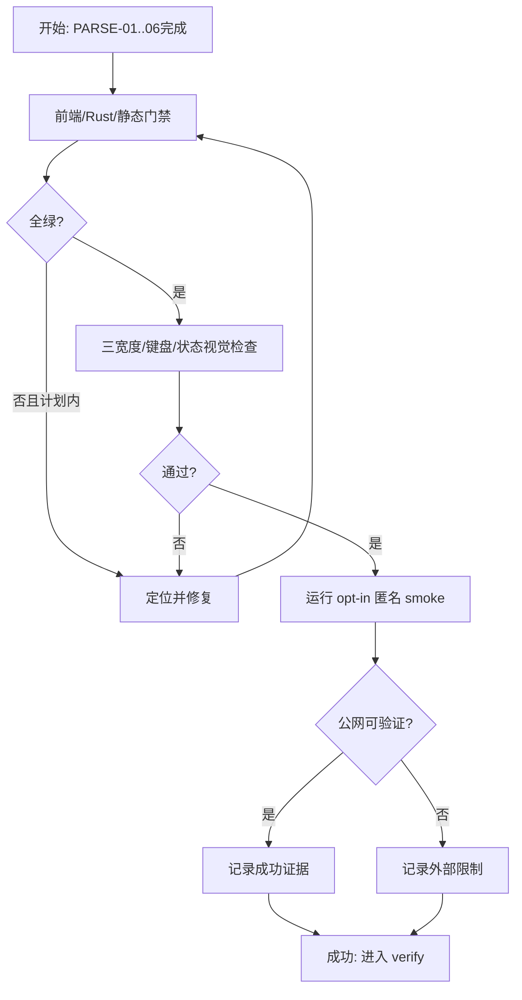

# 实施计划：解析与下载中心

## 交付单元标识

`parse-download-center`

## 阅读导航

| 项目 | 内容 |
| --- | --- |
| 目标 | 把 `/download` 升级为真实解析、分 P/媒体选择和任务草稿交接工作台 |
| 任务数 | 7 个，全部串行 |
| 高风险任务 | PARSE-02 输入/SSRF，PARSE-03 B 站/WBI，PARSE-07 公网 smoke |
| 关键依赖 | 已完成基础 IPC；Rust reqwest/url/MD5；B 站当前匿名接口；Tauri 2 state |
| 验收索引 | AC-PARSE-01 至 AC-PARSE-14 |

## 全局摘要

主线为：恢复真实代码上下文 -> 先写稳定契约测试 -> Rust 输入安全 -> HTTP/WBI/cache/adapter -> 前端请求与状态机 -> 完整下载中心 UI -> task draft 交接 -> 全量门禁和多宽度验证。前端只看到稳定 `ParseVideoResult`，B 站 raw 字段只存在 Rust infrastructure。

状态主线：`idle -> parsing -> success|failed -> enqueueing -> /tasks`。新的 parse request 使用递增 token；旧响应只结束自己的 Promise，不得覆盖最新状态。最大风险是 B 站接口变化与短链 SSRF，必须通过 allowlist、受限重定向、fixture adapter 和 opt-in smoke 收口。

实施前置：本计划获批；继续遵守现有 strict/bundler/ES2020、相对导入、IpcTransport 和 AppError；不启动任务执行、认证持久化、目录对话框或 FFmpeg。

## PARSE-01：上下文复核、稳定契约与失败测试

### 任务目标

在改业务代码前固定 TS/Rust DTO、command 请求形状、task draft 边界和测试夹具，使后续层无需猜字段。

### 规格映射

AC-PARSE-09、13、14；规格“架构约束”“TypeScript 与 API 来源”。

### 范围与影响面

`features/download-center/contracts.ts`、`stores/task-drafts.ts` 类型面、Rust `models/parse.rs`、fixture 目录、code-context 增量记录。

### 前置与完成条件

- 前置：计划批准；读取根 tsconfig/reference、现有 IPC contract、Cargo/Tauri module。
- 完成：TS 与 Rust 字段同名；serde fixture 测试先失败；前端 service/store 测试可引用唯一 contract。

### 实现子项

- 定义 DownloadMode、VideoCodec、AudioFormat、VideoPart、MediaOption、ParseVideoResult、DownloadTaskDraft。
- 请求保持 `{ input: string }`；不创建 B 站 raw TS 类型。
- Red：Rust DTO JSON shape、TS service exact command/args、draft 字段测试。
- 夹具去除 Cookie/WBI key；只含 adapter 所需匿名响应。

### 交互、API 与边界

本任务不渲染 UI、不发公网请求。稳定 DTO 是前端契约，Rust serialization test 是后端证据；raw fixture 不具备跨层权威性。

### 风险与回退

字段无法覆盖规格时回到 spec，不以可选大对象规避契约。避免定义 task id/status/progress。

## PARSE-02：输入归一化、短链边界与 SSRF 防护

### 任务目标

以测试先行实现五类输入的权威 Rust 规范化和前端粗粒度 eligibility guard。

### 规格映射

AC-PARSE-01、02、11、14；规格“Rust 行为与安全”。

### 范围与影响面

Rust URL resolver/normalizer、前端 input validation 纯函数、E003/E004 映射。

### 输入语义（执行不得猜测）

- 控件保留用户原始文本；提交值使用 Unicode `trim` 后的 normalized value。
- 原值为空或 trim 后为空：视为空白，解析按钮禁用，不展示错误、不调用 IPC。
- normalized value 含内部空白、换行或控制字符：非法；不尝试删除或拼接字符。
- 不设置额外产品长度截断；超出底层 URL parser/IPC 可处理范围按 E003，输入框不静默裁剪。
- BV/AV 大小写按既有标识语义：BV 前缀大小写不改写，`av` 前缀大小写不敏感，数字必须正数。
- 校验触发：按钮/Enter/粘贴/drop；普通编辑立即清除旧校验错误但不自动请求。
- 粘贴/drop 仅当 normalized value 通过前端 guard 时自动 parse；否则只回填并显示 E003。

### 实现子项

- Red：标准、移动、b23、BV、AV、`p`、纯空格、前后空白、内部空白、非 HTTPS、伪子域、非法 p。
- Rust allowlist：`bilibili.com` 或其真实子域、`b23.tv`；host 比较用 URL parser，不用字符串 contains。
- 短链手动处理最多 5 次重定向，每跳 HTTPS+allowlist，最终仍需 bilibili host。
- 前端 guard 只减少无效 IPC；Rust validator 始终权威，防御性重复有不同责任。

### 状态与 loading

本地 invalid 不进入 parsing；合法短链解析的 loading 从 IPC 调用开始，resolve/reject/最新请求被替代时结束。

### 风险与回退

发现合法 B 站 host 变体未覆盖时新增明确 allowlist fixture，不放宽任意 host。指定 P 不存在留到 adapter 结果校验。

## PARSE-03：B 站 HTTP Adapter、WBI 缓存与 parse_video 命令

### 任务目标

实现匿名真实解析后端，同时把外部接口变化限制在 Rust infrastructure。

### 规格映射

AC-PARSE-03、06、08、09、11、13、14。

### 范围与影响面

Cargo 依赖；`infrastructure/bilibili/{client,raw,adapter,wbi}.rs`、TTL cache、parser service、parse command、Tauri state/注册。

### 实现子项

- Red：metadata/playurl fixture adapter、指定 P、匿名 option、E001-E006、WBI fresh/expired/失败一次成功/失败两次。
- 在实现时确认当前 B 站网页客户端使用的 endpoint/必要请求头/WBI 参数；把 endpoint 和 raw 字段集中在 client/raw，不写入 Vue。
- HTTP 设置连接/总超时、响应 body 上限、有限重定向；不记录敏感头/body。
- WBI key TTL 12h；签名类失败 invalidates 后重取，只允许一次 retry。
- `ParserService` 通过显式 HttpPort/Clock 注入测试替身；生产实例由 `lib.rs` manage。
- command 返回稳定 result；不存在/删除 E004，需要登录 E005，地区/权限 E006，网络 E001，签名耗尽 E002 或 E_INTERNAL 按批准错误语义记录。

### API 与类型策略

外部没有可复用 TS/protobuf。权威消费契约为 Rust DTO + TS contract；raw JSON 用私有 serde structs 和 fixture，adapter 保留字段语义并做唯一映射。

### 测试与验证

默认测试完全离线；公网 smoke 标记 ignored/opt-in，不进入每次单测硬依赖。cargo fmt/check/test 必须通过。

### 风险与回退

若匿名 playurl 当前无需 WBI，仍保持 WBI port/测试但不强行对不需要签名的 endpoint 加签；如接口不可用，记录外部 smoke 失败，fixture 契约和代码测试不得伪造公网通过。

## PARSE-04：前端 Service、解析 Store 与选择规则

### 任务目标

实现唯一前端解析状态源、会话缓存、竞态保护、分 P 与模式规则。

### 规格映射

AC-PARSE-02、04、05、06、07、10、11、14。

### 范围与影响面

download-center service/store、task-drafts store；不修改 AppShell 或全局 AppError。

### 实现子项

- Red：exact `parse_video` args、idle/parsing/success/failed、旧响应丢弃、canonical cache、clear、retry。
- 选中规则：requestedPage 存在则选它，否则 parts[0]；全选为全部 cid；反选为全集减当前集；空集允许但禁用 enqueue。
- 默认 mode `video-audio`；默认 quality/codec/audio option 取后端数组第一个可用项。
- mode 切换：视频模式清空 audioFormat/bitrate；音频模式清空 quality/codec；不可用 requiresLogin 不得成为提交值。
- `canParse`、`canEnqueue`、selected count 为 getter，不落重复 state。
- task draft store 只追加/读取/清空草稿，不定义任务状态。

### 状态与副作用

request token 在 parse action 所有 resolve/reject 路径比较；过期请求不改 loading/error/result。service 只 invoke/normalize，不 toast/navigate；页面 action 负责反馈和跳转。

### 风险与回退

结果缺少必要 options 时保持 success 但 enqueue disabled，并显示明确能力提示；不自动伪造默认值。

## PARSE-05：下载中心表单与结果组件

### 任务目标

按批准 page-design 实现完整可访问 UI，并只消费 store 稳定状态。

### 规格映射

AC-PARSE-02 至 06、11、12、14。

### 页面与字段明细

| 顺序 | 区块/字段 | 控件/展示 | 默认/来源 | 显隐与禁用 | 校验/空值 |
| --- | --- | --- | --- | --- | --- |
| 1 | `input` | 文本 input | 原始用户值 | parsing/enqueueing 禁用 | 按 PARSE-02 输入语义 |
| 2 | 解析 | 主按钮/Enter | 无 | normalized 空或 busy 禁用 | invalid 不发 IPC |
| 3 | error/status | live/alert | store state | pending/failed 时显示 | error 保留输入 |
| 4 | cover | 16:9 img/占位 | coverUrl | success 显示 | 加载失败固定占位 |
| 5 | title/owner/duration/bvid | 只读文本 | result | success 显示 | 空字符串显示 `—`，duration `mm:ss`/`h:mm:ss` |
| 6 | parts | checkbox 列表 | result.parts | 多 P 显示批量工具 | 标题空为 `P{page}`；至少一项方可入队 |
| 7 | mode | radio fieldset | video-audio | success 显示 | 三项固定 |
| 8 | quality/codec | select | result capabilities | 视频模式显示 | 无 option 时禁用并提示 |
| 9 | audioFormat/bitrate | select | result capabilities | audio-only 显示 | requiresLogin 禁选 |
| 10 | outputDir | 只读 input + 更改 | 默认下载目录/fallback | success 显示；更改按钮本模块禁用并说明 | 空路径阻止入队 |
| 11 | 清空/入队 | 次/主按钮 | store | idle 时清空禁用；busy 防重复 | canEnqueue 决定主按钮 |

### 实现子项

- Red：按钮/Enter/paste/drop、字段显隐、label/fieldset/ARIA、loading/error、封面 fallback、响应式结构。
- 拆 InputPanel、VideoSummary、PartSelector、DownloadOptions、ActionBar；DownloadPage 只组合和处理 navigate/notify。
- success 内容按输入 -> identity -> parts -> options -> actions 固定顺序。
- 所有颜色来自 tokens，图标来自 Lucide；不改全局壳层规则。

### 反馈时序

parse loading 从 action 接受输入至最新 service resolve/reject；retry 复用当前 normalized input。无二次确认。清空立即执行。E005 登录按钮直接导航，不丢当前输入/result。

### 风险与回退

Naive UI 控件样式与 token 冲突时通过 feature class/theme override 收口，不散落 hex/inline style。

## PARSE-06：任务草稿交接、通知与路由集成

### 任务目标

完成“加入队列”的本模块闭环，不越界实现任务执行/持久化。

### 规格映射

AC-PARSE-04、05、06、10、11、14。

### 范围与影响面

DownloadPage orchestration、task-drafts store、Naive message、Router `/tasks`；TasksPage 不新增任务表格。

### 实现子项

- Red：每个 selected part 生成一个 draft；模式字段互斥；requiresLogin/空 part/空目录拒绝；busy 去重。
- enqueueing 开始锁定表单；draft append 成功后结束、发成功消息并 push `/tasks`。
- 会话 store append 不应失败；若未来 port reject，保持 result 并显示 AppError，不导航。
- E005 “前往登录”只导航 `/login`；返回后 store 仍在内存中。

### Draft 字段规则

- 通用：canonicalUrl、bvid、cid、page、partTitle、mode、outputDir。
- 视频模式：qualityId、codec 有值；audioFormat/audioBitrateId 为 null。
- 音频模式：audioFormat/audioBitrateId 有值；qualityId/codec 为 null。
- 不生成 id/status/progress/createdAt；这些由 task-management 拥有。

### 风险与回退

若下一模块需要新的任务拥有字段，通过 task-management spec 扩展其模型，不回写本模块伪字段。

## PARSE-07：全量门禁、视觉验收与公网 smoke

### 任务目标

为 AC-PARSE-01..14 建立可复现证据并修复计划范围内问题。

### 规格映射

全部验收标准。

### 范围与影响面

全模块、execution changelog、verification 输入；不新增产品行为。

### 验证子项

- `npm test`、typecheck/build；cargo fmt/check/test。
- 静态扫描 invoke、raw DTO 越界、hex、any、敏感日志、重复 input/selection rules。
- 浏览器 mock success/error 夹具检查 1280x800、900x700、800x650；键盘与 AX 树。
- opt-in 公网 smoke 使用公开匿名内容，不使用/记录 Cookie；验证成功则记录日期与 command shape，失败单列外部状态，不覆盖离线测试结论。
- 检查空白/内部空白、paste/drop、竞态、WBI retry、requiresLogin、draft 跳转完整证据。

### 风险与回退

行为/布局失败回到对应 PARSE-02..06；外部 API 变化回到 PARSE-03 adapter；稳定契约不适配现实则回 architecture/spec，不在验证期偷改。

## 功能拆解明细

| 功能单元 | 任务 | 完成条件 |
| --- | --- | --- |
| 稳定 DTO/command | PARSE-01 | TS/Rust shape 与 exact args 测试固定 |
| 五类输入/指定 P/SSRF | PARSE-02 | 边界、allowlist、重定向测试覆盖 |
| metadata/playurl/WBI/cache | PARSE-03 | fixture、TTL、单次重试和 command 通过 |
| 状态/竞态/选择/模式 | PARSE-04 | 所有 transition/getter/清理规则通过 |
| 完整 `/download` UI | PARSE-05 | 字段、状态、ARIA、响应式齐全 |
| 草稿/通知/跳转 | PARSE-06 | drafts 正确且 `/tasks` 交接成功 |
| 验收证据 | PARSE-07 | AC-PARSE-01..14 均有证据 |

## 项目脚手架与初始化策略

不新增或重跑 scaffold。复用已通过 review 的官方 Tauri Vue TS 工程、Router/Pinia/i18n/Naive UI/Lucide/Vitest；执行阶段不得重新选择框架、history 模式、状态库或 IPC 边界。只增加解析所需 Rust HTTP/URL/hash 依赖和 feature 目录。

## API 对接与类型策略

- 前端契约源：本模块 `contracts.ts`；Rust权威证据：DTO serde tests。
- 内部接口：`parse_video`，请求 `{ input }`，返回 `ParseVideoResult`，错误 AppError。
- 外部接口：当前 B 站网页匿名 metadata/playurl/nav-WBI 响应；无正式 TS/protobuf，使用私有 Rust raw structs + 去敏 fixture。
- request layer 仅 Rust Bilibili client；mapper 仅 Rust adapter；页面不处理外部 code/data。
- mock 覆盖成功/错误/竞态；离线回归不依赖公网；smoke 只证明当前外部可用性。

## 依赖关系

`PARSE-01 -> PARSE-02 -> PARSE-03 -> PARSE-04 -> PARSE-05 -> PARSE-06 -> PARSE-07`。

## 整洁性与复杂度控制

- URL 规则所有者：Rust normalizer；TS guard 仅作 UI eligibility，并以命名说明非权威。
- 外部字段只在 raw/adapter；选择规则只在 download store；draft 字段只在 contract。
- 组件只展示/发事件；service 不 toast/navigate；store 不操作 DOM。
- 不引入万能 ParserManager、event bus、repository 或跨 feature base component。

## 模式决策与替代方案

- 保留 Adapter 以吸收 B 站外部变化；直接把 raw JSON 暴露给 Vue 被拒绝。
- 使用小 HttpPort/Clock 测 WBI 与缓存；全局 service locator 被拒绝。
- task-drafts 是明确跨模块 handoff store，不是 Repository；任务状态机留给下一模块。

## 代码上下文与影响范围

沿用 `artifacts/code-context.md`。目标 TS 受根 strict/bundler/ES2020 配置约束，无 alias；声明闭包为 Vue/Pinia/Router/Naive/Tauri 现有声明与新增 feature contracts。Rust 影响 `models/commands/services/infrastructure/lib.rs/Cargo.toml`。无需仓库级 `.d.ts` 扫描。

## 并行执行建议

不启用 workflow-style parallel execution。Rust adapter 决定稳定 capability 数据，store/UI/draft 均依赖前序；并行会促使 UI 猜 raw 字段并增加同文件冲突。保持一个串行主路径。

## 触发与上下文准备

- 触发：用户批准本计划。
- 上下文：批准 spec/clarifications、page/architecture design、现有 code-context、当前 source/tests、B 站当前接口证据。
- 观察点：每任务更新 task-board/changelog；公网状态、contract 偏差、敏感日志立即可见。
- 人工介入：稳定契约需要改变、登录凭据才可验证、B 站阻断所有匿名接口时回到 spec/外部依赖决策。
- handoff：PARSE-07 -> verify -> review；通过后提升 task-management。

## 受影响文件或模块

`src/features/download-center/`、`src/pages/DownloadPage.vue`、`src/stores/task-drafts.ts`、相关 locales/styles/tests；`src-tauri/src/{models,commands,services,infrastructure}`、Cargo 和 lib 组合；当前模块 lifecycle 文档。禁止修改其他模块规格或实现任务状态机。

## 测试策略

PARSE-01..06 均执行 red -> green -> refactor。前端覆盖纯规则、Pinia action、component/ARIA/Router 集成；Rust 覆盖 normalizer、安全跳转、fixture adapter、WBI/TTL/错误；门禁沿用 29 个前端与 6 个 Rust 基线并只增不减。视觉使用 deterministic mock result，公网只做 opt-in smoke。

## 观察与人工介入点

计划审批是当前硬门禁。实现中如当前 B 站 API 迫使修改稳定 DTO、产品权限行为或跨模块边界，停止编码并回退 architecture/spec；普通 raw 字段变化由 adapter 内解决，无需扩大范围。

## 回滚说明

按任务就地修复，不删除工程或生命周期文档。外部 adapter 失败不回退基础壳；store/UI 失败不绕过 Rust 契约。任务草稿交接无法满足下一模块时回到 spec，而不是提前实现任务持久化。
