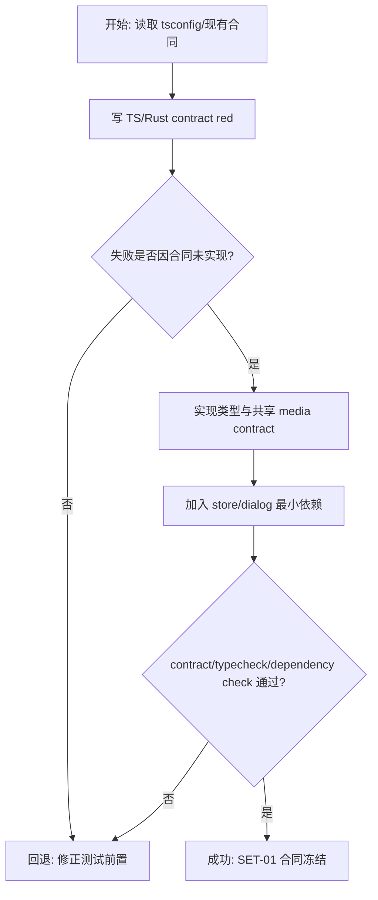
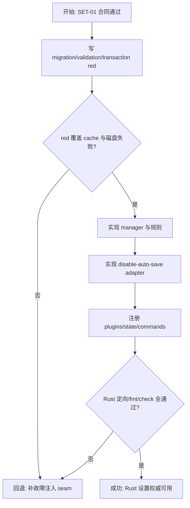
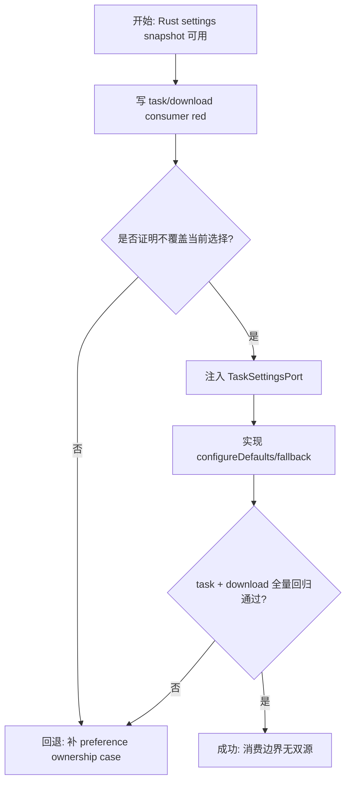
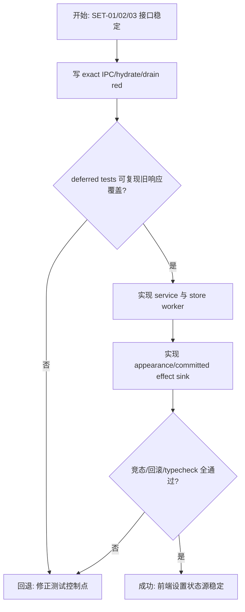
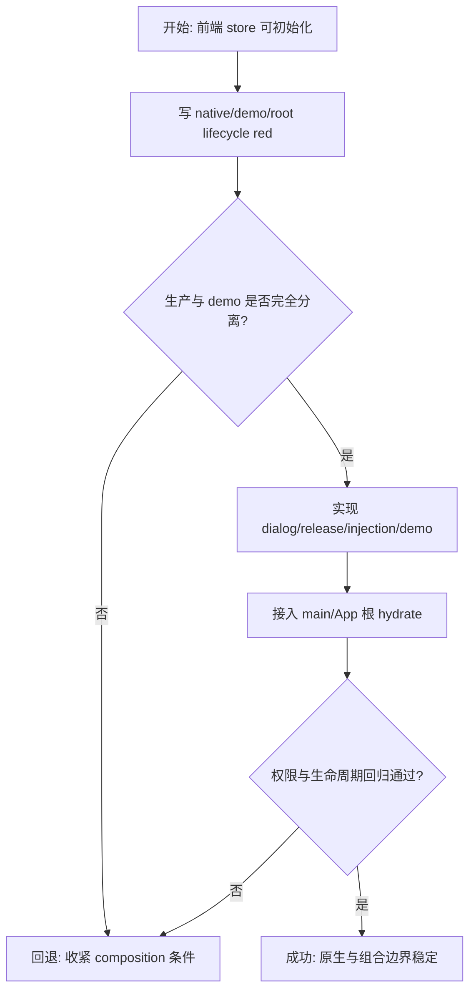
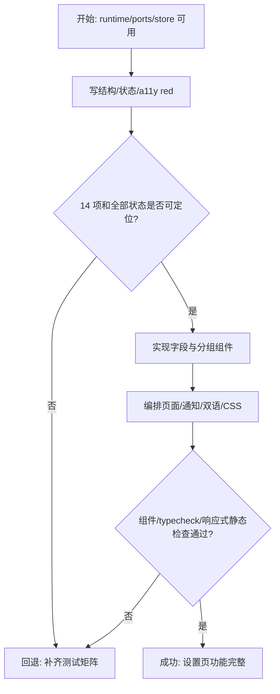
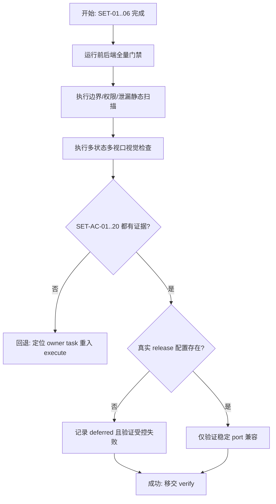

# 设置管理实施计划

> **For agentic workers:** 执行时必须使用 `frontend-agent-framework-execute` 与 `superpowers:executing-plans`，按 SET-01 至 SET-07 串行推进。每项先建立可信 red，再完成最小 green、重构、定向门禁和任务板更新。当前目录不是 Git 仓库，不伪造 commit 检查点。

**Goal:** 交付 Rust 权威持久化、Vue 即时反馈、全局主题/语言回滚及下载/调度消费完整接入的 BiliCatch 设置模块。

**Architecture:** Rust `SettingsManager` 用版本化完整文档、typed patch 与 candidate transaction 管理唯一权威状态，plugin-store adapter 关闭 auto-save 并显式保存。Vue `SettingsStore` 用每字段 drain loop 合并连续意图，根 `SettingsEffectSink` 应用外观与下载默认；组件只接收 props/emits，原生 dialog 与后续 release 能力在 port 后。

**Tech Stack:** Vue 3、TypeScript strict、Pinia、vue-i18n、Naive UI、Lucide、Vitest、Tauri 2、Rust 1.98、serde、tauri-plugin-store 2.x、tauri-plugin-dialog 2.x。

**Spec:** `docs/requests/bilicatch-v1-desktop/module-runs/settings/spec/spec.md`

## 交付单元与全局约束

- 交付单元：`settings`；只覆盖已批准规格 SET-AC-01..20，不实现 updater 安装、托盘、通知发送或窗口拦截。
- 11 个持久字段的名称、类型、默认值与范围必须与规格完全一致；Rust serde camelCase 是 IPC 权威。
- store 固定为 `settings.json` / `document`，禁用 auto-save；任何失败不得提交 manager state、revision、plugin cache 最终值或磁盘。
- 路径只来自单目录 dialog；前端不 trim/拼接/展开，Rust 校验绝对、存在且为目录。
- 同字段变更串行合并到最新意图；不同字段可并发，但 Rust manager 防 lost update。
- 主题/语言候选立即生效并在保存失败时回滚；下载默认值只应用 confirmed snapshot。
- UI 不显示 raw backend message/details/OS error；中英文必须同步。
- TypeScript 遵循根 `tsconfig.json` 的 strict、ES2020、ESNext/bundler、isolatedModules、no alias；生产代码禁止 `any`。
- 所有 shell 命令以 `rtk` 开头；Rust 使用 `C:/Users/yangjianlin/.cargo/bin/cargo.exe`。

## 阅读导航

| 项目 | 内容 |
| --- | --- |
| 任务总数 | 7 |
| 执行模式 | 全部串行；不启用 workflow/subagent |
| 高风险任务 | SET-02 plugin cache 事务、SET-03 已完成模块回归、SET-04 连续保存与回滚 |
| 主线 | 合同/依赖 -> Rust 存储 -> 消费边界 -> 前端状态 -> 原生组合 -> 页面 -> 全量验收 |
| 规格覆盖 | SET-AC-01..20 全部绑定任务与证据 |

## 全局摘要

实施先冻结 Rust/TypeScript 同名合同与插件依赖，再用 fake store 建立 migration、校验、revision 和失败回滚测试。随后把任务调度改为只读 settings provider，并给下载中心加入不覆盖用户当前选择的默认值接入。前端 store 在 UI 前完成 hydrate、per-field drain 和 effect rollback；原生 dialog/demo/deferred release 由 composition root 注入。最后实现四组连续设置页并运行多视口、权限、安全和全量回归。

目录无 Git 元数据，执行期间以 task-board 和 changelog 作为检查点。任何测试失败在所属任务内修复；产品合同不清回 spec，模块关系不兼容回 architecture-design。

## 任务拆解

### SET-01：跨端合同、类型闭包与最小依赖

**目标与规格映射**

冻结设置 V1 DTO、typed patch、共享媒体枚举和插件依赖。覆盖 SET-AC-04..07、09、18、20。

**文件**

- Create: `src/contracts/media.ts`
- Create: `src/features/settings/contracts.ts`、`contracts.test.ts`、`options.ts`
- Create: `src-tauri/src/models/settings.rs`
- Modify: `src-tauri/src/models/mod.rs`、`src/features/download-center/contracts.ts`
- Modify: `package.json`、`package-lock.json`、`src-tauri/Cargo.toml`、`src-tauri/Cargo.lock`
- Read: `tsconfig.json`、`src/vite-env.d.ts` 与安装后 dialog 声明

**Interfaces**

- Produces: `SettingsValues`、`SettingsSnapshot`、mapped `SettingsPatch`、`SettingKey`、`FieldSaveState`、`VideoQualityId`、`AudioFormat`。
- Rust produces: `SettingsDocument`、`SettingsValues`、`SettingsPatch`、`UpdateSettingRequest`、`SettingsSnapshot`，serde camelCase。

**TDD 步骤**

- [ ] 写 TS contract red，断言 11 个默认值、8 个 quality、3 个 audio format 以及 field/value 关联。
- [ ] 写 Rust exact JSON red，至少断言 `schemaVersion/revision/values` 与 `{patch:{field,value}}`。
- [ ] 分别运行定向 Vitest/Cargo test，确认因类型不存在而失败。
- [ ] 实现最小 TS/Rust 类型；将 download-center 的 `AudioFormat` 改为兼容 re-export，现有 import 不变。
- [ ] 安装 `@tauri-apps/plugin-dialog`、`tauri-plugin-dialog`、`tauri-plugin-store`，锁定 2.x，不安装 JS store/updater。
- [ ] 重跑 contract、download-center contracts、typecheck、Cargo contract tests，确认通过。
- [ ] 更新 task-board/changelog；检查依赖 diff 不含无关升级。

关键断言形态：

```ts
expect(DEFAULT_SETTINGS.maxConcurrentTasks).toBe(3)
expect(DEFAULT_SETTINGS.connectionsPerTask).toBe(8)
expect(VIDEO_QUALITY_IDS).toContain("80")
const patch: SettingsPatch = { field: "theme", value: "dark" }
```

```rust
assert_eq!(json["values"]["defaultVideoQuality"], "80");
assert_eq!(json["values"]["connectionsPerTask"], 8);
```

**风险与回退**

依赖解析失败时先记录实际 registry/toolchain 错误并按批准权限重试；不得替换插件或升级全仓。共享类型造成回归时只保留 re-export 兼容面，不批量改无关调用者。



### SET-02：Rust 设置迁移、校验、事务存储与 Commands

**目标与规格映射**

实现唯一权威 `SettingsManager`、V1 migration、路径/范围校验、plugin-store cache rollback 和两个 IPC commands。覆盖 SET-AC-03..10、18、20。

**文件**

- Create: `src-tauri/src/services/settings/{mod,ports,validation,migration,manager}.rs`
- Create: `src-tauri/src/infrastructure/settings/{mod,store}.rs`
- Create: `src-tauri/src/commands/settings.rs`
- Modify: `src-tauri/src/services/mod.rs`、`infrastructure/mod.rs`、`commands/mod.rs`、`lib.rs`
- Create/Modify: Rust unit/integration tests与临时目录夹具

**Interfaces**

- Consumes: SET-01 Rust DTO。
- Produces: `SettingsStorePort::load_raw/save_document`、`SettingsManager::load/snapshot/update/scheduler_limits`、`get_settings_snapshot`、`update_setting`。
- Private test seam: infrastructure-local store backend supports `get/set/save` failure injection;不向 service/UI 暴露。

**TDD 步骤**

- [ ] 用 fake defaults/store 写 red：首次默认、缺字段、未知字段、非法单字段、整体损坏、未来未知 schema。
- [ ] 写 validation red：并发 0/11、连接 0/33、非法枚举、空/相对/不存在/文件路径；边界 1/10/1/32 通过。
- [ ] 写 transaction red：no-op 不增 revision；save 失败 snapshot/revision 不变；两字段顺序更新无 lost update。
- [ ] 写 adapter red：`set` 后 `save` 失败恢复旧 cache，后续成功保存不含失败 candidate。
- [ ] 运行 Rust 定向测试确认 red，然后实现 migration/validation/manager/store adapter 最小代码。
- [ ] 用 `StoreBuilder::disable_auto_save()` 构建固定 `settings.json`；默认下载目录用安装目录下 download，默认 temp 用安装目录下 temp。
- [ ] 注册 plugin、`Arc<SettingsManager>` 与两个 commands；command 只委派，不做字段分支。
- [ ] 运行 Rust settings tests、serde integration、fmt/check；静态检查 manager 无 `AppHandle` 且无锁跨 await。

关键失败顺序：

```text
old = store.get("document")
store.set("document", candidate)
if store.save() fails:
  restore old cache value (or delete when old absent)
  return SETTINGS_STORE_UNAVAILABLE
manager state commits only after save_document succeeds
```

**交互与状态**

无 Vue UI。错误统一为 `E_INTERNAL` 加稳定 details；message 不携带 raw JSON、路径或 OS 原文。

**风险与回退**

真实 plugin API 与锁定 2.x 声明不一致时回 architecture/spec；不得启用 auto-save 或改成前端直写。整体损坏文件不得被默认值覆盖。



### SET-03：任务调度与下载中心设置消费

**目标与规格映射**

移除任务配置双源，并让下载中心在不覆盖当前用户选择的前提下消费 confirmed 默认值。覆盖 SET-AC-05、11、12、17、18。

**文件**

- Modify: `src-tauri/src/services/tasks/ports.rs`、`manager.rs`、`mod.rs`
- Modify: `src-tauri/src/commands/tasks.rs`、`src-tauri/src/lib.rs`
- Modify: 现有 task manager/integration tests
- Modify: `src/features/download-center/store.ts`、`store.test.ts`
- Modify: `src/contracts/media.ts` 或 settings selector tests（只在合同修正需要时）

**Interfaces**

- Consumes: `SettingsManager::scheduler_limits`、共享 `VideoQualityId/AudioFormat`。
- Produces: `TaskSettingsPort::scheduler_limits() -> SchedulerLimits`；`DownloadCenterStore.configureDefaults(defaults)`。
- `DownloadDefaults` 只含 `downloadDirectory/defaultVideoQuality/defaultAudioFormat`，不接收完整设置文档。

**TDD 步骤**

- [ ] 写 task red：active 数达到新上限不 claim；降低上限不改变 active task；连接 32 进入新 `TaskExecutionSpec`；33 在 settings 层拒绝。
- [ ] 写 download store red：初始化目录、首选 quality/audio、不可用 fallback、已有手动选择不被 configure 覆盖、clear 后下次解析使用新默认。
- [ ] 运行两组定向测试确认 red。
- [ ] 定义 `TaskSettingsPort/SchedulerLimits`，让 `SettingsManager` 实现只读端口；移除 `scheduler_config/set_scheduler_limits`。
- [ ] 调整 `TaskManager` 构造与所有 fake provider；`claim_next` 在每次认领读取 limits。
- [ ] 实现 `configureDefaults` 与 parse/mode/clear 的默认应用，保留现有 public store 行为和 re-export。
- [ ] 运行全部 task-management、download-center、Rust manager tests 与 typecheck。

关键断言：

```ts
store.configureDefaults({ downloadDirectory: "D:/Media", defaultVideoQuality: "80", defaultAudioFormat: "mp3" })
store.applyResult(resultWithout80)
expect(store.qualityId).toBe(firstAvailableId)
```

```rust
assert_eq!(manager.claim_next().unwrap().connection_count, 32);
```

**风险与回退**

这是对已 review 模块的最敏感修改。任何任务状态、parse cache、draft shape 或用户当前选择回归都阻断 SET-03；不以设置需求为由重写原 store。



### SET-04：前端 Service、Settings Store 与效果协调

**目标与规格映射**

实现 exact IPC、根级 hydrate、逐字段状态、coalescing drain、snapshot revision 合并和主题/语言失败回滚。覆盖 SET-AC-06..10、16..18。

**文件**

- Create: `src/features/settings/service.ts`、`service.test.ts`
- Create: `src/features/settings/store.ts`、`store.test.ts`
- Create: `src/features/settings/effects.ts`
- Create: `src/app/settings-effects.ts`、对应 test
- Modify: `src/stores/app.ts`、`src/features/download-center/store.ts`（仅 sink 所需公开 action）

**Interfaces**

- `SettingsService.getSnapshot(): Promise<SettingsSnapshot>`。
- `SettingsService.update(patch: SettingsPatch): Promise<SettingsSnapshot>`，args exact `{request:{patch}}`。
- `SettingsEffectSink.applyAppearance(values)` 与 `applyCommitted(values)`。
- Store actions: `initialize`、`retryInitialize`、`preview`、`commit`、`applySnapshot`。

**TDD 步骤**

- [ ] 写 service red：exact command/args、AppError normalization、无多余 mapper。
- [ ] 写 initialize red：幂等、load error、retry、旧生命周期响应忽略、confirmed effects 只在成功 snapshot 后调用。
- [ ] 用 deferred promises 写 drain red：A->B->C 最终 C；B 可合并；旧 saved timer 不清新 saving/error；不同字段最终同时存在。
- [ ] 写 appearance red：candidate 立即应用；当前 generation 失败回 confirmed；失败期间新 desired 不被旧失败回退。
- [ ] 实现最小 service/store，异步 worker ownership 放一处；Pinia state 保持可检查，不存 Promise。
- [ ] 实现根 effect sink：appearance 写 app store；committed 下载子集写 download store。
- [ ] 运行 settings store/service/effects tests、app/download store 回归与 typecheck。

drain loop 必须等价于：

```text
set desired[field]
if worker exists: return existing worker
while desired[field] != confirmed[field]:
  persist current desired
  accept non-stale snapshot
on error for current desired: rollback current field and appearance
```

**状态与失败**

`loading/ready/load_error` 与字段 `idle/preview/saving/saved/error` 严格分离。UI 永不消费 raw error message；store 保存规范化 `AppError` 供页面映射。

**风险与回退**

若 store 文件增长到混合 UI/transport/effect，按已批准边界拆 helpers，而非把算法下放组件。真实时间 timer 使用 fake timer 测试，不放宽竞态断言。



### SET-05：目录、Release Port、Demo 与根 Composition

**目标与规格映射**

隔离原生目录选择与后续发布能力，完成 production/demo 注入和应用启动 hydrate。覆盖 SET-AC-03、13、14、18..20。

**文件**

- Create: `src/features/settings/dialog.ts`、`dialog.test.ts`
- Create: `src/features/settings/release.ts`、`release.test.ts`
- Create: `src/features/settings/injection.ts`、`demo.ts` 及 tests
- Modify: `src/main.ts`、`src/app/App.vue`、相关 app tests
- Modify: `src-tauri/capabilities/default.json`、`src-tauri/src/lib.rs`

**Interfaces**

- `DirectoryPickerPort.selectDirectory(initialPath): Promise<string | null>`。
- `ReleaseActionsPort.checkForUpdates/openLicenses`，production deferred details 固定。
- Injection hooks 在缺 provider 时返回明确 unavailable adapter，不抛同步 setup error。

**TDD 步骤**

- [ ] 写 dialog red：`open({directory:true,multiple:false,defaultPath})` exact、string/null、数组/拒绝错误。
- [ ] 写 release red：deferred 只返回 `UPDATE_NOT_CONFIGURED/LICENSES_NOT_CONFIGURED`，不返回 fake latest、不打开 URL。
- [ ] 写 demo red：默认、load error、save error、update latest/available/error、picker select/cancel 都可由 hash 参数确定。
- [ ] 写 App root red：未访问 `/settings` 也 initialize 一次；卸载不遗留 timer；backend/auth 生命周期不受影响。
- [ ] 实现 adapters/injection/demo 并在 `main.ts` 组装；`App.vue` 初始化 settings store 与 effect sink。
- [ ] capability 只加入 `dialog:allow-open`；确认无 store/updater/shell 新 permission。
- [ ] 运行定向 tests、AppShell/auth/download 回归、typecheck 和 capability 静态扫描。

**交互与失败**

dialog cancel 是 null，不产生 notification。production release 在 system-release 前始终受控失败。demo 只在 `import.meta.env.DEV && demo=1` 可达。

**风险与回退**

禁止为方便从 WebView 直接使用 plugin-store。若 capability 生成名与插件 2.x 不匹配，以生成 schema/官方权限为准修正并保持仅 allow-open。



### SET-06：四组设置页面、即时反馈与无障碍

**目标与规格映射**

替换 Settings EmptyState，交付 14 项完整 UI、逐字段状态、About 动作、响应式和双语可访问体验。覆盖 SET-AC-01..08、13..17、19。

**文件**

- Create: `src/features/settings/components/{SettingSection,SettingRow,FieldSaveStatus,PathSetting,RangeSetting,DownloadSettings,AppearanceSettings,SystemSettings,AboutSettings}.vue`
- Create/Modify: 对应 component tests
- Modify: `src/pages/SettingsPage.vue`、`src/pages/pages.test.ts`
- Create: `src/features/settings/settings.css`
- Modify: `src/main.ts`（style import）、`src/locales/zh-CN.ts`、`en-US.ts`

**Interfaces**

- Components consume typed values/status and emit typed field changes or directory/release commands。
- `SettingsPage` consumes settings store + injected ports + `appStore.appInfo.version`；only page owns non-blocking notifications and picker/update pending。

**TDD 步骤**

- [ ] 写页面 red：四 section、11 controls、version/check/license、loading/load-error/retry、无手动保存按钮。
- [ ] 写字段组件 red：readonly path/tooltip/focus return，slider preview vs commit，select/switch typed emits，固定 live status。
- [ ] 写 About red：真实版本/unavailable、checking disabled、latest/available/error、license deferred error。
- [ ] 写 a11y red：label/id/describedby、aria-live 不含 slider value、icon aria-label、键盘事件与焦点保持。
- [ ] 实现最小组件与页面编排；使用 Naive UI controls/Lucide，不直接 import Pinia/Tauri/IPC 于业务组件。
- [ ] 实现单页 section CSS：880px、三列/单列断点、无 page cards/gradient、36px 控件、8px 最大圆角、letter-spacing 0。
- [ ] 补齐 zh-CN/en-US 并运行 locale key parity、组件/page tests、typecheck。

字段顺序固定：

```text
下载: downloadDirectory, temporaryDirectory, maxConcurrentTasks,
      connectionsPerTask, defaultVideoQuality, defaultAudioFormat
外观: theme, locale
系统: notifyOnComplete, closeBehavior, autoCheckUpdates
关于: version, checkForUpdates, openLicenses
```

**状态与交互**

picker pending 只禁用当前目录按钮；update pending 只禁用检查按钮。保存错误回退后保持行级错误，成功约 1.2-2 秒淡出。主题/语言切换不得移动焦点或滚动。

**风险与回退**

组件若只是单层无语义 wrapper 可在实现中合并，但不可把 store/plugin 逻辑放入页面或组件。视觉问题必须修布局，不通过缩小字号或隐藏字段解决。



### SET-07：全量回归、视觉、安全与验收证据

**目标与规格映射**

执行 SET-AC-01..20 的自动化与视觉证据矩阵，确认插件权限、持久事务、消费者回归和发布受控降级。覆盖全部 SET-AC。

**文件**

- 全 settings scope 与 app/download/task 回归面
- Create: `docs/requests/bilicatch-v1-desktop/module-runs/settings/execution/changelog.md`
- 后续 verify 阶段创建 verification/evidence；本任务保存可复现原始命令与视觉结果

**TDD/验证步骤**

- [ ] 先运行全部定向 settings suites，任何失败回到 SET-01..06 owner，不在验收任务里打补丁绕过。
- [ ] 运行 `rtk npm test`、`rtk npm run typecheck`、`rtk npm run build`。
- [ ] 运行 `rtk C:/Users/yangjianlin/.cargo/bin/cargo.exe fmt --manifest-path src-tauri/Cargo.toml -- --check`、Cargo check/test。
- [ ] 静态扫描：组件直接 Tauri/Pinia/IPC、WebView store/updater/shell 权限、hardcoded endpoint/license、raw errors/settings JSON/credential/log 泄漏、旧 scheduler setter。
- [ ] 用 demo 状态验证 1280/900/800 和窄屏，覆盖 loading/ready/load-error/save-error/update latest/available/error、light/dark、中文/英文。
- [ ] 记录 DOM metrics：水平 overflow、重叠、最小 36px 操作尺寸、label/control/status 稳定、最长路径省略、文字换行。
- [ ] 为 SET-AC-01..20 建证据映射；外部 update/license 真实成功明确 deferred 到 system-release，不用 demo 冒充 production。
- [ ] 更新 changelog/task-board，只有所有 blocker 清零才移交 verify。

**风险与回退**

依赖网络或真实发布配置的项只记录受控 deferred，不降低当前接口/UI 验收。当前非 Git 仓库，回退只撤销本任务增量且不覆盖用户文件。



## 功能拆解明细

| 功能单元 | Owner | 输入 | 输出/副作用 | 关键失败语义 | 任务 |
| --- | --- | --- | --- | --- | --- |
| V1 contract/defaults | Rust model + TS contract | PRD 字段表 | exact DTO/options | 类型漂移由 fixture 阻断 | SET-01 |
| migration/validation | Rust settings service | raw JSON + runtime paths | 合法 V1 document | 整体损坏不覆盖 | SET-02 |
| persistence transaction | manager/store adapter | typed patch | revision snapshot + disk | save 失败恢复 cache/state | SET-02 |
| scheduler settings | TaskSettingsPort | confirmed limits | claim/connection config | 不影响已运行 attempt | SET-03 |
| download defaults | download store | confirmed subset | 后续解析默认选择 | 不覆盖当前选择 | SET-03 |
| frontend persistence state | SettingsStore | user intent/snapshot | field state + effects | latest intent/rollback | SET-04 |
| directory picker | dialog adapter | current path | string/null | cancel 非错误 | SET-05 |
| release actions | release port | user command | latest/available/error | 未配置明确失败 | SET-05/06 |
| settings page | page/components | store + ports + appInfo | 14 项可访问 UI | 局部错误不中断其他行 | SET-06 |
| evidence | verify surface | suites/DOM/screenshots | AC matrix | blocker 回 owner | SET-07 |

路径字段是只读展示，不接受键盘输入、粘贴、换行或空白文本；执行不得新增 placeholder 或自由文本校验。所有 select 只发枚举，slider 只发整数，switch 只发 boolean。

## 项目脚手架与初始化策略

- 复用既有 create-tauri-app 4.7.4、Vue/Pinia/i18n/Naive UI/Vitest 与 Rust command-service-infrastructure 结构，不重跑生成器。
- SET-01 只补 store/dialog 依赖与共享 contract；SET-05 才接入 plugin/capability/composition。
- 执行不得替换 Hash Router、Vite、TypeScript 配置、状态库或 UI 库，不升级无关依赖。

## API 对接与类型策略

| 接口 | Contract source | Request layer | 类型/Adapter | 驱动状态 |
| --- | --- | --- | --- | --- |
| `get_settings_snapshot` | Rust serde DTO | settings service | TS 同名镜像，direct consume | loading/ready/load_error |
| `update_setting` | Rust typed patch enum | settings service | mapped TS union，无 mapper | saving/saved/error |
| plugin-store | Tauri 2.x Rust API | infrastructure only | raw Value -> migration | load/save failure |
| dialog `open` | Tauri dialog TS declarations | dialog adapter | string/null normalize | picking/cancel/error |
| release actions | 批准 spec port | deferred/demo，后续 production | stable result/error details | checking/latest/available/error |

无 backend TypeScript/protobuf/OpenAPI；执行先读根 tsconfig 和直接导入声明，只读取当前依赖闭包。Rust field names保持 camelCase，不因前端偏好重命名。

## 依赖关系

```text
SET-01 -> SET-02 -> SET-03 -> SET-04 -> SET-05 -> SET-06 -> SET-07
```

- SET-03 依赖 Rust settings provider 与 TS shared types。
- SET-04 依赖 consumer actions 已稳定，才能实现 effect sink。
- SET-05 依赖 store/service，负责真正 composition。
- SET-06 只消费已完成 runtime，不在页面中临时发明接口。

## 整洁性与复杂度控制

- command 只委派，manager 只做领域事务，adapter 只做 plugin I/O，store 只做 hydrate/save concurrency，page 只编排。
- 范围/默认/枚举不进入组件分支；shared media types 保持一处定义。
- per-field worker 不存入 Pinia serializable state；timer/generation owner 明确清理。
- 文件约 250 行进入职责审查，超过 350 行必须拆分；不得用无语义小 wrapper 人为压行数。
- 生产路径无 `any`、非空强断言、raw throw、silent catch 或 console credential/settings dump。

## 模式决策与替代方案

| Pattern | 使用点 | 解决问题 | 拒绝方案 |
| --- | --- | --- | --- |
| Port/Adapter | IPC/store/dialog/release/settings provider | 隔离环境、权限和测试替身 | 组件直调插件、前端直写 store |
| Candidate transaction | Rust manager/store | save 失败不分叉 | 原地修改后补偿、auto-save |
| Per-field drain | Pinia store | 同字段顺序/latest intent | generation-only 忽略响应、全局 command bus |
| Explicit composition sink | app layer | 主题/下载默认跨 store 应用 | Event Bus、多处 watch 链 |

任何 pattern 若只剩单层转发且没有真实替身/边界价值，在 review 中移除；不创建 Repository/UseCase/Factory class hierarchy。

## 代码上下文与影响范围

- 入口：`main.ts`、`App.vue`、`SettingsPage.vue`、Rust `lib.rs`。
- 邻居：`app` store 主题/i18n、download-center apply/mode/clear、TaskManager constructor/claim、existing opener capability。
- 回归敏感：AppShell/Auth 根生命周期、parse default selection/drafts、全部 task manager tests、Cargo composition。
- code graph 仍 unavailable，架构工件和 code-context 的静态调用链为执行导航；若出现新调用者先更新 context 再改。

## 并行执行建议

- 建议并行任务数：0。七项共用 settings DTO、manager、composition root 和 consumer contracts，串行 TDD 更能保证 red 可信及减少共享文件冲突。
- 不启用 subagent/workflow。每次只把一个 task-board 项标记 `in_progress`。

## 触发与上下文准备

- 触发：用户明确批准本计划后，状态切到 `execute`。
- 每项开始读取该任务 Files/Interfaces、已批准 spec、governing tsconfig 或 Rust module owner。
- 新依赖需要网络时按权限流程请求；不采用替代包规避审批。
- 发现 bug 使用 systematic debugging；测试可行行为严格 red-green-refactor。

## 受影响文件或模块

| 区域 | 预计变化 |
| --- | --- |
| TS contracts/settings | `contracts/media.ts`、`features/settings/*` |
| Vue/app | `SettingsPage.vue`、`App.vue`、`main.ts`、settings components/CSS/locales |
| 下载/任务 | download store/contracts、task ports/manager/commands/tests |
| Rust settings | models、services/settings、infrastructure/settings、commands/settings、lib.rs |
| 配置 | package/Cargo manifests/locks、default capability |
| 文档 | task-board、execution changelog、后续 verification evidence |

## 测试策略

- TS unit：contract/options、exact service calls、drain races、effect rollback、consumer defaults、native adapters。
- Vue component/page：14 项结构、loading/error/saved、slider commit、path focus、About 状态、a11y、双语。
- Rust unit/integration：serde、migration matrix、range/path、no-op revision、candidate/store cache failure、scheduler provider。
- 回归：全部 app/auth/download/task tests；npm typecheck/build；Cargo fmt/check/test。
- 静态安全：Tauri import owner、capabilities、release target、raw error/settings/credential/log、旧 scheduler config。
- 视觉：1280/900/800/narrow、light/dark、zh/en、loading/ready/error/update；DOM overflow/overlap/min-size 与截图证据。

## 验收标准映射

| 验收标准 | 主要任务 | 计划证据 |
| --- | --- | --- |
| SET-AC-01 | SET-06 | 页面结构与 14 项组件测试 |
| SET-AC-02 | SET-06、SET-07 | 响应式 CSS 测试、DOM metrics 与截图 |
| SET-AC-03 | SET-02、SET-05、SET-06 | 路径校验、dialog contract、路径行交互 |
| SET-AC-04 | SET-01、SET-02、SET-06 | 范围 contract、边界测试、slider commit |
| SET-AC-05 | SET-01、SET-03、SET-06 | media enum、默认选择、select 选项 |
| SET-AC-06 | SET-04、SET-06 | appearance effect/rollback 与页面交互 |
| SET-AC-07 | SET-01、SET-04、SET-06 | defaults、即时保存状态、系统组测试 |
| SET-AC-08 | SET-04 | deferred promise、generation、timer 测试 |
| SET-AC-09 | SET-02、SET-04 | migration/hydrate/retry 测试 |
| SET-AC-10 | SET-02 | manager 与 plugin cache 故障注入 |
| SET-AC-11 | SET-03 | download defaults/override/fallback 回归 |
| SET-AC-12 | SET-02、SET-03 | limits validation 与 claim execution spec |
| SET-AC-13 | SET-05、SET-06 | release port 与 About 状态矩阵 |
| SET-AC-14 | SET-05、SET-07 | deferred details 与 hardcode 静态扫描 |
| SET-AC-15 | SET-06、SET-07 | label/aria/keyboard/focus 与尺寸证据 |
| SET-AC-16 | SET-04、SET-06、SET-07 | locale parity、错误映射与泄漏扫描 |
| SET-AC-17 | SET-03、SET-04、SET-06 | import boundary 与 effect sink 测试/扫描 |
| SET-AC-18 | SET-01..07 | typecheck/test/build/fmt/check/test 全量门禁 |
| SET-AC-19 | SET-05、SET-06、SET-07 | demo state matrix、截图与 DOM metrics |
| SET-AC-20 | SET-01、SET-05、SET-07 | 依赖/capability/credential 静态扫描 |

## 观察与人工介入点

- 观察：settings revision、store call order、每字段 worker 次数、effect sink 调用顺序、TaskSettingsPort 每次 claim 读取、dialog/release 结果。
- 人工介入：真实 update endpoint、公钥、许可 URL 仅在 system-release 提供后验证；当前检查 deferred 语义。
- 计划批准后执行；execute 完成后自动进入 verify/review，只有 blocker 才按 owner task 回流。

## 回滚说明

- 无 Git 元数据，按任务 owner 文件和 task-board 恢复最近一个 green 状态，不删除或覆盖用户已有变更。
- 合同/架构不兼容回 spec/architecture；依赖安装失败恢复 manifests/locks 到 SET-01 前内容；UI 回滚不得撤销已通过的 Rust/consumer contract。
- plugin-store 写入测试只用 temp app data，不操作用户真实设置；视觉 demo 不触发原生持久化。
