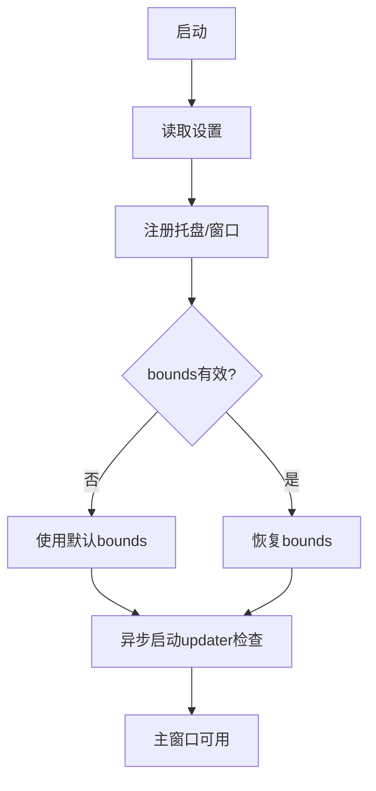
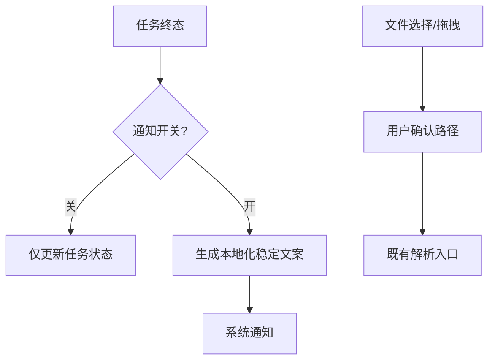
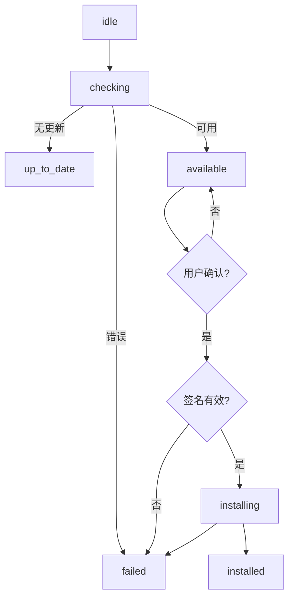
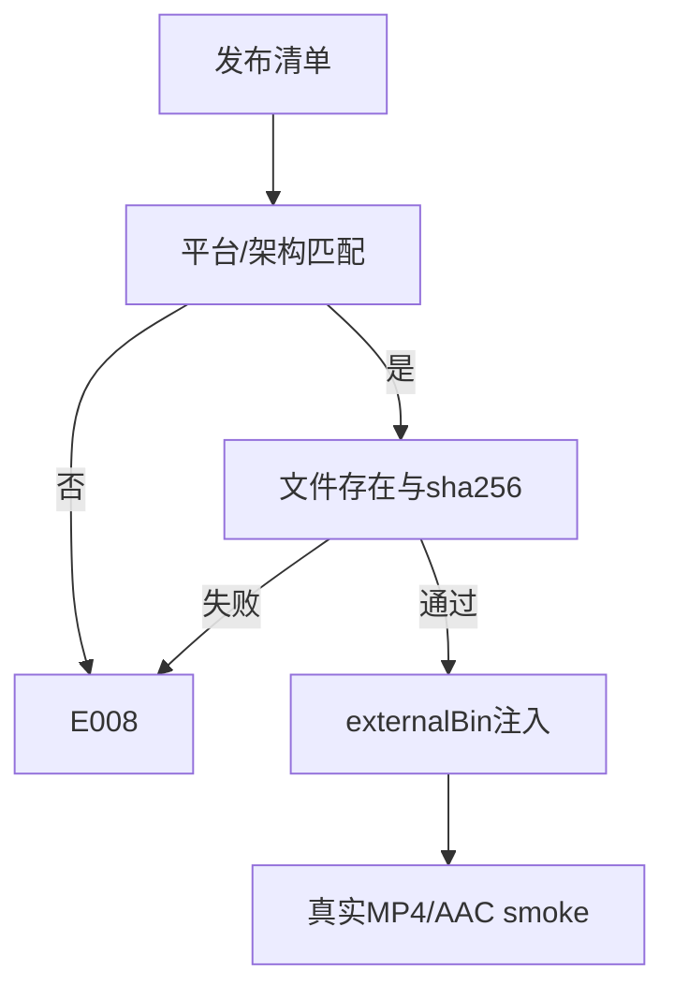
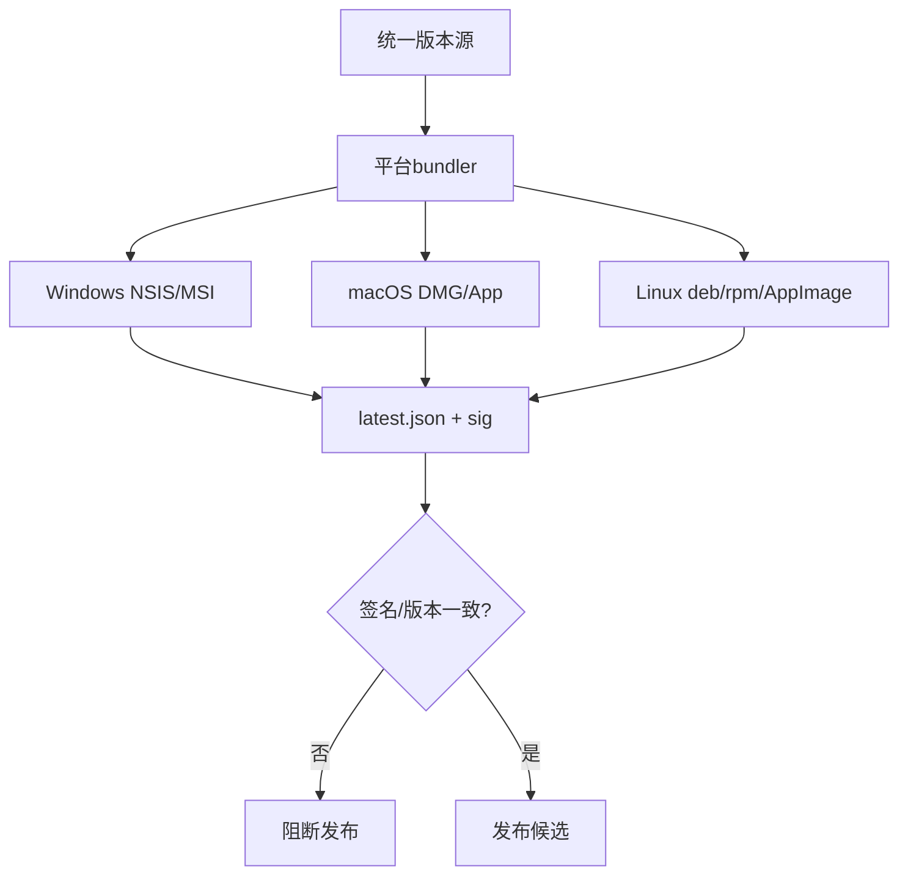
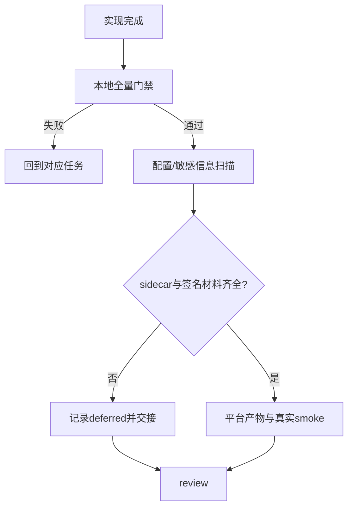

# 执行计划：系统集成与发布

## 交付单元标识

`system-release`

## 阅读导航

- 任务总数：6 个，固定串行依赖。
- 高风险：SR-04 sidecar/签名材料、SR-05 跨平台 bundler。
- 外部闸门：可信 FFmpeg 二进制、证书、公钥、发布 URL 和目标平台 runner。

## 全局摘要

先完成权限与系统生命周期边界，再实现更新状态机和 sidecar 校验，最后接入 bundler 与证据收口。业务下载协议和页面路由不变。

## 任务拆解

### SR-01 系统生命周期、托盘与窗口行为

- 目标：实现启动初始化、托盘菜单、窗口 bounds 恢复、关闭确认/最小化策略。
- 规格映射：SR-AC-01、SR-AC-02、SR-AC-04。
- 影响面：`src-tauri/services/system`、`infrastructure/system`、`lib.rs`、capability。
- 前置：规格批准；读取实际 Tauri 配置与 SettingsManager。
- 完成：启动不阻塞下载页，活动任务退出有确认，损坏 bounds 回退默认。
- 禁止猜测：不得新增业务路由、不得绕过 SettingsManager 持久化。
- 测试：窗口边界纯规则、生命周期 fake、capability 静态检查。

### SR-02 通知、文件对话框与拖拽边界

- 目标：把任务终态映射为本地化通知，复用现有文件选择和拖拽解析入口。
- 规格映射：SR-AC-03。
- 影响面：系统通知 adapter、文件 dialog adapter、既有 parser invoke 边界。
- 前置：SR-01。
- 完成：通知开关可控；通知无 URL/cookie/stderr；路径只来自用户选择。
- 禁止猜测：不在组件或系统层复制 Bilibili 解析规则。
- 测试：通知开关、稳定文案、敏感字段扫描、文件取消路径。

### SR-03 Updater 状态机与签名校验

- 目标：实现 HTTPS 检查、平台/版本匹配、签名验证、安装确认、取消和失败清理。
- 规格映射：SR-AC-05、SR-AC-06。
- 影响面：`services/system/updater`、`infrastructure/update`、typed IPC DTO、设置入口。
- 前置：SR-01；发布 URL、公钥以配置注入。
- 完成：重复检查被拒绝；旧响应不覆盖新请求；未确认/未签名不安装。
- 禁止猜测：不透传原始响应、签名原文或安装器 stderr。
- 测试：HTTPS/平台/版本/签名矩阵、并发代次、取消/失败清理、fake updater。

### SR-04 FFmpeg externalBin 与发布清单

- 目标：按平台校验 sidecar 存在、绝对路径、哈希和许可证材料，缺失稳定返回 E008。
- 规格映射：SR-AC-08、SR-AC-10。
- 影响面：现有 `FfmpegLocator`、`tauri.conf.json` externalBin、sidecar manifest。
- 前置：SR-03；可信二进制和哈希由发布方提供。
- 完成：开发环境缺失可安全失败；发布清单能校验平台/架构/版本/sha256/license。
- 禁止猜测：不下载未知二进制，不把 stderr/绝对路径写入 UI 或任务。
- 测试：缺失/哈希错误/平台不匹配、许可证清单、已有 mux fake 回归；真实 smoke 依赖外部 sidecar。

### SR-05 三平台 bundler 与签名产物

- 目标：配置 Windows NSIS/MSI、macOS DMG/App、Linux deb/rpm/AppImage，并生成一致版本、`latest.json`、`.sig`。
- 规格映射：SR-AC-09、SR-AC-11。
- 影响面：Tauri bundler 配置、CI 发布脚本、图标与签名环境变量。
- 前置：SR-04；平台 runner、签名证书/公钥和发布 URL。
- 完成：每个平台产物命名/版本一致，元数据字段完整，签名步骤失败即阻断发布。
- 禁止猜测：不在本地生成假签名，不把私钥写入仓库。
- 测试：配置静态校验、产物清单一致性、签名缺失阻断；目标平台实机由发布环境执行。

### SR-06 全量验证、发布审查与交接

- 目标：绑定 SR-AC-01..11 证据，完成敏感信息扫描、配置检查、平台产物清单与 sidecar 交接。
- 规格映射：全部验收标准。
- 影响面：verification/review 文档、CI 日志、发布清单。
- 前置：SR-01..SR-05。
- 完成：本地门禁全绿；真实 sidecar smoke 有证据，或明确 deferred 并把阻断交给发布环境。
- 测试：`npm run typecheck`、`npm run build`、Rust fmt/check/test、配置静态扫描和目标平台 smoke。

## 项目脚手架与初始化策略

继续使用现有 Tauri 2/Vue 脚手架；只在现有配置和分层内增加系统适配器、capability、updater/bundler 配置。禁止升级依赖或重建入口。

## API 对接与类型策略

- Rust serde DTO 为唯一 IPC 契约源；前端复用稳定 camelCase 类型。
- updater 原始 JSON 只在 Rust adapter 校验；系统服务接收 typed `UpdateState`。
- 无新增业务 API；发布服务 URL、公钥和签名材料通过构建/运行配置注入。

## 依赖关系

`SR-01 -> SR-02 -> SR-03 -> SR-04 -> SR-05 -> SR-06`

SR-02 可在 SR-01 完成后与 SR-03 并行实现，但发布集成与证据收口仍按上述顺序串行验收。

## 整洁性与复杂度控制

- 端口/适配器只用于平台和外部发布边界；不新增通用 manager/factory 层。
- 每个系统副作用 adapter 单一职责；发布脚本只编排，不复制业务规则。
- 配置表和 manifest 使用显式结构化字段，避免字符串拼接和隐式默认值。

## 模式决策与替代方案

- 采用 Adapter + 组合根 + 显式状态机；拒绝插件市场、事件总线和 pipeline DSL。
- 更新器使用单一 owner 的状态机，不引入可插拔 provider registry。

## 代码上下文与影响范围

- 复用 `src-tauri/lib.rs` 组合根、`SettingsManager`、`TaskManager`、现有 `FfmpegLocator` 和 Tauri capability。
- 不修改下载任务状态契约，不新增页面或路由。
- 前端变更限于设置/通知状态的最小 adapter 与本地化文案。

## 执行方式与人工介入

- 单 agent 串行执行；任务内部可并行跑纯测试，但不并行修改共享配置。
- 人工介入点：签名材料、公钥、sidecar 清单、目标平台 runner、发布确认。

## 回滚说明

- capability、bundler、updater 配置均可按任务粒度回退；不触碰业务数据。
- 更新安装失败删除临时文件并保持当前版本；发布失败保留日志但不标记成功。
