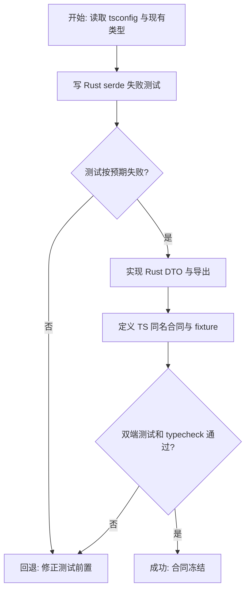
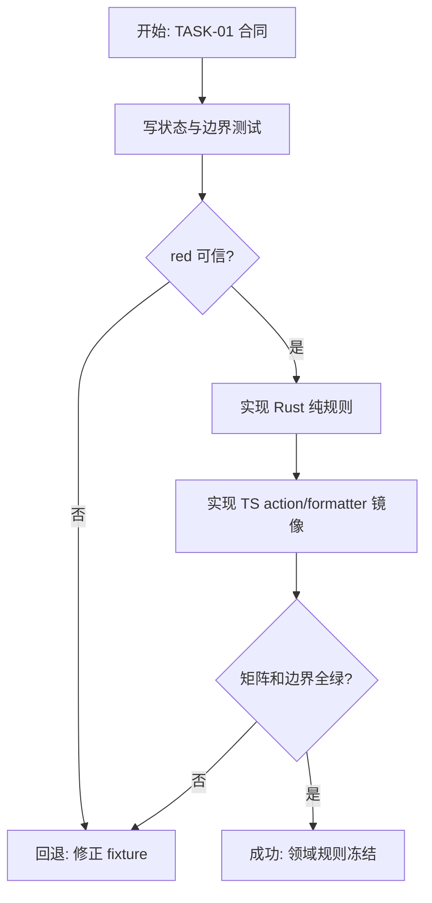
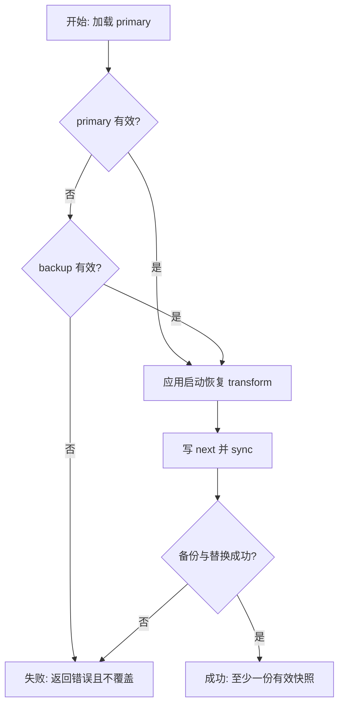
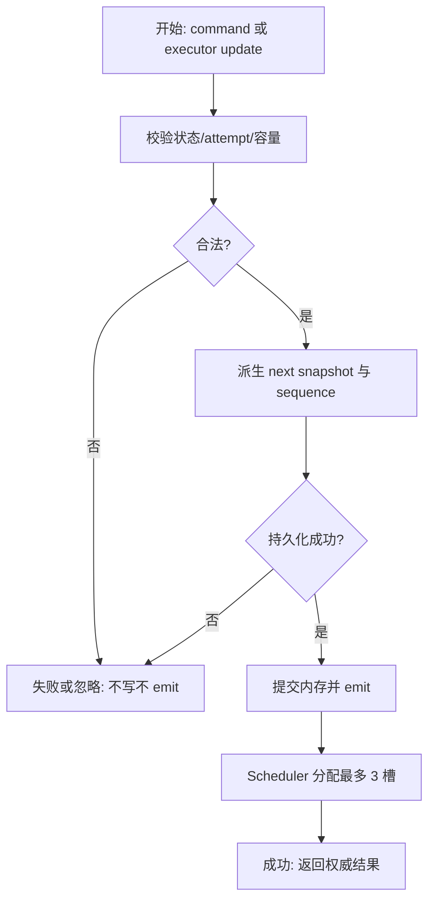
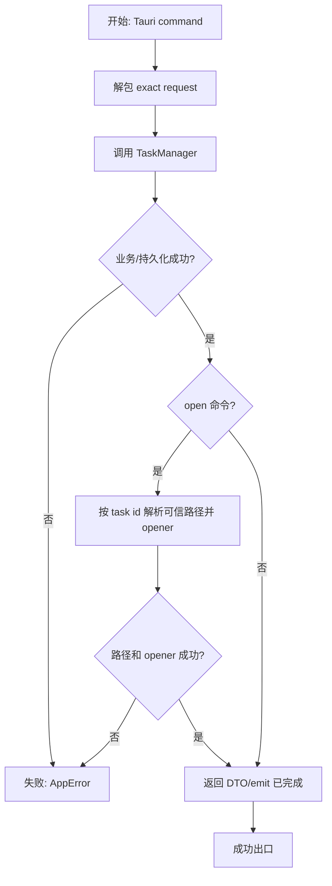
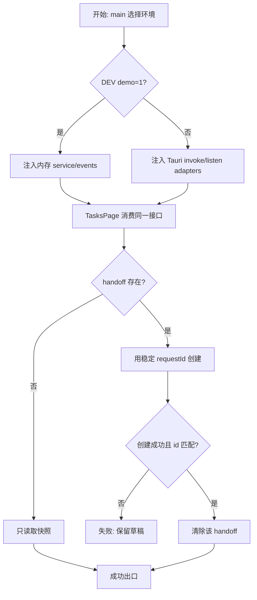
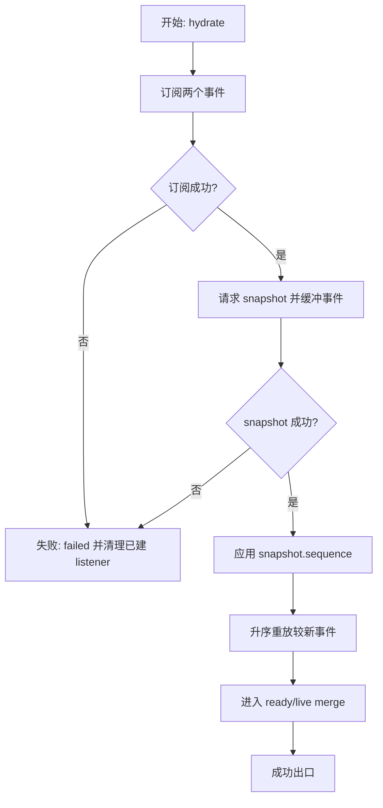
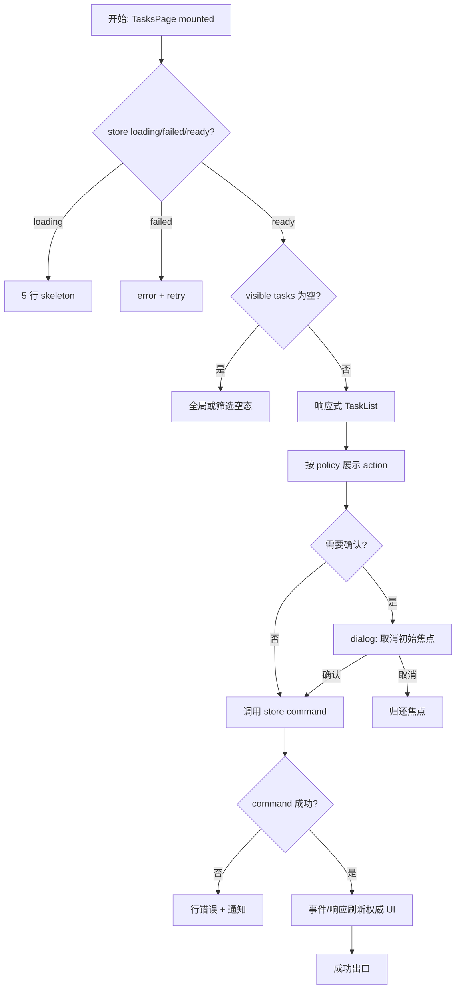
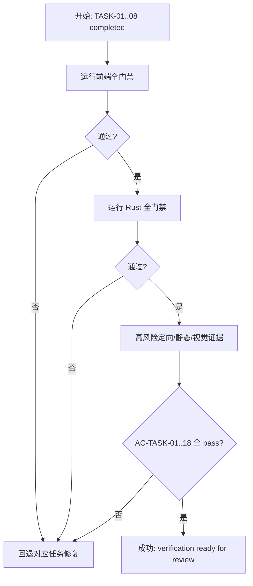

# 下载任务管理实施计划

> **For agentic workers:** 执行时必须使用 `frontend-agent-framework-execute` 与 `superpowers:executing-plans`，按 TASK-01 至 TASK-09 串行推进；每个任务先 red、再 green、最后更新 task-board。当前仓库不是 Git 仓库，不伪造 commit 检查点。

**Goal:** 交付 Rust 权威、可持久恢复且由实时事件驱动的下载任务控制台，并为后续音频/视频执行器提供稳定宿主。

**Architecture:** Rust TaskManager 统一拥有任务事实、状态转换、调度、持久化和事件序号；Vue TaskStore 只合并稳定快照并派生视图。文件系统、Tauri event 和媒体执行通过小型 Port/Adapter 隔离，页面与组件不接触 transport。

**Tech Stack:** Vue 3、TypeScript strict、Pinia、Vue Router、vue-i18n、Naive UI、Lucide、Tauri 2、Rust 1.98、Tokio、serde、Vitest。

**Spec:** `docs/requests/bilicatch-v1-desktop/module-runs/task-management/spec/spec.md`

## Global Constraints

- 只覆盖 `task-management`；不实现真实 HTTP Range、音视频下载、FFmpeg、认证、设置 UI、系统通知或托盘。
- 队列最大 100；默认任务并发 3；单任务连接数默认 8；网络自动重试 3 次，退避 1/2/4 秒。
- Rust serde DTO/本规格字段表为权威合同；TypeScript 保留 camelCase 名称，不随意重命名。
- Rust 是 transition、容量、retry、持久化和文件副作用的唯一权威；前端不推测成功状态。
- 复用现有 create-tauri-app 工程与 AppShell；不新增状态框架、localStorage、通用 Event Bus、Repository 或 DI container。
- 所有 shell 命令以 `rtk` 开头；Rust 使用 `C:/Users/yangjianlin/.cargo/bin/cargo.exe`。
- 文件约 250 行进入职责审查，超过 350 行拆分；TasksPage 约 180 行内；生产 TypeScript 禁止 `any`。

---

## 阅读导航

| 项目 | 内容 |
| --- | --- |
| 任务总数 | 9 |
| 串行任务 | 9 |
| 可并行任务 | 0；共享契约与状态层级连续依赖，不启用 workflow/subagent |
| 高风险任务 | TASK-03 持久化恢复、TASK-04 调度/事件顺序、TASK-07 hydration 竞态 |
| 关键依赖 | 已批准 spec、现有 DownloadTaskDraft/AppError/IpcTransport、Tauri setup/opener |
| 主线 | 契约 -> 领域规则 -> 持久化 -> manager/scheduler -> Tauri -> TS adapter/handoff -> store -> UI -> verify |

## 全局摘要

实施先固定双端类型和序列化，再通过纯函数完成状态机、操作矩阵、文件名和校验。JSON store 通过故障注入证明 `.next/.bak` 恢复；TaskManager 在此基础上实现 FIFO/并发、attempt 防迟到、自动重试、清理和“持久化后 emit”。最后接入 Tauri commands/events/opener、前端 adapter、Pinia hydration 和完整响应式任务页。

最大风险是“快照与事件竞态”和“文件写入中断”：前者由先订阅、缓冲、快照 sequence、重放解决；后者由主文件/备份恢复协议解决。任何架构不兼容先回 `architecture-design`，行为分歧回 `spec`，测试失败在已批准计划内回当前任务修复。

## 任务拆解

### TASK-01：双端任务契约与 TypeScript 上下文

**任务目标**

建立 Rust/TS 稳定任务 DTO、请求、响应与事件类型，先用序列化和 exact field tests 固定 camelCase、枚举、null、十进制 byte 字符串与事件名。

**规格映射**

AC-TASK-01、04、08、17；“API 与数据合同”“代码上下文与影响假设”。

**文件**

- Create: `src-tauri/src/models/task.rs`
- Create: `src-tauri/tests/task_contract.rs`
- Modify: `src-tauri/src/models/mod.rs`
- Create: `src/features/task-management/contracts.ts`
- Create: `src/features/task-management/contracts.test.ts`
- Read/verify: `tsconfig.json`、`src/vite-env.d.ts`、现有 `AppError`、`IpcTransport`、`DownloadTaskDraft`

**Interfaces**

- Consumes: `AppError`、`DownloadTaskDraft` media fields。
- Produces: `TaskStatus`、`TaskControlRequest`、`TaskAction`、`DownloadTask`、`TaskListSnapshot`、create/control/open/batch results、`TaskProgressEvent`、`TaskRemovedEvent`；Rust serde 与 TS 字段完全一致。

**串行属性与完成条件**

- 串行首任务；后续所有任务依赖这些名字。
- 完成时 Rust contract test、TS runtime fixture/type test 与 `vue-tsc` 通过，无 alias/global 猜测。

- [ ] **Step 1: 记录 governing TypeScript 闭包**

确认根 `tsconfig.json` 的 `strict`、ES2020、DOM、ESNext、bundler、noUnused、无 paths/types；只读取上述直接类型与 `@tauri-apps/api/event` 声明入口，并写入 execution changelog。

- [ ] **Step 2: 写失败的 Rust serde 契约测试**

```rust
#[test]
fn task_snapshot_serializes_for_the_frontend() {
    let value = serde_json::to_value(task_fixture()).unwrap();
    assert_eq!(value["status"], "downloading");
    assert_eq!(value["controlRequest"], "none");
    assert_eq!(value["bytesDownloaded"], "9007199254740993");
    assert_eq!(value["totalBytes"], "18014398509481986");
    assert_eq!(value["error"], serde_json::Value::Null);
}
```

运行：`rtk C:/Users/yangjianlin/.cargo/bin/cargo.exe test --manifest-path src-tauri/Cargo.toml --test task_contract`

预期：因 `models::task` 尚不存在而 FAIL。

- [ ] **Step 3: 定义 Rust 权威 DTO**

```rust
#[derive(Debug, Clone, Serialize, Deserialize, PartialEq, Eq)]
#[serde(rename_all = "camelCase")]
pub struct DownloadTask {
    pub id: String,
    pub revision: u64,
    pub created_at: String,
    pub updated_at: String,
    pub file_name: String,
    pub output_dir: String,
    pub output_path: Option<String>,
    pub bvid: String,
    pub cid: u64,
    pub page: u32,
    pub part_title: String,
    pub mode: DownloadMode,
    pub quality_id: Option<String>,
    pub codec: Option<VideoCodec>,
    pub audio_format: Option<AudioFormat>,
    pub audio_bitrate_id: Option<String>,
    pub status: TaskStatus,
    pub control_request: TaskControlRequest,
    pub progress_percent: u8,
    pub bytes_downloaded: String,
    pub total_bytes: Option<String>,
    pub speed_bytes_per_second: String,
    pub eta_seconds: Option<u64>,
    pub automatic_retry_count: u8,
    pub next_retry_at: Option<String>,
    pub error: Option<AppError>,
}
```

请求 wrapper 必须使用 `request` 单参数；event 分别定义 `TaskProgressEvent { sequence, task }` 与 `TaskRemovedEvent { sequence, task_id }`。

- [ ] **Step 4: 写并落实 TS 合同 fixture**

```ts
const task: DownloadTask = {
  id: "batch-1:0", revision: 1, createdAt: "2026-09-10T00:00:00Z",
  updatedAt: "2026-09-10T00:00:00Z", fileName: "P1.mp4", outputDir: "Downloads",
  outputPath: null, bvid: "BV1xx411c7BF", cid: 1001, page: 1, partTitle: "P1",
  mode: "video-audio", qualityId: "80", codec: "avc", audioFormat: null,
  audioBitrateId: null, status: "queued", controlRequest: "none", progressPercent: 0,
  bytesDownloaded: "0", totalBytes: null, speedBytesPerSecond: "0", etaSeconds: null,
  automaticRetryCount: 0, nextRetryAt: null, error: null,
};
expect(task.status).toBe("queued");
```

运行：`rtk npm test -- src/features/task-management/contracts.test.ts`，随后 `rtk npm run typecheck`；预期全部 PASS。

**交互与状态约束**

本任务不渲染 UI、不调用 IPC；只固定可供后续消费的状态域与 optional/null 语义。

**风险与回退**

若 Rust/TS 字段无法一一对齐，停止并修正合同；不得在前端 mapper 中掩盖命名不一致。



### TASK-02：领域状态机、操作策略、校验与文件名

**任务目标**

用纯函数固定七状态 transition、合法操作、进度单调性、草稿/requestId 校验，以及跨平台 200 字符文件名规则。

**规格映射**

AC-TASK-02、03、04、07、10、12；容量/文件名、行操作矩阵、设计约束。

**文件**

- Create: `src-tauri/src/services/tasks/state_machine.rs`
- Create: `src-tauri/src/services/tasks/filename.rs`
- Create: `src-tauri/src/services/tasks/validation.rs`
- Create: `src-tauri/src/services/tasks/mod.rs`
- Modify: `src-tauri/src/services/mod.rs`
- Create: `src/features/task-management/action-policy.ts`
- Create: `src/features/task-management/action-policy.test.ts`
- Create: `src/features/task-management/formatters.ts`
- Create: `src/features/task-management/formatters.test.ts`

**Interfaces**

- Consumes: TASK-01 enums/DTO 与 `DownloadTaskDraft`。
- Produces: `allowed_actions`、`apply_intent`、`apply_execution_update`、`validate_create_request`、`sanitize_filename`；TS `actionsForStatus`、`formatBytes/Speed/Eta/Progress`、稳定排序 comparator。

**前置/完成条件**

- TASK-01 PASS。
- 表驱动测试覆盖每个状态/操作、非法 transition、attempt/回退进度、文件名和输入边界。

- [ ] **Step 1: 写状态矩阵失败测试**

```rust
assert_eq!(allowed_actions(TaskStatus::Downloading), &[TaskAction::Pause, TaskAction::Cancel]);
assert!(apply_intent(&downloading(), TaskAction::Retry).is_err());
assert_eq!(apply_intent(&failed(), TaskAction::Retry).unwrap().status, TaskStatus::Queued);
assert!(accept_progress(&completed(), current_attempt(), 90, 90).is_none());
assert!(accept_progress(&downloading(), stale_attempt(), 70, 700).is_none());
```

运行：`rtk C:/Users/yangjianlin/.cargo/bin/cargo.exe test --manifest-path src-tauri/Cargo.toml services::tasks::state_machine`

预期：模块缺失而 FAIL。

- [ ] **Step 2: 实现函数式 State 规则**

使用穷尽 `match (status, intent)`；queued/downloading/paused/processing 可 cancel，failed 可 retry/delete，completed 可 delete，cancelled 可 delete。pause/resume 只设置 controlRequest，executor 确认才完成状态变化；manual retry 清 error/speed/eta/nextRetryAt/count。

```rust
pub(crate) fn allowed_actions(status: TaskStatus, can_cancel_processing: bool) -> &'static [TaskAction];
pub(crate) fn apply_intent(task: &DownloadTaskRecord, action: TaskAction) -> Result<DownloadTaskRecord, AppError>;
pub(crate) fn apply_execution_update(task: &DownloadTaskRecord, attempt_id: &str, update: ExecutionUpdate) -> Option<DownloadTaskRecord>;
```

- [ ] **Step 3: 写并实现文件名/创建校验表**

```rust
assert_eq!(sanitize_filename("  a\\b/c:*?\"<>|\n  ", "mp4"), "abc.mp4");
assert_eq!(sanitize_filename("CON", "mp4"), "CON_.mp4");
assert_eq!(sanitize_filename("...", "m4a"), "download.m4a");
assert!(sanitize_filename(&"界".repeat(250), "mp4").chars().count() <= 200);
assert!(validate_request_id(" batch\n").is_err());
```

requestId 先 trim 再要求 1-80 个 `[A-Za-z0-9_-]`；outputDir trim 后非空并使用归一值；模式字段按 video/audio 互斥。文件名空 fallback 在 manager 传 `<bvid>-P<page>`，完整名称含扩展名最多 200 Unicode 字符。

- [ ] **Step 4: 写 TS action/formatter 失败测试并实现镜像**

```ts
expect(actionsForStatus("paused", false)).toEqual(["resume", "cancel"]);
expect(actionsForStatus("processing", false)).toEqual([]);
expect(formatBytes("1536")).toBe("1.5 KiB");
expect(formatEta(3723)).toBe("1:02:03");
expect(compareTasks(activeNew, completedNew)).toBeLessThan(0);
```

运行：`rtk npm test -- src/features/task-management/action-policy.test.ts src/features/task-management/formatters.test.ts`；预期实现前 FAIL、实现后 PASS。

- [ ] **Step 5: 执行定向门禁**

运行 Rust 定向测试、TS 两个 suite 与 `rtk npm run typecheck`。全部 PASS 后更新 TASK-02 状态。

**禁止猜测边界**

不得新增状态/操作、改变 100 统计口径、用 byte 截断 Unicode、把文件名/transition 规则放进组件。

**风险与回退**

Rust/TS action policy 若出现不一致，Rust 为权威并修改 TS/test；不得复制第三套模板判断。



### TASK-03：版本化 JSON 持久化与恢复

**任务目标**

实现 app-data `tasks.json` 的 load/save、`.next/.bak` 替换协议、schema 检查和启动状态恢复，确保损坏数据不被静默覆盖。

**规格映射**

AC-TASK-07、09、10、17；“持久化与恢复”。

**文件**

- Create: `src-tauri/src/infrastructure/tasks/mod.rs`
- Create: `src-tauri/src/infrastructure/tasks/json_store.rs`
- Modify: `src-tauri/src/infrastructure/mod.rs`
- Modify: `src-tauri/Cargo.toml`（`[dev-dependencies] tempfile = "3"`）
- Create: `src-tauri/tests/fixtures/tasks-v1.json`

**Interfaces**

- Consumes: internal `PersistedTaskFile { schema_version, sequence, tasks }` 与 TASK-02 recovery transform。
- Produces: `TaskStorePort::load/save`、`JsonTaskStore::new(path)`；load result 明确 `Clean | RecoveredFromBackup`。

**前置/完成条件**

- TASK-02 PASS。
- 临时目录测试覆盖首次启动、round-trip、主文件损坏 backup 恢复、双损坏、未知 schema、替换失败保持有效副本。

- [ ] **Step 1: 写失败的 persistence 故障测试**

```rust
#[test]
fn recovers_from_backup_without_overwriting_corrupt_primary() {
    let dir = tempfile::tempdir().unwrap();
    let store = JsonTaskStore::new(dir.path().join("tasks.json"));
    write_file(store.primary_path(), b"not-json");
    write_file(store.backup_path(), valid_fixture_bytes());
    let loaded = store.load().unwrap();
    assert_eq!(loaded.source, LoadSource::Backup);
    assert_eq!(loaded.snapshot.tasks.len(), 2);
    assert_eq!(std::fs::read(store.primary_path()).unwrap(), b"not-json");
}
```

运行：`rtk C:/Users/yangjianlin/.cargo/bin/cargo.exe test --manifest-path src-tauri/Cargo.toml infrastructure::tasks::json_store`

预期：store 不存在而 FAIL。

- [ ] **Step 2: 实现版本化 load**

主文件不存在返回空 schema v1；主文件有效直接加载；主文件解析/版本失败时尝试 backup 并返回 recovery warning；两者失败返回 `AppError`，不写任何文件。未知高版本不能降级覆盖。

```rust
pub(crate) trait TaskStorePort: Send + Sync {
    fn load(&self) -> Result<LoadedTaskFile, AppError>;
    fn save(&self, snapshot: &PersistedTaskFile) -> Result<(), AppError>;
}
```

- [ ] **Step 3: 实现 `.next/.bak` save**

序列化到同目录 `.next` 并 sync；当前主文件有效时复制/替换 `.bak`；再把 `.next` 提升为主文件。任何失败清理可安全清理的 next，但至少保留一个可解析的 primary/backup；测试注入文件操作失败点证明。

- [ ] **Step 4: 实现恢复 transform**

启动 load 后：downloading/processing -> queued；queued/paused/terminal 保持；所有 task 的 speed/eta/controlRequest/nextRetryAt 清零，attempt 作废，checkpoint/bytes/progress 保留，revision/sequence 增加并立即保存。

- [ ] **Step 5: 执行定向门禁**

运行：`rtk C:/Users/yangjianlin/.cargo/bin/cargo.exe fmt --manifest-path src-tauri/Cargo.toml -- --check` 与 persistence tests；预期全部 PASS。

**禁止猜测边界**

不得用 localStorage、数据库、先删主文件再写、双损坏时返回空成功，或把 executor checkpoint 当作 UI DTO。

**风险与回退**

若 Windows 替换行为不能满足至少一份有效副本，保留旧主文件并使 save 返回错误；不能以数据丢失换取命令成功。



### TASK-04：TaskManager、Scheduler、重试与事件顺序

**任务目标**

在持久化端口上实现命令事务、FIFO/并发 3、executor/event/cleanup ports、attempt 防迟到、自动重试和持久化后 emit。

**规格映射**

AC-TASK-01、02、04、05、06、07、08、10、13；用户流程与副作用边界。

**文件**

- Create: `src-tauri/src/services/tasks/manager.rs`
- Create: `src-tauri/src/services/tasks/scheduler.rs`
- Create: `src-tauri/src/services/tasks/ports.rs`
- Modify: `src-tauri/src/services/tasks/mod.rs`
- Modify: `src-tauri/Cargo.toml`（`tokio = { version = "1", features = ["sync", "time", "rt"] }`）

**Interfaces**

- Consumes: TASK-01 DTO、TASK-02 rules、TASK-03 `TaskStorePort`。
- Produces: `TaskManager::{list,create,control,pause_all,clear_completed,apply_executor_update,set_max_concurrency}`、`TaskExecutorPort`、`TaskEventSink`、`TempFileCleaner`。

**前置/完成条件**

- TASK-03 PASS。
- controllable fake clock/executor/store/sink/cleaner tests 能证明顺序、失败与调用次数；manager 不依赖 Tauri 类型。

- [ ] **Step 1: 写 manager 事务与幂等失败测试**

```rust
let first = manager.create(create_request("batch-1", 2)).await.unwrap();
let second = manager.create(create_request("batch-1", 2)).await.unwrap();
assert_eq!(first.tasks, second.tasks);
assert!(second.reused);
assert_eq!(store.saved_snapshot().tasks.len(), 2);
assert!(sink.events_occurred_after_save());

manager.seed(99);
assert!(manager.create(create_request("batch-2", 2)).await.is_err());
assert_eq!(manager.list().await.tasks.len(), 99);
```

运行：`rtk C:/Users/yangjianlin/.cargo/bin/cargo.exe test --manifest-path src-tauri/Cargo.toml services::tasks::manager`

预期：manager 未定义而 FAIL。

- [ ] **Step 2: 定义最小 Ports 与 manager 事务骨架**

```rust
#[async_trait]
pub(crate) trait TaskExecutorPort: Send + Sync {
    fn supports(&self, mode: DownloadMode) -> bool;
    async fn start(&self, spec: TaskExecutionSpec, attempt_id: String) -> Result<(), AppError>;
    async fn pause(&self, task_id: &str, attempt_id: &str) -> Result<(), AppError>;
    async fn cancel(&self, task_id: &str, attempt_id: &str) -> Result<(), AppError>;
}

pub(crate) trait TaskEventSink: Send + Sync {
    fn progress(&self, event: TaskProgressEvent) -> Result<(), AppError>;
    fn removed(&self, event: TaskRemovedEvent) -> Result<(), AppError>;
}
```

所有 manager 变更先 clone/derive next snapshot，`store.save(next)` 成功后再 commit 内存并 emit；save 失败时内存与事件均不变。锁内不 await executor。

- [ ] **Step 3: 写并实现 FIFO/并发测试**

```rust
manager.set_max_concurrency(3).unwrap();
manager.schedule().await.unwrap();
assert_eq!(executor.started_ids(), vec!["batch:0", "batch:1", "batch:2"]);
assert_eq!(manager.task("batch:3").status, TaskStatus::Queued);
manager.complete("batch:0").await.unwrap();
assert_eq!(executor.started_ids().last().unwrap(), "batch:3");
```

eligible 顺序为 createdAt/index FIFO；downloading/processing 占槽；paused/queued/retry wait 不占；降低并发不终止在跑任务。没有支持 mode 的 executor 时任务保持 queued。

- [ ] **Step 4: 写并实现 attempt/重试测试**

使用 paused/resume、cancel 和 retry 都生成/失效 attempt；stale attempt、bytes/progress 回退和 terminal update 不写不 emit。fake clock 断言 retryable failure 在 1/2/4 秒重新 eligible，初始 + 3 次失败后 failed；terminal 直接 failed；manual retry count 归零。

```rust
assert!(manager.apply_executor_update(id, old_attempt, progress(80)).await.unwrap().is_none());
clock.advance_seconds(1);
assert_eq!(manager.task(id).automatic_retry_count, 1);
assert_eq!(executor.start_count(id), 2);
```

- [ ] **Step 5: 写并实现暂停/恢复/取消/批量测试**

pause 设置 pauseRequested，executor confirm 才 paused；resumeRequested 等槽位后直接 downloading。取消先使 attempt 失效，调用 executor cancel 和 cleaner；cleaner 失败进入 failed。pause_all 汇总逐项 failures；clear_completed 一次 save 后发 remove events，任一 save 失败时零删除。

- [ ] **Step 6: 实现进度 coalescing 与 persistence cadence**

状态变化立即 save+emit；同任务普通进度 emit 最多 250ms 一次、save 最多 1s 一次，但缓存最新值并在终止/flush 前提交。fake clock 不使用真实 sleep，测试窗口边界与最终 flush。

- [ ] **Step 7: 执行 manager 全门禁**

运行 manager/scheduler/state tests、`cargo fmt --check`、`cargo check --offline`；全部 PASS 后记录 TASK-04。

**禁止猜测边界**

不得在 manager 内实现 HTTP/FFmpeg；不得持锁等待 executor；不得 emit 未持久化快照；不得把部分 clear 当成功。

**风险与回退**

若 coalescing 与事务耦合导致复杂度失控，保留状态事件即时和每秒持久化，先将进度 coalescer 独立为 scheduler helper；不放宽 sequence/attempt 规则。



### TASK-05：Tauri Commands、事件与可信路径 Opener

**任务目标**

把 TaskManager 接入 Tauri setup/state，注册六个 exact commands，实现 TauriTaskEventSink 和按 task id 验证的文件/目录打开。

**规格映射**

AC-TASK-08、09、13、14、17、18；Commands/Event 合同与 opener 安全边界。

**文件**

- Create: `src-tauri/src/commands/tasks.rs`
- Modify: `src-tauri/src/commands/mod.rs`
- Create: `src-tauri/src/infrastructure/tasks/tauri_event_sink.rs`
- Modify: `src-tauri/src/infrastructure/tasks/mod.rs`
- Modify: `src-tauri/src/lib.rs`
- Modify only if generated capability proves necessary: `src-tauri/capabilities/default.json`

**Interfaces**

- Consumes: TASK-04 TaskManager/public DTO、Tauri AppHandle、现有 opener plugin。
- Produces: exact commands `list_download_tasks`、`create_download_tasks`、`control_download_task`、`pause_all_download_tasks`、`clear_completed_tasks`、`open_download_task`；events exact `download://progress`、`download://removed`。

**前置/完成条件**

- TASK-04 PASS。
- command tests prove request wrapper names and no arbitrary path parameter; `lib.rs` setup loads app-data manager without breaking ParserService。

- [ ] **Step 1: 写 command/registration 失败测试**

在 `src-tauri/tests/task_contract.rs` 静态/serde request assertions 中固定 nested request 字段；在 Rust unit test 对 opener adapter 使用 recording opener，completed 存在路径通过，queued/缺失/不存在路径失败。

```rust
let request = OpenDownloadTaskRequest { task_id: "batch:0".into(), target: OpenTarget::File };
assert!(service.open(request).await.is_ok());
assert_eq!(opener.paths(), vec![trusted_output_path]);
```

运行 task contract 与 commands tests；预期命令模块缺失而 FAIL。

- [ ] **Step 2: 实现薄 Commands**

```rust
#[tauri::command]
pub async fn create_download_tasks(
    request: CreateDownloadTasksRequest,
    manager: State<'_, TaskManager>,
) -> Result<CreateTasksResult, AppError> {
    manager.create(request).await
}
```

其余五个 command 同样只做参数解包/调用；业务 guard 留在 manager。delete 的 control result 返回删除前 task 且 remove event 为集合删除权威信号。

- [ ] **Step 3: 实现 Tauri event sink**

`progress` 调 `AppHandle.emit("download://progress", event)`；`removed` 调 `emit("download://removed", event)`；emit error 归一为 AppError，不创建应用内 Event Bus。

- [ ] **Step 4: 在 setup 中组合 manager**

保留 ParserService `.manage(parser)`；在 `.setup` 解析 `app.path().app_data_dir()`、构建 JsonTaskStore/TauriTaskEventSink/deferred executor、加载/恢复并 `app.manage(manager)`；setup 失败终止启动且提供明确错误。

- [ ] **Step 5: 实现可信路径打开**

command 仅接收 taskId/target；manager 返回 completed task 的 outputPath 后再次检查存在性，target=file 打开文件，directory 打开 parent。前端无法传路径；无需新增超出 `opener:default` 的 permission 时保持 capability 不变。

- [ ] **Step 6: 执行 Tauri 门禁**

运行 task/command tests、`rtk C:/Users/yangjianlin/.cargo/bin/cargo.exe check --manifest-path src-tauri/Cargo.toml --offline` 与 `cargo fmt --check`；确认 parse_video 仍注册。

**禁止猜测边界**

不得把 AppHandle 注入 domain model，不接收 arbitrary path，不移除现有 commands/plugin/capability。

**风险与回退**

若 opener 后端 API 与当前插件版本签名不同，只在 infrastructure adapter 按已安装声明调整；不能退回前端直接 openPath 任意路径。



### TASK-06：前端 Service/Event Adapter 与草稿幂等交接

**任务目标**

实现 TypeScript exact invoke/listen adapter、注入边界、开发 demo service，以及兼容现有 append/items/clear 的 handoffId。

**规格映射**

AC-TASK-01、08、14、15、17、18；页面初始化、API adapter 与 demo 风险边界。

**文件**

- Create: `src/services/ipc/event-client.ts`
- Create: `src/services/ipc/event-client.test.ts`
- Create: `src/features/task-management/service.ts`
- Create: `src/features/task-management/service.test.ts`
- Create: `src/features/task-management/injection.ts`
- Create: `src/features/task-management/demo-service.ts`
- Modify: `src/stores/task-drafts.ts`
- Modify: `src/stores/task-drafts.test.ts`
- Modify: `src/main.ts`

**Interfaces**

- Consumes: `IpcTransport`、`@tauri-apps/api/event.listen`、TASK-01 contracts、existing task drafts。
- Produces: `TaskService` query/commands、`TaskEventSource.subscribe(onProgress,onRemoved) -> Promise<UnlistenFn>`、injection keys、`handoffId` lifecycle、DEV-only deterministic task fixtures。

**前置/完成条件**

- TASK-05 PASS。
- exact command/args/event names、unsubscribe、reject normalization、handoff stability/clear-after-id tests 通过；main 只负责组合。

- [ ] **Step 1: 写 service exact request 失败测试**

```ts
await service.createTasks({ requestId: "batch-1", drafts });
expect(invoke).toHaveBeenCalledWith("create_download_tasks", {
  request: { requestId: "batch-1", drafts },
});
await service.openTask("task-1", "directory");
expect(invoke).toHaveBeenCalledWith("open_download_task", {
  request: { taskId: "task-1", target: "directory" },
});
```

运行：`rtk npm test -- src/features/task-management/service.test.ts src/services/ipc/event-client.test.ts`；预期模块缺失而 FAIL。

- [ ] **Step 2: 实现 EventTransport 与 TaskService**

`event-client.ts` 只把 Tauri `listen<T>` 适配为 payload callback；TaskService 固定六个 command，不 remap DTO。`subscribe` 先完成两个 listener；第二个失败时立即 unlisten 第一个再 reject。

```ts
export interface TaskEventSource {
  subscribe(
    onProgress: (event: TaskProgressEvent) => void,
    onRemoved: (event: TaskRemovedEvent) => void,
  ): Promise<() => void>;
}
```

- [ ] **Step 3: 扩展草稿 handoff 且保留兼容面**

首次 append 到空 store 时创建 `handoffId`；继续 append 保持同 id；`clear(expectedId?)` 只在 id 匹配时清理，防止旧请求响应清掉新草稿。requestId 生成器封装为可测试函数，输出 1-80 合法字符。

```ts
store.append([draft]);
const requestId = store.handoffId;
store.append([secondDraft]);
expect(store.handoffId).toBe(requestId);
store.clear("other-id");
expect(store.items).toHaveLength(2);
```

- [ ] **Step 4: 提供确定性 DEV demo**

仅 `import.meta.env.DEV && demo=1` 使用内存 TaskService/EventSource，fixture 覆盖 downloading/paused/processing/completed/failed/cancelled 和长文件名；支持 query 参数触发 empty/error。production 分支仍用真实 IPC/event。

- [ ] **Step 5: 更新 Composition Root**

在 `main.ts` 与 parse service 相同 demoMode 下构建 task service/event source，通过 injection key provide；不得把实例放 global 或 Pinia state。

- [ ] **Step 6: 执行 adapter/handoff 门禁**

运行四个定向 suite、现有 `task-drafts.test.ts` 与 `DownloadPage.test.ts`、`rtk npm run typecheck`；验证解析入队交接无回归。

**禁止猜测边界**

不得在 service 格式化字段/实现状态机，不在生产路径引用 demo fixture，不让旧 clear 清除新 handoff。

**风险与回退**

若双 listen 部分成功，必须清理首 listener；不能以页面卸载时泄漏订阅作为可接受风险。



### TASK-07：Pinia Hydration、事件合并、筛选与命令状态

**任务目标**

建立前端唯一任务状态源，正确完成先订阅/缓冲/快照/重放、sequence 去重、稳定排序、派生计数和行/批量 pending。

**规格映射**

AC-TASK-01、02、07、08、11、12、13、15；初始化、筛选排序、边界异常。

**文件**

- Create: `src/features/task-management/store.ts`
- Create: `src/features/task-management/store.test.ts`

**Interfaces**

- Consumes: TASK-01 contracts、TASK-02 action/formatter、TASK-06 TaskService/EventSource 与 handoff store。
- Produces: `hydrate`、`dispose`、`acceptProgress`、`acceptRemoved`、`createPendingDrafts`、`control/open/pauseAll/clearCompleted` actions；`visibleTasks/counts/canPauseAll/canClearCompleted/capacityState` getters。

**前置/完成条件**

- TASK-06 PASS。
- fake deferred promises/events 证明所有竞态、重复、乱序、unsubscribe、pending 成败和筛选排序。

- [ ] **Step 1: 写 hydration 竞态失败测试**

```ts
const hydration = store.hydrate(service, events);
events.progress({ sequence: 12, task: task({ id: "a", progressPercent: 60 }) });
snapshot.resolve({ sequence: 10, capacity: 100, tasks: [task({ id: "a", progressPercent: 20 })] });
await hydration;
expect(store.byId.a.progressPercent).toBe(60);
events.progress({ sequence: 11, task: task({ id: "a", progressPercent: 40 }) });
expect(store.byId.a.progressPercent).toBe(60);
```

另测 remove/upsert 混排、未知 remove、subscribe 失败、snapshot 失败、dispose 幂等。运行 `rtk npm test -- src/features/task-management/store.test.ts`，预期 store 缺失 FAIL。

- [ ] **Step 2: 实现 hydration 状态机**

状态固定 `idle | subscribing | loading | ready | failed`；先 await subscribe，再 list；loading 期间缓冲两个事件，应用 snapshot 后仅重放较新序号；ready 后按 sequence 接受。dispose 调 unsubscribe、清 timer/buffer，旧 hydration token 不得覆盖新实例。

- [ ] **Step 3: 实现规范化集合与派生 getter**

store 使用 `Record<string, DownloadTask>` + stable `orderIds`；upsert 只替换单项，不整表重建。counts 和 filters 按 spec；active-first、createdAt desc comparator；progress 不改变 orderIds。

```ts
const active = new Set<TaskStatus>(["queued", "downloading", "paused", "processing"]);
function matchesFilter(task: DownloadTask, filter: TaskFilter): boolean {
  if (filter === "active") return active.has(task.status);
  if (filter === "completed") return task.status === "completed";
  if (filter === "failed") return task.status === "failed";
  return true;
}
```

- [ ] **Step 4: 实现 handoff 创建与 command pending**

hydrate ready 后才创建 pending drafts；成功 merge result 并 `clear(requestId)`，失败保留。`pendingTaskIds`/`batchPending` 在调用前设置，在成功/失败 finally 解除；response/event 都走同一 sequence/upsert 路径，不推测目标状态。

- [ ] **Step 5: 实现错误与容量状态**

区分 blocking initialError、nonblocking bannerError、rowErrors；已有集合时刷新/listen 失败不清空数据。capacity 0-89 normal、90-99 warning、100 full；queue-full details 转为明确本地 key，不修改 AppError code。

- [ ] **Step 6: 执行 store 门禁**

运行 store suite、contracts/action/formatter suites 和 `rtk npm run typecheck`；预期全部 PASS 且无悬挂 timer/listener warning。

**禁止猜测边界**

不得 optimistic 改权威 status、按事件重排、在组件复制 filter/count、用 watch 深拷贝整表或吞掉监听错误。

**风险与回退**

若 response 与 event sequence 语义不一致，回到 TASK-01/05 修订合同；不能用“最后到达者胜”绕过 sequence。



### TASK-08：完整任务页、组件、样式与可访问交互

**任务目标**

实现四筛选工具条、稳定任务列/响应式行、七状态、进度与格式、所有行/批量操作、确认、loading/empty/error 及双语文案。

**规格映射**

AC-TASK-02、10、11、12、13、15、16、18；完整 page-design 与 Function-complete 行为。

**文件**

- Create: `src/features/task-management/components/TaskToolbar.vue`
- Create: `src/features/task-management/components/TaskList.vue`
- Create: `src/features/task-management/components/TaskRow.vue`
- Create: `src/features/task-management/components/TaskStatus.vue`
- Create: `src/features/task-management/components/TaskProgress.vue`
- Create: `src/features/task-management/components/TaskConfirmDialog.vue`
- Create: `src/features/task-management/task-management.css`
- Create: component tests beside components as `*.test.ts`
- Modify: `src/pages/TasksPage.vue`
- Create: `src/pages/TasksPage.test.ts`
- Modify: `src/main.ts`（import feature stylesheet）
- Modify: `src/locales/zh-CN.ts`
- Modify: `src/locales/en-US.ts`

**Interfaces**

- Consumes: TASK-07 store/actions/getters、shared EmptyState/AppIconButton、Router/i18n/notifier。
- Produces: 完整 `/tasks` 可访问页面；组件只通过 typed props/emits 交互。

**前置/完成条件**

- TASK-07 PASS。
- 组件/page tests 覆盖七状态、四筛选、全部动作、确认焦点、long text、loading/empty/error；三宽度截图无重叠。

- [ ] **Step 1: 写页面 loading/filter/empty 失败测试**

```ts
expect(wrapper.findAll("[data-testid='task-skeleton-row']")).toHaveLength(5);
await wrapper.get("[data-filter='active']").trigger("click");
expect(wrapper.findAll("[data-task-id]")).toHaveLength(4);
expect(wrapper.get("[role='tab'][aria-selected='true']").text()).toContain("下载中");
```

运行：`rtk npm test -- src/pages/TasksPage.test.ts`；预期占位页不满足而 FAIL。

- [ ] **Step 2: 实现 TaskToolbar 与页面状态骨架**

四 tabs 保持稳定 count 区，左右键切换；暂停全部/清除完成使用 icon+text、disabled tooltip。TasksPage onMounted hydrate，onUnmounted dispose；全空 EmptyState 跳 `/download`，筛选空为紧凑行，initial failure 有 retry，已有数据错误用 banner。

- [ ] **Step 3: 写并实现列/状态/进度组件测试**

```ts
expect(progress.attributes("role")).toBe("progressbar");
expect(progress.attributes("aria-valuenow")).toBe("65");
expect(row.get("[data-field='speed']").text()).toBe("2.3 MiB/s");
expect(row.get("[data-field='eta']").text()).toBe("1:20");
expect(failedRow.get("[data-field='error']").attributes("title")).toContain("timeout");
```

TaskList 桌面列顺序严格为文件/状态/进度/速度/剩余与大小/操作；空 speed/ETA 使用短横线；文件/错误省略但 title/tooltip 完整。

- [ ] **Step 4: 写并实现 action matrix 与确认交互**

逐状态断言按钮：queued cancel；downloading pause/cancel；paused resume/cancel；processing 按 `canCancelProcessing`；failed retry/delete；completed open menu/delete；cancelled delete。按钮取 `actionsForStatus`，TaskRow 不自行 switch。

取消、completed delete、clear completed 打开 dialog；初始焦点为取消，Escape/取消关闭并归还触发按钮；确认后从 command 开始至 promise settle 显示 busy 并防重复。failed/cancelled delete 可直接调用。

- [ ] **Step 5: 实现双语内容与通知规则**

新增 `tasks.filters/status/actions/columns/empty/errors/confirm/capacity/metadata` 对称 key；现有 errors 保持。pause/resume/retry 成功只靠状态变化；命令失败全局通知 + 行错误；capacity 90/100 用 warning 文案。

- [ ] **Step 6: 实现稳定响应式 CSS**

`>=1100px` 六列；860-1099 四列合并遥测；<860 极窄两至三行 grid、tabs 可横向滚动。固定 progress 6px、按钮 36px、行 min-height 68px、`min-width:0`；不嵌套卡片、不缩放字体、不用渐变。

- [ ] **Step 7: 加入确定性视觉入口并截图**

DEV `#/tasks?demo=1` 显示混合状态，`&empty=1` 和 `&error=1` 显示分支。用 Edge/Playwright 等现有可用浏览器在 1280x800、900x700、800x650 与 800x1100 检查首屏/滚动；截图保存 verification evidence，不进入 production fixture。

- [ ] **Step 8: 执行 UI 门禁**

运行 task component/page suites、全部前端 tests、`rtk npm run typecheck`、`rtk npm run build`；使用可访问树或 DOM assertions 检查 tab/progress/dialog/aria-label/focus。

**禁止猜测边界**

不得增加搜索/分页/排序 UI，不显示范围外帮助文案，不让长文本遮挡动作，不以颜色作为唯一状态，不把 section 包成浮动卡片。

**风险与回退**

若 800px 操作区拥挤，按批准设计合并遥测/换行，不隐藏合法操作或缩小字体；若 dialog 库焦点行为不足，修正组件而非跳过焦点测试。



### TASK-09：跨端集成、验收矩阵与最终门禁

**任务目标**

对 AC-TASK-01..18 建立证据矩阵，执行全量前后端、持久化故障、事件竞态、静态边界和多宽度验收，修复范围内失败后提交 verify。

**规格映射**

AC-TASK-01..18 全覆盖；人工评审与交接、风险。

**文件**

- Create: `docs/requests/bilicatch-v1-desktop/module-runs/task-management/verification/verification.md`
- Create: `docs/requests/bilicatch-v1-desktop/module-runs/task-management/verification/evidence/commands.md`
- Create: visual evidence PNG files
- Modify: `docs/requests/bilicatch-v1-desktop/module-runs/task-management/execution/changelog.md`
- Modify: `docs/requests/bilicatch-v1-desktop/module-runs/task-management/plan/task-board.md`

**Interfaces**

- Consumes: TASK-01..08 全部实现、spec AC、frontend/Rust toolchain。
- Produces: 每条 AC 的 pass/fail/evidence/handoff，进入 review 所需的 verification artifact。

**前置/完成条件**

- TASK-08 PASS。
- 所有 blocking AC pass；任何失败立即回对应任务，不把 warning 写成 pass。

- [ ] **Step 1: 写验收矩阵骨架并绑定测试名**

每行使用 `Acceptance item | Verification method | Result | Evidence | Follow-up | Handoff`；先把 AC-TASK-01..18 标为 pending，再在命令/视觉证据产生后逐行改 pass/fail。

- [ ] **Step 2: 执行完整前端门禁**

```powershell
rtk npm test -- --run
rtk npm run typecheck
rtk npm run build
```

记录 test files/count、构建产物大小和任何 warning；失败回 TASK-06/07/08。

- [ ] **Step 3: 执行完整 Rust 门禁**

```powershell
rtk C:/Users/yangjianlin/.cargo/bin/cargo.exe fmt --manifest-path src-tauri/Cargo.toml -- --check
rtk C:/Users/yangjianlin/.cargo/bin/cargo.exe check --manifest-path src-tauri/Cargo.toml --offline
rtk C:/Users/yangjianlin/.cargo/bin/cargo.exe test --manifest-path src-tauri/Cargo.toml --offline
```

记录 lib/integration/doc tests 数量；失败回 TASK-01..05 的拥有任务。

- [ ] **Step 4: 执行高风险定向证据**

单独记录：99+2 原子拒绝、幂等 create、状态矩阵、并发第 4 项等待、1/2/4 fake clock、stale attempt、persist-before-emit、primary/backup 双损坏、恢复 transform、取消清理失败、可信 opener、subscribe 部分失败、snapshot/event 乱序。

- [ ] **Step 5: 执行静态边界扫描**

```powershell
rtk rg -n "invoke\(|listen\(|localStorage|sessionStorage|\bany\b|TODO|FIXME|console\." src src-tauri/src
rtk rg -n "download://progress|download://removed|create_download_tasks|TaskExecutorPort" src src-tauri/src
```

确认 invoke/listen 只在 adapters，组件不导入 Pinia/Tauri，parse_video 仍注册，无范围外下载/通知实现。

- [ ] **Step 6: 执行视觉与可访问验收**

检查 1280x800、900x700、800x650、800x1100 的混合状态，以及 900x700 empty/error；验证 canvas/页面非空、无重叠/横向页面溢出、长中英文不遮挡、tabs/progress/dialog/icon tooltips/focus 可操作。

- [ ] **Step 7: 完成 verification 与 handoff**

只有 AC-TASK-01..18 全 pass 才将 TASK-09 completed、state 切 verify/review；失败则 `reentry_reason=verification_failed` 回 execute 并修复，不请求 review。

**禁止猜测边界**

不得用 demo 截图证明真实 Rust 下载；不得忽略测试 skip/warning；不得把后续 executor 缺失误报为本模块真实下载成功。

**风险与回退**

浏览器无法执行 Tauri 原生 opener/persistence 时，用 Rust adapter/integration tests 证明原生边界，浏览器只证明 UI；证据中明确区分。



## 功能拆解明细

### 任务表格

| 顺序 | 列 | 来源 | 格式与空值 | 操作关系 |
| --- | --- | --- | --- | --- |
| 1 | 文件/媒体 | fileName、page、mode、codec/format | 名称单行省略+tooltip；次行 metadata | 点击名称不隐式打开 |
| 2 | 状态 | status、controlRequest、nextRetryAt | 七种本地化 badge；等待恢复/重试补充文本 | action-policy 决定操作 |
| 3 | 进度 | progressPercent | 0-100 + 固定 6px progressbar；未知 processing 用 aria-valuetext | 高频事件局部更新 |
| 4 | 速度 | speedBytesPerSecond | downloading 且 >0 格式化，否则短横线 | 无 |
| 5 | 剩余/大小 | etaSeconds、bytesDownloaded、totalBytes | ETA `mm:ss/h:mm:ss`；size downloaded/total | 无 |
| 6 | 操作 | status + pending | 图标、tooltip、aria-label、36px | pause/resume/cancel/retry/open/delete |

- 筛选无分页/搜索/用户排序；全部、active、completed、failed 从单一集合派生。
- loading 5 skeleton；全空可去 `/download`；筛选空短文案；blocking error 可 retry；nonblocking error 保留列表。
- 页面没有文本输入。唯一需归一的 string 是 API requestId/outputDir/filename，已在 TASK-02 明确 trim、空白、换行、非法字符、字符计数与提交时校验。

### 交互 Loading 起止

| 交互 | 开始 | 成功结束 | 失败/中断结束 |
| --- | --- | --- | --- |
| hydrate | 开始建立 listener | snapshot + buffered replay 完成 | subscribe/list 失败并清理 listener |
| handoff create | ready 后调用 create | response/event merge 且匹配 id 清 drafts | 保留 drafts、显示 retry |
| 行 command | 调 service 前 | 权威 response/event 接受 | reject 后保留状态、行错误+通知 |
| pause all | 调 batch command 前 | affected/failures 处理完成 | reject 后 batch pending 清除 |
| clear completed | 用户确认后 | remove events/response 合并 | 集合不变、dialog 可重试 |
| open | 选 file/directory 后 | opener resolve | 显示错误通知，不改 task |

## 项目脚手架与初始化策略

- 继续使用仓库现有官方 Vue+TypeScript/Tauri 2 scaffold，不创建第二应用/package。
- 新依赖仅允许 Rust Tokio sync/time/rt 与测试 tempfile；前端现有 `@tauri-apps/api` 已含 event API，opener plugin 已安装。
- `main.ts` 只增加 task service/event injection 与 CSS；`lib.rs` 保留 parser manage/commands 并增加 task setup。
- 不更改 Hash router、最小窗口、主题 token、Pinia/i18n/Naive UI/Lucide 选择。

## API 对接与类型策略

- Contract source：Rust serde DTO + approved spec field table；无 backend TS/protobuf/OpenAPI。
- TASK-01 翻译同名 TS；TASK-05 提供 Rust commands/events；TASK-06 负责 invoke/listen adapter；TASK-07/08 只直接消费稳定 DTO。
- 六 commands 的 exact 参数/返回在 TASK-01/05/06 分别由 serde、command 和 transport tests 覆盖。
- 数据语义不需要 UI mapper；bytes/ETA/display 仅由 formatter 处理，AppError 由现有 normalizeIpcError 统一。
- event 原始 envelope 只在 EventTransport 解包，store 接收 TaskProgressEvent/TaskRemovedEvent。

## 依赖关系

```text
TASK-01 -> TASK-02 -> TASK-03 -> TASK-04 -> TASK-05 -> TASK-06 -> TASK-07 -> TASK-08 -> TASK-09
```

每个任务完成其定向门禁后才能进入下一任务。没有可安全并行的执行单元：即使 UI 与 Rust 文件不同，也依赖同一 DTO、行为矩阵和事件序号，串行能减少重复返工。

## 整洁性与复杂度控制

- State transition、filename、validation、formatting、sorting 各自纯函数单点；模板无复杂分支。
- manager 遵循 validate -> derive -> persist -> emit；commands/page 只编排。
- listener/timer/attempt 都有明确 owner 与 dispose/invalidate；测试断言清理。
- Rust internal record 与 public DTO 分离；checkpoint/temp/sourceRequestId 不泄漏。
- 若 manager 超过 350 行，按 command transaction、executor update、scheduler coordination 拆文件，不引入空泛 Manager 层之外的二次 facade。

## 模式决策与替代方案

| Pattern | 真实问题 | 最轻实现 | 拒绝方案/移除信号 |
| --- | --- | --- | --- |
| State | 七状态/操作易漂移 | Rust match + TS policy mirror tests | 拒绝状态类；状态缩为简单二元时可移除表 |
| Adapter/Port | FS/Tauri/executor 需测试替换 | 小 load/save、emit、executor 接口 | 拒绝通用 Repository/DI；单纯 formatter 不建 port |
| Observer | worker 实时更新 Vue | 两个固定 event + sequence/buffer/unsubscribe | 拒绝全局 Event Bus；无实时需求时改 query |
| Command | 多控制意图共享入口 | TaskAction 枚举 | 拒绝 command classes/handler registry |

## 代码上下文与影响范围

- 入口：`src/main.ts`、`src/pages/TasksPage.vue`、`src/stores/task-drafts.ts`、`src-tauri/src/lib.rs`、commands/models/services/infrastructure。
- 共享邻居：DownloadPage append/route、AppError/IpcTransport、AppShell task nav、ParserService 注册。
- code graph missing/bootstrap 无仓库入口已记录；execute 再用 `rg` 确认新增 import/call sites，不安装任意 vendor 工具。
- 预期新增约 20 个 focused files；不修改 parse contracts，task draft 只增加 handoff 元数据。

## 并行执行建议

- 结论：不启用 workflow-style parallel execution，不派发 subagent。
- 原因：当前 request 固定 `execution_mode=sequential`；九个任务形成单链，跨端契约和状态规则是共享高冲突面。
- 可并行的只剩只读命令或独立测试运行，可由工具层并发，不构成独立实现 workflow。

## 触发与上下文准备

- Trigger：用户批准计划后，state 从 plan gate 进入 execute。
- Context：approved spec/clarifications、page/architecture design、code-context、task board、当前 TS/Rust入口。
- Observation points：每个 TASK 的 red、green、targeted gate；TASK-04/07/09 为强制人工检查点。
- Handoff：TASK-09 verification -> framework review；任何 blocker 回 execute，architecture mismatch 回 architecture-design。

## 受影响文件或模块

- Frontend：task-management feature、TasksPage、task-drafts、main composition、locales、IPC event adapter、styles/tests。
- Rust：task model、task service/state/scheduler/ports、JSON/event infrastructure、task commands、lib setup、Cargo/tests/fixtures。
- Docs：task board、execution changelog、verification/evidence、state。
- 明确不改：DownloadPage UI/parse_video contract、Login/Settings 页面业务、audio/video downloader、system notifications。

## 测试策略

- TDD：每个 TASK 先运行精确失败测试，再最小实现，再定向 green；TASK-09 才执行全量门禁。
- Rust：table-driven state/filename/validation；in-memory ports + fake clock；tempdir persistence fault cases；serde integration；Tauri thin adapter。
- TS：exact transport、listener cleanup、handoff id、fake promise/event hydration、policy/formatter、component/page interaction。
- 视觉：确定性 DEV fixture，1280/900/800 宽；混合/empty/error；真实 Tauri 边界不用浏览器 mock 冒充。
- 回归：DownloadPage/task-drafts、AppShell/router/locales、ParserService/parse contract 全部保留在 full suite。

## 观察与人工介入点

- TASK-03：确认 Windows 下至少保留一份有效 JSON；否则停止推进 manager。
- TASK-04：确认 save-before-emit、attempt 与 fake clock 证据；否则不可接 IPC。
- TASK-07：确认 snapshot/event 人工排序用例；否则不可接 UI。
- TASK-08：检查 800px 长英文/长文件名、dialog focus 和 action menu。
- TASK-09：只有 AC-TASK-01..18 全 pass 才进入 review；真实下载保持 queued 是范围边界，不是隐藏失败。

## 回滚说明

- 合同/行为与批准 spec 冲突：停止并回 spec，不在 plan/execute 改语义。
- 实际 Tauri/Windows 约束推翻 `.next/.bak` 或 setup 设计：记录 changelog，回 architecture-design。
- 单元/集成/视觉失败：在当前批准范围回对应 TASK 修复，重跑该任务及下游相关测试。
- 新增依赖无法离线解析：先检查现有 lock/transitive 能力；需要联网安装时申请权限，不绕过或手写不安全替代。
- 修改都局限 task module 与明确 integration points；不通过 reset/checkout 回退用户文件。

## 计划自检

### AC 覆盖矩阵

| AC | 主要实现任务 | 最终证据任务 |
| --- | --- | --- |
| AC-TASK-01 | TASK-01、04、06、07 | TASK-09 |
| AC-TASK-02 | TASK-02、04、07、08 | TASK-09 |
| AC-TASK-03 | TASK-02 | TASK-09 |
| AC-TASK-04 | TASK-01、02、04 | TASK-09 |
| AC-TASK-05 | TASK-04 | TASK-09 |
| AC-TASK-06 | TASK-04 | TASK-09 |
| AC-TASK-07 | TASK-02、03、04、07 | TASK-09 |
| AC-TASK-08 | TASK-01、04、05、06、07 | TASK-09 |
| AC-TASK-09 | TASK-03、05 | TASK-09 |
| AC-TASK-10 | TASK-02、03、04、08 | TASK-09 |
| AC-TASK-11 | TASK-07、08 | TASK-09 |
| AC-TASK-12 | TASK-02、07、08 | TASK-09 |
| AC-TASK-13 | TASK-04、05、07、08 | TASK-09 |
| AC-TASK-14 | TASK-05、06 | TASK-09 |
| AC-TASK-15 | TASK-06、07、08 | TASK-09 |
| AC-TASK-16 | TASK-08 | TASK-09 |
| AC-TASK-17 | TASK-01..09 | TASK-09 |
| AC-TASK-18 | TASK-05、06、08 | TASK-09 |

### 自检结果

- Spec coverage：AC-TASK-01..18 均有直接 owner 和 TASK-09 证据入口，无缺口。
- Placeholder scan：无未定义产品行为、空任务或“按常规实现”；静态扫描命令中的 `TODO/FIXME` 是被检查对象，不是计划占位。
- Type consistency：TaskStatus、TaskControlRequest、五项 TaskAction、两个 event、六个 command 和 DTO 字段在 spec/architecture/plan 一致。
- Granularity：每个任务均有独立 red/green、文件/interface、失败回退与 Mermaid；九个任务与九个流程图一一对应。
