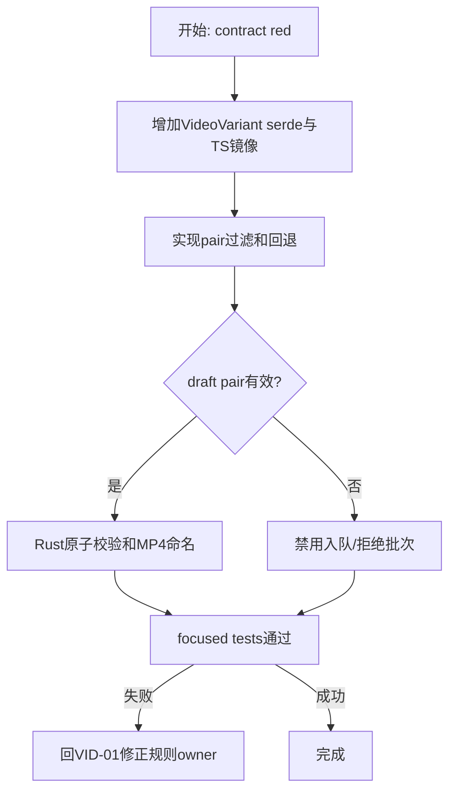
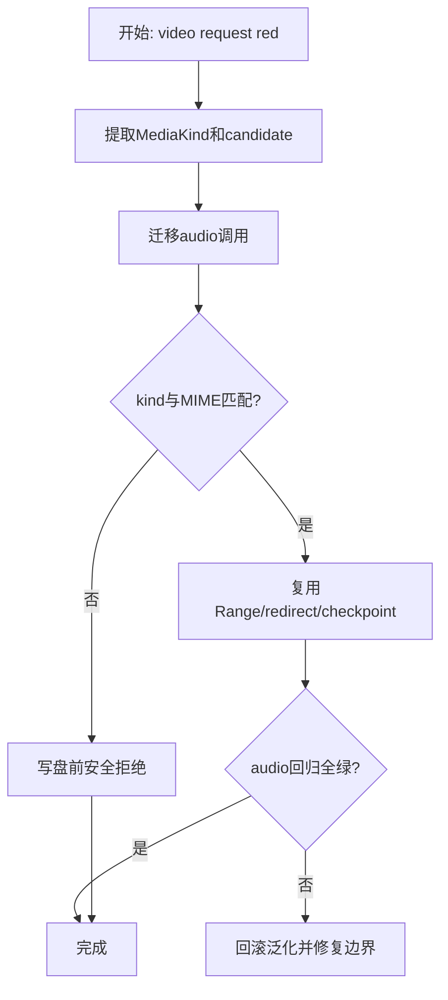
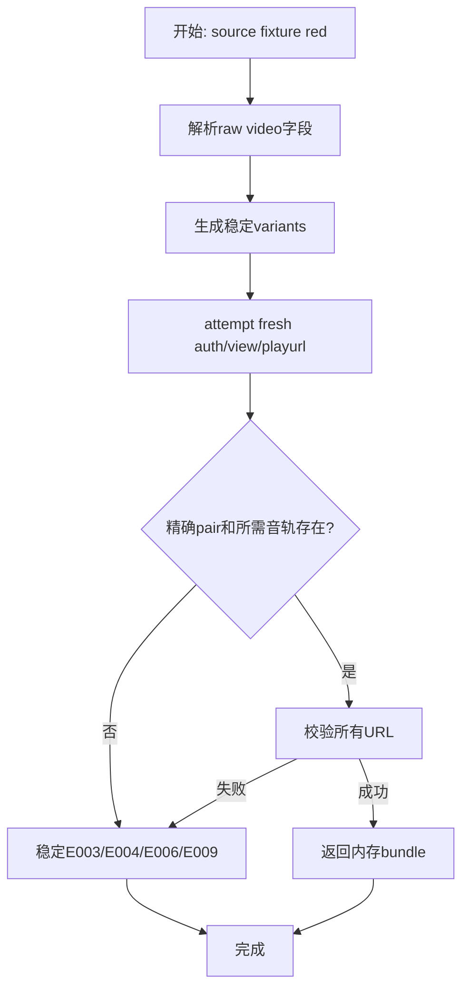
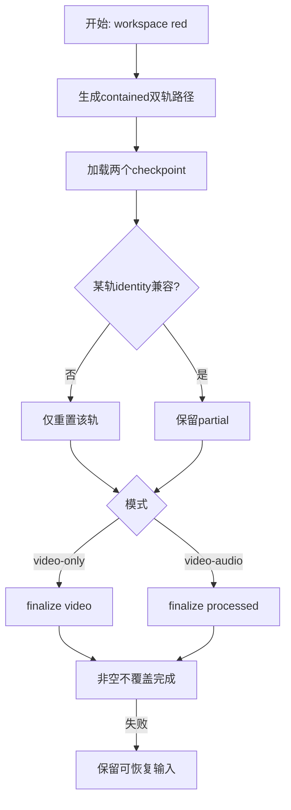
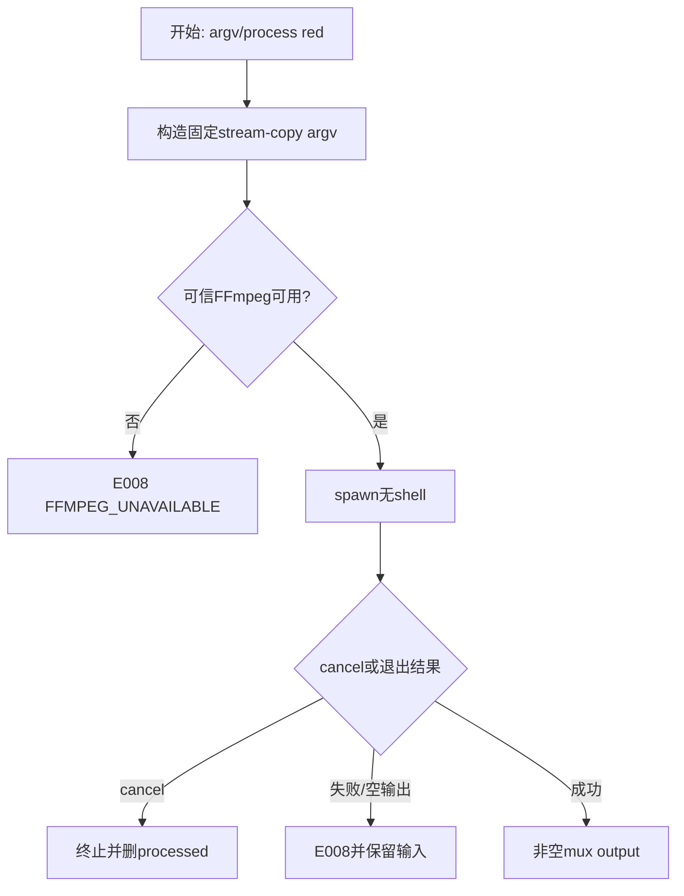
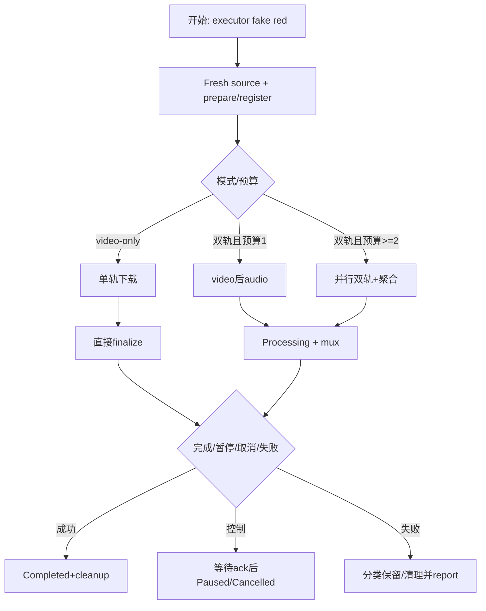
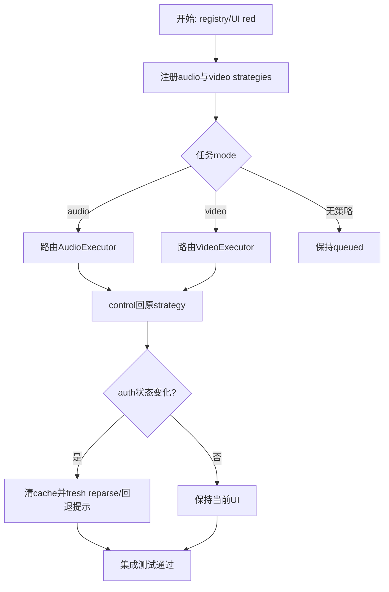
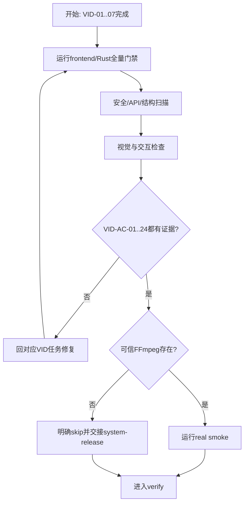

# 实施计划：视频下载与音视频合并

## 交付单元标识

`video-download`

## 阅读导航

- 目标：交付可运行的video-only与video-audio任务执行，保持audio/task/auth/settings无回归。
- 任务总数：8；串行8；可并行0。
- 高风险：VID-02通用化不弱化audio guard，VID-06双轨竞态，VID-07多strategy control路由。
- 固定顺序：VID-01 -> VID-02 -> VID-03 -> VID-04 -> VID-05 -> VID-06 -> VID-07 -> VID-08。
- 关键依赖：批准spec、现有135项Rust/166项前端基线、可信FFmpeg仍由system-release提供。

## 全局摘要

- 主线：variant合同 -> media byte基础 -> fresh source -> per-track workspace -> mux -> executor -> registry/UI协调 -> verify/review证据。
- 状态主线：queued -> downloading(0..90) -> video-only finalize或video-audio processing/mux -> completed；pause/cancel/failure沿用TaskManager。
- 最大风险：quality/codec无效组合、双轨一侧完成后的暂停/失败、cancel与finalize竞争、通用化破坏audio MIME/profile语义。
- 前置：spec/Q1..Q6已批准；目录无Git元数据，使用task-board/changelog作检查点；所有shell命令以 `rtk` 开头。

## 任务拆解

## VID-01：VideoVariant合同、选择规则与任务校验

- 任务目标：消除quality/codecs笛卡尔积，冻结Rust serde与TS等义类型、选择回退、draft及MP4命名。
- 规格映射：VID-AC-01..03、18、20、22、24。
- 范围与影响面：`models/parse.rs`、B站parse adapter fixture、download-center contracts/video-options/store/component、task validation/rules/tests。
- 前置条件：读取根 `tsconfig.json`、直接import类型与Rust serde source；不得猜alias/global。
- 实现子项：先写跨端contract red；新增 `VideoVariant`；实现按quality过滤codec、AVC/HEVC/AV1排序、default/切换回退；invalid pair禁用入队；Rust批次拒绝audio字段或缺video字段；MP4命名沿用安全规则。
- 交互与状态：locked quality可见disabled；空variants不切audio-only；mode切换保留最近有效pair；能力变化提示只消费一次。
- API与数据：`videoVariants` required array，camelCase字段不改名；既有 `qualities/codecs` 保留兼容投影。
- 测试与验证：TS纯规则/store/component；Rust serde/task rules；typecheck、focused cargo。
- 风险与回退：若locked quality无法从raw构造variant，仍由qualities展示，不伪造codec；规格含义冲突才回spec。



## VID-02：通用媒体Source与HTTP字节边界

- 任务目标：让同一HTTP Range实现安全下载audio/video，同时保留媒体kind/MIME验证和audio回归。
- 规格映射：VID-AC-06、08、09、15、17、22、24。
- 范围与影响面：services download contract、audio source适配、HTTP downloader/support、loopback tests。
- 前置条件：VID-01完成；现有audio Range/cover 10项和全量Rust为回归基线。
- 实现子项：先写video MIME与kind red；引入 `MediaKind/MediaSourceCandidate/MediaDownloadRequest`；audio bundle显式映射；identity包含track kind；保持206/200/416/ETag/short-read/redirect逻辑单owner。
- 交互与状态：downloader仍只返回Completed/Paused/Cancelled或typed error，不读TaskStatus；Range未证明时单连接。
- API与数据：内部类型不serde到WebView；URL仅attempt内存；connectionCount保持1..32。
- 测试与验证：audio旧矩阵全过；新增video/mp4接受、交叉MIME拒绝、track identity隔离和预算测试。
- 风险与回退：不得以泛化enum绕过audio MIME/tier；若接口膨胀则拆source与request，不复制downloader。



## VID-03：B站Fresh Video Source与权限适配

- 任务目标：从每次attempt的fresh auth/view/playurl解析精确video variant和video-audio普通音频轨。
- 规格映射：VID-AC-01、02、04..06、19..21、24。
- 范围与影响面：Bilibili raw/video_source、adapter、ParserService port/fixtures、URL validator。
- 前置条件：VID-02稳定media source类型；复用现有auth/WBI/signature流程。
- 实现子项：raw video增加base/backup URL、bandwidth、MIME；codec前缀适配；variant去重；匿名<=480P；精确quality+codec选择；video-audio选最高普通AAC；时效错误同attempt至多fresh resolve一次。
- 交互与状态：运行中能力变化不静默换选择；明确login/permission/unavailable/network错误。
- API与数据：raw字段不离开infrastructure；public parse只新增variant pair，不含URL。
- 测试与验证：snake/camel fixtures、AVC/HEVC/AV1、locked quality、恶意host、缺video/audio、fresh resolve计数、secret scan。
- 风险与回退：未知codec忽略且不展示；B站字段不足时更新fixture/adapter，不把raw暴露到service。



## VID-04：双轨Workspace、Checkpoint与原子输出

- 任务目标：提供contained双轨路径、独立恢复、逐轨重置和两种模式finalize/cleanup。
- 规格映射：VID-AC-03、07、09、11、12、14、15、21、24。
- 范围与影响面：shared safe-path primitives、video workspace port/adapter、tempdir integration tests、startup cleaner兼容。
- 前置条件：VID-02 media/identity合同冻结。
- 实现子项：先写路径/恢复red；显式video/audio/processed与两个checkpoint；V1 versioned无secret；单轨不兼容只删除单轨；video-only finalize video；video-audio finalize processed；非空/同卷/不覆盖；cleanup幂等。
- 交互与状态：pause保留轨道；cancel/success删task root；E007/E008/E009保留兼容轨并删processed；启动只删内部processed。
- API与数据：路径不进入WebView；checkpoint只含track kind、hash、bytes、optional total/etag。
- 测试与验证：canonical containment、恶意task id、两轨互不误删、同名并发、empty output、restart transform。
- 风险与回退：共享只提取path/collision原语，不合并audio/video生命周期对象。



## VID-05：FFmpeg Stream-copy Mux Adapter

- 任务目标：实现可信、无shell、可取消的双输入MP4无损封装，复用locator/process runner而不混入audio profile。
- 规格映射：VID-AC-12..15、19、21、23、24。
- 范围与影响面：video mux port、FFmpeg shared runner/locator、video argv builder、fake/optional real smoke。
- 前置条件：VID-04稳定输入/输出路径；真实sidecar缺失是允许skip，不是fake测试豁免。
- 实现子项：argv red；固定nostdin/loglevel、两input、map、`-c copy`、faststart；输入/输出非空；process cancel等待退出；stable E008 details；无stderr泄漏。
- 交互与状态：只由video-audio Processing调用；video-only fake断言零调用。
- API与数据：`VideoMuxRequest` 只接收workspace paths；executable只来自resource dir。
- 测试与验证：离散argv特殊路径、fake success/exit/cancel/empty/missing；可信binary存在才跑real MP4 smoke。
- 风险与回退：若codec/container不能copy则E008，不转码；真实兼容性问题回spec。



## VID-06：VideoExecutor、双轨调度与聚合进度

- 任务目标：把source/workspace/download/mux/reporter组成可控attempt，完整覆盖单轨与双轨状态出口。
- 规格映射：VID-AC-07..16、21、22、24。
- 范围与影响面：services/video executor/progress/runtime及fake end-to-end tests。
- 前置条件：VID-02..05 ports稳定；TaskManager状态合同不修改。
- 实现子项：video-only线性路径；预算1顺序、>=2 ceil/floor并行；per-track control；bytes/speed聚合；双方total已知才total/ETA；pause/cancel等待全部ack；video-audio Processing/mux；错误分类/cleanup/fresh retry。
- 交互与状态：下载0..90；仅视频不Processing；双轨才Processing；finalize后Completed/100；迟到update沿用attempt guard。
- API与数据：executor不直写store，不解释B站raw/HTTP/argv；controls保存到active map且duplicate start不覆盖。
- 测试与验证：两个happy path、三预算、未知total、一轨先完成、一轨失败、pause/resume/restart/cancel/mux cancel、E007/8/9、cleanup集合。
- 风险与回退：禁止detached track；并行future必须统一收束，任一分支返回前不得遗留writer。



## VID-07：Strategy Registry、Production Composition与认证UI协调

- 任务目标：让runner同时可靠路由audio/video，并使登录变化刷新video能力而不破坏页面状态。
- 规格映射：VID-AC-02、17..20、22..24。
- 范围与影响面：download_runtime registry/runner/lib.rs、DownloadPage/store/cache/locale/component/task row tests。
- 前置条件：VID-06 VideoExecutor available；读取tsconfig与auth公开snapshot闭包。
- 实现子项：registry按mode返回唯一executor；control只发对应active strategy；production共享Parser/TaskManager/downloader/locator；auth transition清cache并fresh reparse一次；有效选择保留，否则回退提示；安全error文案。
- 交互与状态：reparse busy从请求开始到成功/失败/被新token取代结束；不二次确认；失败保留输入并显示安全提示；task action矩阵不变。
- API与数据：无新command/event/capability；组件无Tauri/Pinia；raw error不渲染。
- 测试与验证：registry fake、audio/video同时queued、control隔离、auth登入/登出/stale reparse、zh/en、DOM/a11y。
- 风险与回退：composition只组装；若registry需要锁内await则重构为clone handle后await。



## VID-08：全量验证、安全审查与验收证据

- 任务目标：运行全部门禁，逐项绑定VID-AC-01..24，修复阻断项并形成verify/review输入。
- 规格映射：VID-AC-01..24全部。
- 范围与影响面：完整前端/Rust、capabilities/config、视觉脚本、docs task-board/changelog/evidence。
- 前置条件：VID-01..07 completed；不以focused tests替代full gates。
- 实现子项：frontend tests/typecheck/build；Rust fmt/check/all-targets；loopback/fake；secret/URL/raw error/shell/capability scan；1280/800、light/dark、zh/en视觉；职责/行数/pattern review；可信FFmpeg inventory与明确skip。
- 交互与状态：检查quality/codec联动、locked state、auth refresh、任务video副信息、safe errors、无溢出/重叠/不可达控件。
- API与数据：serde/TS/IPC/event/checkpoint逐项核对；无新WebView权限。
- 测试与验证：每个AC至少一个自动或人工证据；blocker回对应owner任务并重跑全量。
- 风险与回退：公网/真实FFmpeg只opt-in；缺外部资源明确deferred至system-release，不伪造pass。



## 功能拆解明细

| 功能单元 | Owner任务 | 输入 | 成功出口 | 失败/回退 |
| --- | --- | --- | --- | --- |
| quality/codec选择 | VID-01 | qualities + videoVariants + auth | valid pair/draft | disabled或一次回退 |
| media byte transfer | VID-02 | kind/source/path/budget | track completed | paused/cancelled/E007/E009 |
| fresh source | VID-03 | bvid/cid/mode/pair | validated bundle | E003/E004/E006/E009 |
| workspace/checkpoint | VID-04 | task/attempt/track | contained paths/final | 逐轨重置或typed I/O error |
| MP4 mux | VID-05 | video/audio/output paths | non-empty processed | cancelled/E008 |
| attempt orchestration | VID-06 | TaskExecutionSpec | reporter terminal update | pause/cancel/retryable/failed |
| runtime/UI integration | VID-07 | mode/control/auth transition | correct strategy/fresh UI | queued或安全error |
| evidence | VID-08 | all implementation | PASS review input | 回owner任务 |

## 项目脚手架与初始化策略

- 复用现有create-tauri-app工程、Vue/Pinia/i18n/Tauri分层和测试工具；不重新脚手架、不升级依赖。
- 只增加批准spec所需文件并拆真正共享的media/path/process边界；现有路由、theme和component体系不替换。

## API 对接与类型策略

- contract source：Rust serde字段表；无backend TS/protobuf/OpenAPI。TS保持camelCase等义镜像。
- `parse_video` 原command增加required `videoVariants` response字段，不新增request/command。
- raw B站字段经Rust adapter归一化；URL/MIME/bandwidth只在后端内存contract。
- UI直接消费稳定parse/task DTO；only `video-options` 做控制语义映射，components不适配raw contract。
- errors继续由service normalize，页面按code本地化；mock覆盖public contract，fixture覆盖raw adapter。

## 依赖关系

```text
VID-01 -> VID-02 -> VID-03 -> VID-04 -> VID-05 -> VID-06 -> VID-07 -> VID-08
```

- VID-02先稳定通用byte类型，避免VID-03/06各自复制source request。
- VID-04/05先提供确定性side-effect ports，VID-06再编排。
- VID-07最后接production，避免半成品strategy提前认领任务。

## 整洁性与复杂度控制

- TaskManager、variant rules、source selection、Range、workspace、mux、progress各只有一个owner。
- 生产文件250行进入审查、超过350行拆分；测试超出需按场景分组说明。
- orchestration保持同一抽象层；外部await前后检查control；不持锁await、不留detached track。
- 禁止raw backend error/URL/credential进入UI、task、event、checkpoint或日志。

## 模式决策与替代方案

- Strategy registry解决两个真实executor路由；保持静态小集合，拒绝插件系统。
- Adapter隔离B站/HTTP/filesystem/FFmpeg；Composite progress只聚合固定两轨。
- 拒绝quality/codec笛卡尔积、每codec executor、pipeline DSL、shell命令、前端媒体URL和无证据Range。

## 代码上下文与影响范围

- code graph仍missing且无仓库bootstrap；沿用code-context的 `rg`、入口、fixture/loopback/fake fallback。
- TypeScript由根 `tsconfig.json` governing：strict/ES2020/DOM/ESNext/bundler/isolatedModules/noEmit/no alias。
- 重点回归：166项前端、135项Rust、audio profile/Range/cleanup、task retry/cancel、auth restore/cache、settings limits。

## 并行执行建议

- 不启用workflow/subagent。8项任务共享parse、media source、workspace、runner与composition，串行TDD更容易固定合同并定位回归。
- 只允许同一任务内部并行运行互不写文件的frontend/Rust检查；不并行编辑共享代码。

## 触发与上下文准备

- Trigger：用户批准本计划后进入execute，VID-01置为in_progress。
- Context：approved spec/clarifications、architecture、code-context、tsconfig、Rust serde/raw/runner/workspace/FFmpeg与现有测试。
- Observation：每任务red、green、refactor、focused gate和changelog；VID-08观察全量与视觉。
- Handoff：verify绑定VID-AC证据，review无blocker后移交system-release。

## 受影响文件或模块

- 前端：download-center contracts/video-options/store/DownloadOptions/DownloadPage、task row/locales及tests/demo。
- Rust：models parse/task、Bilibili raw/adapter/video source、download media contract/HTTP、workspace、video mux/executor/progress/runtime、runner registry、lib composition。
- 文档：task-board、execution changelog、verification evidence、review、code-context。

## 测试策略

- 每个可测试行为遵循red -> green -> refactor；先运行最小filter证明red来自缺失/错误行为。
- TS：纯规则、Pinia、component/page、locale/contract；Rust：serde/table tests、fixture、loopback HTTP/tempdir、fake mux/executor/registry。
- 全量：`npm run test -- --run`、`npm run build`、Cargo fmt/check/test `--all-targets -j 1`。
- 视觉：显式demo state覆盖1280/800、匿名/登录、浅/深、中文/英文；检查DOM宽度、裁切、36px控件及人工截图。
- 静态：secret/URL/raw error/stderr/shell/capability/生产文件职责扫描。

## 观察与人工介入点

- 计划批准前不写代码；批准后单agent串行执行。
- 若video-only真实fixture不能形成最低可用MP4，回spec请求决策，不暗中remux。
- 可信FFmpeg存在才运行real smoke；缺失记录skip，system-release承接。
- 任何audio/task/auth/settings全量回归为blocker，回当前owner任务修复。

## 回滚说明

- contract/architecture不兼容：回architecture-design或spec并记录reentry_reason。
- focused/full测试失败：停留execute，回最近owner任务；不推进verify。
- review blocker：回execute补回归再全量验证。
- 文档与状态使用task-board/changelog作为检查点；目录不是Git仓库，不伪造commit或使用破坏性reset。

## 验收标准映射

| 验收标准 | 主要任务 | 计划证据 |
| --- | --- | --- |
| VID-AC-01..03 | VID-01/03 | variant contract、选择/draft/task rules |
| VID-AC-04..06 | VID-02/03 | fresh source、MIME/URL/permission fixtures |
| VID-AC-07 | VID-04/06 | video-only zero mux + finalize |
| VID-AC-08..10 | VID-02/04/06 | budget、loopback、双轨progress |
| VID-AC-11..12 | VID-04/06 | pause/cancel/restart竞态 |
| VID-AC-13..14 | VID-05/06 | argv/fake mux/output probe |
| VID-AC-15..16 | VID-04/06 | cleanup/retry/stale attempt |
| VID-AC-17 | VID-07 | registry/control隔离/audio回归 |
| VID-AC-18..20 | VID-01/03/07 | UI/a11y/locale/safe contract |
| VID-AC-21 | VID-02..07 | fake端到端矩阵 |
| VID-AC-22..24 | VID-08 | full gates、skip、clean-code review |
